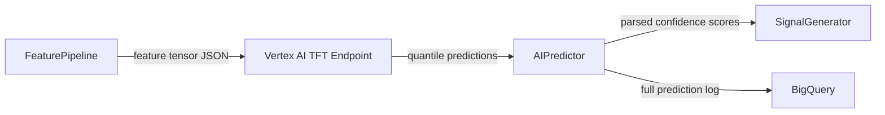

## Purpose

This page explains the AI model at the core of Geonera's prediction engine — the Temporal Fusion Transformer (TFT) — covering its architecture, design rationale, and how it is applied to multi-horizon Forex and Gold price direction forecasting.

## Overview

Geonera uses a **Temporal Fusion Transformer (TFT)** model trained on multi-timeframe OHLCV and indicator features. TFT was selected over simpler recurrent models (LSTM, GRU) for three reasons: its interpretable attention mechanism allows post-hoc analysis of which features drove each prediction; its explicit handling of both static covariates (symbol metadata) and time-varying inputs suits the multi-symbol, multi-timeframe nature of Geonera; and its quantile output heads naturally produce confidence-calibrated predictions.

The model is deployed on **Google Vertex AI** as a custom prediction endpoint. A separate model version is trained and registered for each supported symbol (EURUSD, XAUUSD, etc.). Model versions are immutable once deployed — new versions go through shadow testing before receiving live traffic.

## Inputs

| Input | Type | Source | Description |
|-------|------|--------|-------------|
| Feature tensor | JSON array | FeaturePipeline | Normalized lookback window of indicator+candle features |
| Static covariates | JSON object | FeaturePipeline | Symbol metadata (pip size, session, asset class) |
| Model version ID | String | Config | Which deployed Vertex AI model endpoint to call |

## Outputs

| Output | Type | Destination | Description |
|--------|------|-------------|-------------|
| Prediction payload | JSON | AIPredictor | Per-horizon direction (LONG/SHORT/FLAT) + confidence score |
| Prediction log | BigQuery row | Analytics | Full input+output snapshot for model evaluation |

## Rules

- The model outputs predictions for three horizons: 1-min, 5-min, 15-min.
- Confidence scores are calibrated quantile outputs — a score of 0.80 means the model assigns 80% probability to that direction.
- Predictions with confidence < 0.60 on all horizons are dropped and not forwarded to SignalGenerator.
- The model is retrained when 7-day rolling directional accuracy drops below 52%.
- No feature engineering happens inside the model — all normalization is done by FeaturePipeline before the API call.
- Model input shape: `[batch=1, time_steps=60, features=24]` for M1; `[batch=1, time_steps=20, features=24]` for H1.

## Flow



## Example

### TFT Input Schema

```python
# Feature tensor: shape [1, 60, 24] for M1 60-candle lookback
# Features per timestep:
FEATURE_COLUMNS = [
    "open", "high", "low", "close", "volume",       # OHLCV (5)
    "rsi_14",                                          # RSI (1)
    "ema_20", "ema_50",                               # EMAs (2)
    "atr_14",                                          # ATR (1)
    "bb_upper", "bb_middle", "bb_lower",              # Bollinger (3)
    "hour_of_day", "day_of_week",                     # Time features (2)
    "spread",                                          # Market microstructure (1)
    # M5 aggregated features
    "m5_rsi_14", "m5_ema_20", "m5_atr_14",           # (3)
    # H1 aggregated features
    "h1_rsi_14", "h1_ema_20", "h1_atr_14",           # (3)
    "h1_bb_upper", "h1_bb_lower",                     # (2)
    "returns_1",                                       # 1-bar return (1)
]
# Total: 24 features

# Static covariates per symbol
STATIC_COVARIATES = {
    "XAUUSD": {"pip_size": 0.01, "session": "global", "asset_class": "commodity"},
    "EURUSD": {"pip_size": 0.0001, "session": "london_ny", "asset_class": "forex"},
}
```

### Vertex AI Prediction Request

```python
# ai_predictor/vertex_client.py
from google.cloud import aiplatform

def predict(feature_tensor: list, model_endpoint: str) -> dict:
    endpoint = aiplatform.Endpoint(model_endpoint)

    instance = {
        "time_series": feature_tensor,   # shape [60, 24]
        "static_covariates": get_static_covariates(symbol)
    }

    response = endpoint.predict(instances=[instance])
    raw = response.predictions[0]

    return {
        "horizons": [
            {
                "minutes": 1,
                "direction": quantile_to_direction(raw["q10_1m"], raw["q90_1m"]),
                "confidence": abs(raw["q90_1m"] - raw["q10_1m"])
            },
            {
                "minutes": 5,
                "direction": quantile_to_direction(raw["q10_5m"], raw["q90_5m"]),
                "confidence": abs(raw["q90_5m"] - raw["q10_5m"])
            },
            {
                "minutes": 15,
                "direction": quantile_to_direction(raw["q10_15m"], raw["q90_15m"]),
                "confidence": abs(raw["q90_15m"] - raw["q10_15m"])
            },
        ]
    }

def quantile_to_direction(q10: float, q90: float) -> str:
    if q10 > 0:
        return "LONG"
    elif q90 < 0:
        return "SHORT"
    else:
        return "FLAT"
```
