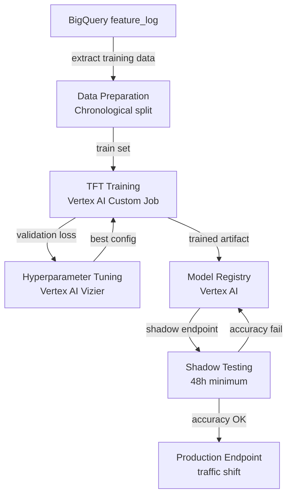

## Purpose

This page describes how TFT models are trained, validated, and deployed to Vertex AI — from data extraction out of BigQuery through to a versioned, production-ready model endpoint.

## Overview

Model training is triggered manually or automatically when production accuracy degrades below threshold. The training pipeline runs as a Vertex AI Custom Training Job using a Python container. Training data is sourced from BigQuery, preprocessed, and fed to PyTorch Forecasting's TFT implementation. After training, the model is registered in Vertex AI Model Registry and shadow-tested against live predictions before receiving production traffic.

## Inputs

| Input | Type | Source | Description |
|-------|------|--------|-------------|
| Historical features | BigQuery `geonera.feature_log` | Feature store | Precomputed feature tensors with labels |
| Training config | YAML | Vertex AI job parameters | Hyperparameters, lookback, horizon, batch size |
| Base model (optional) | Vertex AI Model Registry | Previous training run | For fine-tuning rather than training from scratch |

## Outputs

| Output | Type | Destination | Description |
|--------|------|-------------|-------------|
| Trained model artifact | Cloud Storage bucket | Vertex AI Model Registry | Serialized TFT weights + config |
| Training metrics | Vertex AI experiment | MLOps dashboard | Loss curves, directional accuracy per horizon |
| Deployed endpoint | Vertex AI Endpoint | AIPredictor | REST endpoint for online prediction |

## Rules

- Training data must span at least 6 months of history per symbol.
- Train/validation/test split: 70% / 15% / 15% — split chronologically, never randomly.
- Hyperparameter tuning uses Vertex AI Vizier with 50 trials maximum.
- A model is only promoted to production if it achieves > 54% directional accuracy on the held-out test set.
- Shadow testing period is minimum 48 hours before production traffic is shifted.
- All training runs are logged to Vertex AI Experiments for reproducibility.

## Flow



## Example

```python
# training/train_tft.py
import pytorch_lightning as pl
from pytorch_forecasting import TemporalFusionTransformer, TimeSeriesDataSet
from pytorch_forecasting.metrics import QuantileLoss
from google.cloud import bigquery, storage
import pandas as pd

def load_training_data(symbol: str) -> pd.DataFrame:
    client = bigquery.Client()
    query = f"""
        SELECT
            symbol, close_time, open, high, low, close, volume,
            rsi_14, ema_20, ema_50, atr_14, bb_upper, bb_lower,
            hour_of_day, day_of_week, returns_1,
            direction_5m AS target
        FROM `geonera.feature_log`
        WHERE symbol = '{symbol}'
          AND close_time >= TIMESTAMP_SUB(CURRENT_TIMESTAMP(), INTERVAL 365 DAY)
        ORDER BY close_time
    """
    return client.query(query).to_dataframe()

def build_dataset(df: pd.DataFrame, max_encoder_length=60, max_prediction_length=15):
    df["time_idx"] = range(len(df))
    df["group"] = df["symbol"]  # single group per symbol

    return TimeSeriesDataSet(
        df,
        time_idx="time_idx",
        target="target",
        group_ids=["group"],
        max_encoder_length=max_encoder_length,
        max_prediction_length=max_prediction_length,
        time_varying_known_reals=["hour_of_day", "day_of_week"],
        time_varying_unknown_reals=[
            "open", "high", "low", "close", "volume",
            "rsi_14", "ema_20", "ema_50", "atr_14",
            "bb_upper", "bb_lower", "returns_1",
        ],
        target_normalizer=None,
    )

def train(symbol: str, output_dir: str):
    df = load_training_data(symbol)

    split_idx = int(len(df) * 0.70)
    train_df = df.iloc[:split_idx]
    val_df   = df.iloc[split_idx:int(len(df) * 0.85)]

    train_ds = build_dataset(train_df)
    val_ds   = TimeSeriesDataSet.from_dataset(train_ds, val_df)

    train_dl = train_ds.to_dataloader(train=True,  batch_size=64)
    val_dl   = val_ds.to_dataloader(train=False, batch_size=64)

    tft = TemporalFusionTransformer.from_dataset(
        train_ds,
        learning_rate=3e-4,
        hidden_size=128,
        attention_head_size=4,
        dropout=0.1,
        hidden_continuous_size=32,
        loss=QuantileLoss(quantiles=[0.1, 0.5, 0.9]),
        log_interval=10,
    )

    trainer = pl.Trainer(
        max_epochs=50,
        gradient_clip_val=0.1,
        enable_progress_bar=True,
    )
    trainer.fit(tft, train_dl, val_dl)
    tft.save(f"{output_dir}/model.pt")
    print(f"Model saved to {output_dir}/model.pt")

if __name__ == "__main__":
    import sys
    train(symbol=sys.argv[1], output_dir=sys.argv[2])
```
