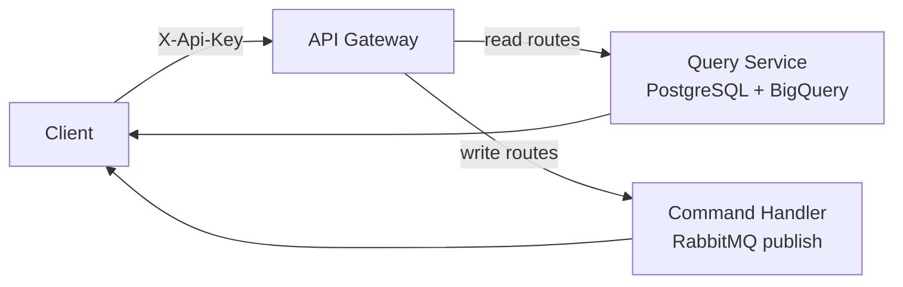

## Purpose

This page catalogs every REST API endpoint exposed by the Geonera API Gateway, with method, path, required scope, and a brief description.

## Overview

The Geonera REST API is organized into four resource groups: `system` (health and status), `trades` (live and historical trade data), `signals` (signal history and state), and `admin` (key management and configuration). All endpoints are prefixed with `/v1`.

## Inputs

| Input | Type | Source | Description |
|-------|------|--------|-------------|
| API key | Header `X-Api-Key` | Client | Authentication (see Authentication page) |
| Query parameters | URL params | Client | Filters, pagination, symbol selection |
| Request body | JSON | Client | For POST/PUT endpoints |

## Outputs

| Output | Type | Destination | Description |
|--------|------|-------------|-------------|
| JSON response | HTTP body | Client | Requested data or operation result |
| HTTP status | Response code | Client | 200 OK, 400 Bad Request, 401/403, 500 |

## Rules

- All endpoints return `Content-Type: application/json`.
- Paginated endpoints use `?page=1&pageSize=50` (max pageSize: 200).
- Date filters use ISO 8601 format: `?from=2026-04-01T00:00:00Z`.
- `400 Bad Request` is returned for invalid query parameters with a JSON error body.
- All responses include a `requestId` field for support tracing.

## Flow



## Example

### Full Endpoint Reference

#### System

| Method | Path | Scope | Description |
|--------|------|-------|-------------|
| GET | `/v1/system/status` | read | Overall system health and service states |
| GET | `/v1/system/services` | read | Per-service health check results |
| GET | `/v1/system/metrics` | read | Key operational metrics (latency, throughput) |

#### Trades

| Method | Path | Scope | Description |
|--------|------|-------|-------------|
| GET | `/v1/trades` | read | List trades with optional filters |
| GET | `/v1/trades/{ticket}` | read | Single trade detail by JForex ticket ID |
| GET | `/v1/trades/open` | read | All currently open positions |
| GET | `/v1/trades/summary` | read | Aggregate PnL, win rate, drawdown stats |

#### Signals

| Method | Path | Scope | Description |
|--------|------|-------|-------------|
| GET | `/v1/signals` | read | Signal history with optional symbol/date filter |
| GET | `/v1/signals/{signalId}` | read | Single signal detail |
| POST | `/v1/signals/halt` | write | Halt signal generation for a symbol |
| DELETE | `/v1/signals/halt/{symbol}` | write | Resume signal generation for a symbol |

#### Admin

| Method | Path | Scope | Description |
|--------|------|-------|-------------|
| GET | `/v1/admin/api-keys` | admin | List all active API keys |
| POST | `/v1/admin/api-keys` | admin | Create a new API key |
| DELETE | `/v1/admin/api-keys/{keyId}` | admin | Revoke an API key |
| GET | `/v1/admin/config` | admin | Current risk configuration |
| PUT | `/v1/admin/config` | admin | Update risk configuration |
| POST | `/v1/admin/emergency-stop` | admin | Halt all trading immediately |

### GET /v1/trades

```bash
GET /v1/trades?symbol=XAUUSD&from=2026-04-01T00:00:00Z&status=CLOSED&page=1&pageSize=50
X-Api-Key: a3f7c291...
```

```json
{
  "requestId": "req-001abc",
  "page": 1,
  "pageSize": 50,
  "total": 127,
  "data": [
    {
      "ticket": "10042381",
      "symbol": "XAUUSD",
      "direction": "LONG",
      "lotSize": 0.10,
      "fillPrice": 2345.45,
      "closePrice": 2349.07,
      "stopLoss": 2343.60,
      "takeProfit": 2349.07,
      "pnl": 36.20,
      "state": "CLOSED",
      "openedAt": "2026-04-05T12:00:00.800Z",
      "closedAt": "2026-04-05T12:23:14.200Z",
      "signalId": "sig-20260405-xauusd-001"
    }
  ]
}
```

### POST /v1/admin/emergency-stop

```bash
POST /v1/admin/emergency-stop
X-Api-Key: <admin-key>
Content-Type: application/json

{"reason": "Manual stop — unusual market conditions"}
```

```json
{
  "requestId": "req-002abc",
  "status": "emergency_stop_activated",
  "openPositionsClosed": 3,
  "tradingHaltedAt": "2026-04-05T14:30:00Z"
}
```
