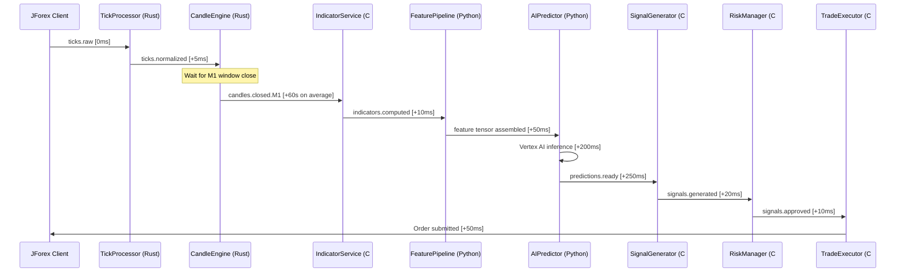

## Purpose

This page traces the exact path that data takes through Geonera — from the moment a tick arrives from Dukascopy to the moment an order is confirmed and logged. It is the reference for understanding data transformation, latency budgets, and where data is stored at each stage.

## Overview

Data in Geonera flows in one direction: from market → processing → intelligence → execution. There is no feedback loop that routes execution results back into the data layer in real time (post-trade analytics flow to BigQuery asynchronously).

Each transformation stage adds structure: raw ticks become normalized ticks, normalized ticks become OHLCV candles, candles become indicator-enriched records, indicators become feature tensors, and feature tensors become AI predictions that drive trade decisions.

Latency is measured and budgeted at each stage. The total tick-to-signal latency target is under 1 second (p99). The total tick-to-order latency target is under 2 seconds (p99).

## Inputs

| Input | Type | Source | Description |
|-------|------|--------|-------------|
| Raw tick | TCP stream | Dukascopy JForex | Bid, ask, timestamp, symbol |
| Historical candles | BigQuery table | Backfill job | OHLCV for model training window |
| Risk configuration | Environment | Secrets manager | Thresholds, limits, symbol list |

## Outputs

| Output | Type | Destination | Description |
|--------|------|-------------|-------------|
| Normalized tick | RabbitMQ message | CandleEngine | Validated, timestamped tick |
| Closed candle | RabbitMQ message | IndicatorService | OHLCV for each timeframe |
| Indicator record | Redis + RabbitMQ | FeaturePipeline | RSI, EMA, ATR, BB per candle |
| Feature tensor | Vertex AI request | AIPredictor | Assembled model input |
| Prediction | RabbitMQ message | SignalGenerator | Direction + confidence per horizon |
| Trading signal | RabbitMQ message | RiskManager | LONG/SHORT/FLAT with parameters |
| Approved signal | RabbitMQ message | TradeExecutor | Signal cleared by risk rules |
| Order confirmation | PostgreSQL + BigQuery | TradeTracker | Filled order with ticket ID |

## Rules

- Ticks older than 5 seconds are dropped by TickProcessor (stale feed detection).
- A candle is only published as "closed" when its full time window has elapsed — no partial candles propagate downstream.
- Indicators are only computed on **closed** candles, never on in-progress candles.
- Feature assembly uses the last N closed candles (default: 60 for M1, 20 for H1) from BigQuery.
- A prediction is only forwarded to SignalGenerator if confidence ≥ 0.60. Low-confidence predictions are logged but discarded.
- Signals only reach TradeExecutor after passing all RiskManager rules. Partial rule failures reject the entire signal.

## Flow

### End-to-End Data Flow with Latency Budget



### Data Schemas at Each Stage

#### Stage 1: Raw Tick
```json
{
  "symbol": "XAUUSD",
  "bid": 2345.12,
  "ask": 2345.45,
  "timestamp": 1743854400123,
  "volume": 1.0
}
```

#### Stage 2: Normalized Tick
```json
{
  "messageType": "ticks.normalized.v1",
  "correlationId": "a3f7c291-...",
  "timestamp": "2026-04-05T12:00:00.123Z",
  "payload": {
    "symbol": "XAUUSD",
    "bid": 2345.12,
    "ask": 2345.45,
    "mid": 2345.285,
    "spread": 0.33,
    "utcTimestamp": "2026-04-05T12:00:00.123Z",
    "source": "dukascopy"
  }
}
```

#### Stage 3: Closed M1 Candle
```json
{
  "symbol": "XAUUSD",
  "timeframe": "M1",
  "open": 2344.80,
  "high": 2345.50,
  "low": 2344.20,
  "close": 2345.12,
  "volume": 1420,
  "openTime": "2026-04-05T12:00:00Z",
  "closeTime": "2026-04-05T12:01:00Z",
  "tickCount": 87
}
```

#### Stage 4: Indicator Record
```json
{
  "symbol": "XAUUSD",
  "timeframe": "M1",
  "timestamp": "2026-04-05T12:01:00Z",
  "rsi14": 58.3,
  "ema20": 2344.10,
  "ema50": 2341.80,
  "atr14": 1.85,
  "bbUpper": 2347.20,
  "bbMiddle": 2344.10,
  "bbLower": 2341.00
}
```

#### Stage 5: AI Prediction
```json
{
  "symbol": "XAUUSD",
  "modelVersion": "tft-v2.3.1",
  "requestedAt": "2026-04-05T12:01:00.600Z",
  "horizons": [
    { "minutes": 1,  "direction": "LONG", "confidence": 0.72 },
    { "minutes": 5,  "direction": "LONG", "confidence": 0.81 },
    { "minutes": 15, "direction": "FLAT", "confidence": 0.61 }
  ]
}
```

#### Stage 6: Trading Signal
```json
{
  "symbol": "XAUUSD",
  "direction": "LONG",
  "confidence": 0.81,
  "entryPrice": 2345.45,
  "stopLoss": 2343.60,
  "takeProfit": 2349.07,
  "atrUsed": 1.85,
  "generatedAt": "2026-04-05T12:01:00.760Z",
  "predictionId": "pred-20260405-xauusd-001"
}
```

## Example

### Python: Tracing a Correlation ID Through the Pipeline

```python
import structlog

log = structlog.get_logger()

def process_prediction(message: dict) -> None:
    correlation_id = message["correlationId"]

    # Bind correlation ID to all log entries in this call
    log = structlog.get_logger().bind(
        correlation_id=correlation_id,
        symbol=message["payload"]["symbol"]
    )

    log.info("prediction_received", model_version=message["payload"]["modelVersion"])

    signal = generate_signal(message["payload"])

    if signal is None:
        log.info("signal_suppressed", reason="low_confidence")
        return

    publish_signal(signal, correlation_id)
    log.info("signal_published", direction=signal["direction"], confidence=signal["confidence"])
```
