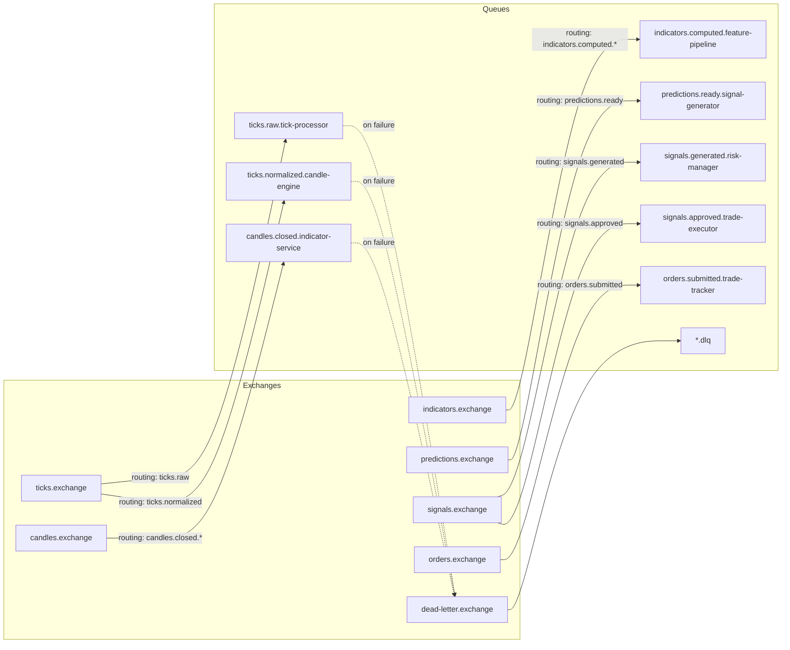

## Purpose

This page defines how Geonera services communicate through RabbitMQ — the exchange topology, queue bindings, message schemas, and delivery guarantees. Understanding this is mandatory before writing any inter-service communication code.

## Overview

Geonera uses RabbitMQ as its sole internal message broker. All inter-service events are published to named exchanges and consumed from dedicated queues. Services never poll databases or call each other's HTTP APIs for coordination.

The messaging topology uses **topic exchanges** for routing flexibility. Exchange names follow the domain they represent. Queue names include the consuming service to make ownership explicit. All messages are persistent (delivery mode 2) and queues are durable to survive broker restarts.

Consumers use **manual acknowledgment** — a message is only ACKed after the service has fully processed and committed the result. Failed processing results in a NACK with requeue=false, routing the message to a dead-letter exchange (DLX) for inspection.

## Inputs

| Input | Type | Source | Description |
|-------|------|--------|-------------|
| Published event | AMQP message | Upstream service | Domain event triggering downstream processing |
| Dead-letter message | DLX queue | Failed consumer | Message that failed processing, awaiting inspection |

## Outputs

| Output | Type | Destination | Description |
|--------|------|-------------|-------------|
| Domain event | AMQP message | Downstream queue | Result event routing to next service |
| Dead-letter event | DLX exchange | Ops team / alerting | Failed message for manual inspection |

## Rules

- All exchanges are `topic` type. Direct and fanout are not used.
- All queues are durable. Transient queues are not permitted.
- All messages use delivery mode 2 (persistent).
- Every queue has a corresponding dead-letter queue: `<queue-name>.dlq`.
- Message TTL is 60 seconds on all queues. Expired messages go to DLQ.
- Consumers must process messages idempotently — a message may be delivered more than once.
- Message payload is always JSON. Binary encoding is not used.
- Every message must include `correlationId`, `timestamp`, and `messageType` fields.

## Flow

### Exchange and Queue Topology



### Full Exchange/Queue Reference

| Exchange | Type | Routing Key Pattern | Producer | Consumer Queue |
|----------|------|--------------------|---------|--------------------|
| `ticks.exchange` | topic | `ticks.raw` | JForexClient | `ticks.raw.tick-processor` |
| `ticks.exchange` | topic | `ticks.normalized` | TickProcessor | `ticks.normalized.candle-engine` |
| `candles.exchange` | topic | `candles.closed.*` | CandleEngine | `candles.closed.indicator-service` |
| `indicators.exchange` | topic | `indicators.computed.*` | IndicatorService | `indicators.computed.feature-pipeline` |
| `predictions.exchange` | topic | `predictions.ready` | AIPredictor | `predictions.ready.signal-generator` |
| `signals.exchange` | topic | `signals.generated` | SignalGenerator | `signals.generated.risk-manager` |
| `signals.exchange` | topic | `signals.approved` | RiskManager | `signals.approved.trade-executor` |
| `orders.exchange` | topic | `orders.submitted` | TradeExecutor | `orders.submitted.trade-tracker` |

## Example

### Standard Message Envelope (all messages)

```json
{
  "messageType": "ticks.normalized.v1",
  "correlationId": "a3f7c291-8e2b-4d10-b3a1-9f4e2c7d8b5a",
  "timestamp": "2026-04-05T12:00:00.123Z",
  "payload": {
    "symbol": "XAUUSD",
    "bid": 2345.12,
    "ask": 2345.45,
    "volume": 1.0,
    "source": "dukascopy"
  }
}
```

### C# RabbitMQ Publisher

```csharp
// Infrastructure/RabbitMqPublisher.cs
public class RabbitMqPublisher : IRabbitMqPublisher
{
    private readonly IModel _channel;
    private readonly ILogger<RabbitMqPublisher> _logger;

    public RabbitMqPublisher(IModel channel, ILogger<RabbitMqPublisher> logger)
    {
        _channel = channel;
        _logger = logger;
    }

    public void Publish<T>(string exchange, string routingKey, T message)
    {
        var envelope = new MessageEnvelope<T>
        {
            MessageType = $"{routingKey}.v1",
            CorrelationId = Guid.NewGuid().ToString(),
            Timestamp = DateTime.UtcNow,
            Payload = message
        };

        var body = Encoding.UTF8.GetBytes(JsonSerializer.Serialize(envelope));

        var props = _channel.CreateBasicProperties();
        props.DeliveryMode = 2; // persistent
        props.ContentType = "application/json";
        props.CorrelationId = envelope.CorrelationId;

        _channel.BasicPublish(
            exchange: exchange,
            routingKey: routingKey,
            basicProperties: props,
            body: body
        );

        _logger.LogInformation(
            "Published {MessageType} to {Exchange}/{RoutingKey} [{CorrelationId}]",
            envelope.MessageType, exchange, routingKey, envelope.CorrelationId
        );
    }
}
```

### C# RabbitMQ Consumer with Manual ACK

```csharp
// Consumers/CandleClosedConsumer.cs
public class CandleClosedConsumer : IHostedService
{
    private readonly IModel _channel;
    private readonly IIndicatorComputer _computer;
    private readonly IRabbitMqPublisher _publisher;

    public Task StartAsync(CancellationToken cancellationToken)
    {
        _channel.BasicQos(prefetchSize: 0, prefetchCount: 10, global: false);

        var consumer = new AsyncEventingBasicConsumer(_channel);
        consumer.Received += async (_, ea) =>
        {
            try
            {
                var envelope = JsonSerializer.Deserialize<MessageEnvelope<CandleClosedEvent>>(
                    Encoding.UTF8.GetString(ea.Body.ToArray())
                );

                var indicators = await _computer.ComputeAsync(envelope.Payload);

                _publisher.Publish("indicators.exchange",
                    $"indicators.computed.{envelope.Payload.Symbol.ToLower()}",
                    indicators);

                _channel.BasicAck(ea.DeliveryTag, multiple: false);
            }
            catch (Exception ex)
            {
                // Send to DLQ — do not requeue
                _channel.BasicNack(ea.DeliveryTag, multiple: false, requeue: false);
            }
        };

        _channel.BasicConsume(
            queue: "candles.closed.indicator-service",
            autoAck: false,
            consumer: consumer
        );

        return Task.CompletedTask;
    }

    public Task StopAsync(CancellationToken cancellationToken)
    {
        _channel.Close();
        return Task.CompletedTask;
    }
}
```
