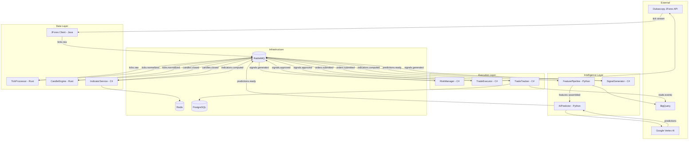

## Purpose

This page provides a complete map of the Geonera system — every service, every communication channel, and every external dependency. It is the entry point for understanding how the system works as a whole before diving into individual components.

## Overview

Geonera is composed of seven core microservices, three external systems, and two shared infrastructure components. Services are grouped into three logical layers:

- **Data Layer** — Responsible for acquiring, normalizing, and storing market data (ticks, candles, indicators).
- **Intelligence Layer** — Responsible for assembling features, running AI inference, and generating trading signals.
- **Execution Layer** — Responsible for validating risk, submitting orders, and tracking trade state.

All inter-service communication is asynchronous via RabbitMQ. External API calls (Vertex AI, JForex) are synchronous HTTP/REST or proprietary TCP protocol.

## Inputs

| Input | Type | Source | Description |
|-------|------|--------|-------------|
| Tick stream | TCP / proprietary | Dukascopy JForex | Live bid/ask prices for configured symbols |
| Historical OHLCV | REST API | Dukascopy historical API | Bulk candle data for training and backfill |
| AI predictions | HTTPS REST | Google Vertex AI | TFT model inference results |
| Operator config | YAML + env vars | Config files / secrets manager | Risk params, symbol list, model endpoints |

## Outputs

| Output | Type | Destination | Description |
|--------|------|-------------|-------------|
| Market orders | JForex API | Dukascopy broker | Live trade submissions |
| Event logs | Streaming insert | BigQuery | All system events for analytics |
| Metrics | OpenTelemetry | Grafana / monitoring | Latency, throughput, error rates |
| Alerts | PagerDuty API | On-call engineer | Drawdown breaches, service failures |

## Rules

- No service communicates directly with another service via HTTP — all internal communication goes through RabbitMQ exchanges.
- The JForex Java client is the **only** component that connects to the Dukascopy broker network.
- Vertex AI is the **only** component that runs model inference — no local inference is permitted in production.
- Every service must emit a structured heartbeat event to RabbitMQ every 30 seconds for health monitoring.
- The RiskManager service is the **last gate** before any order reaches TradeExecutor — it cannot be bypassed.

## Flow



## Example

### Service Startup Order

Services must start in this order to avoid missed messages:

```bash
# 1. Infrastructure first
docker compose up -d rabbitmq redis postgres

# 2. Data layer
docker compose up -d tick-processor candle-engine indicator-service

# 3. JForex client (starts streaming ticks)
docker compose up -d jforex-client

# 4. Intelligence layer
docker compose up -d feature-pipeline ai-predictor signal-generator

# 5. Execution layer (last — gates all trades)
docker compose up -d risk-manager trade-executor trade-tracker
```

### Service Responsibilities Summary

| Service | Language | Layer | Responsibility |
|---------|----------|-------|----------------|
| JForexClient | Java | Data | Tick streaming, order submission |
| TickProcessor | Rust | Data | Normalization, deduplication |
| CandleEngine | Rust | Data | OHLCV aggregation per timeframe |
| IndicatorService | C# | Data | RSI, EMA, ATR, Bollinger Bands |
| FeaturePipeline | Python | Intelligence | BigQuery queries, tensor assembly |
| AIPredictor | Python | Intelligence | Vertex AI inference |
| SignalGenerator | C# | Intelligence | Prediction to signal conversion |
| RiskManager | C# | Execution | Risk rule evaluation |
| TradeExecutor | C# | Execution | JForex order submission |
| TradeTracker | C# | Execution | Order lifecycle, PostgreSQL state |
