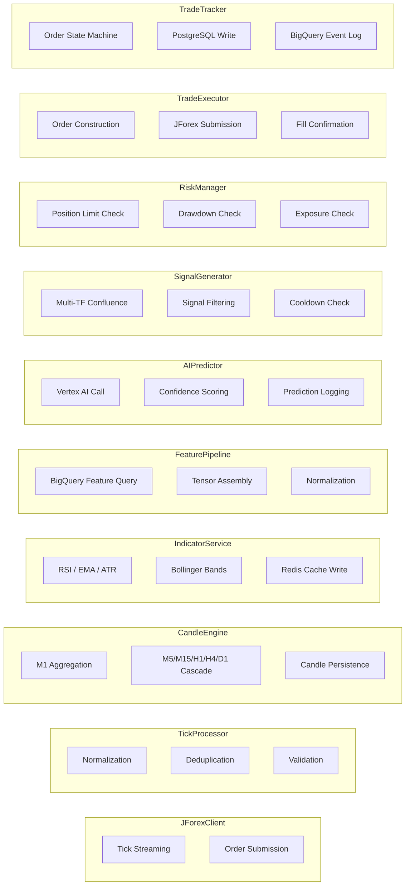

## Purpose

This page explains the principles behind how Geonera is split into services, what each service owns exclusively, and how boundaries are enforced. Understanding service design prevents boundary violations during development and helps engineers decide where new functionality belongs.

## Overview

Geonera follows the **Single Responsibility Principle** at the service level. Each service owns exactly one domain, exposes no synchronous API to other internal services, and manages its own data store (database-per-service pattern where applicable).

Service boundaries are defined by data ownership, not by feature grouping. For example, the IndicatorService owns indicator computation and caching — it does not own candle data (CandleEngine owns that) and does not own trade signals (SignalGenerator owns that).

Services are independently deployable. Deploying a new version of AIPredictor does not require redeploying CandleEngine. This is enforced by the RabbitMQ message contract — as long as message schemas are backward-compatible, services evolve independently.

## Inputs

| Input | Type | Source | Description |
|-------|------|--------|-------------|
| Domain event | RabbitMQ message | Upstream service | Trigger for service to begin processing |
| Configuration | Environment variables | Docker / Kubernetes secrets | Service-specific config at startup |
| Shared state | Redis read | IndicatorService cache | Indicator values for feature assembly |

## Outputs

| Output | Type | Destination | Description |
|--------|------|-------------|-------------|
| Domain event | RabbitMQ message | Downstream service | Result of processing, triggers next step |
| Persisted state | PostgreSQL / BigQuery | Own data store | Service-owned persistent data |
| Cached state | Redis | Shared cache | Fast-read indicator values |

## Rules

- **No direct HTTP calls between internal services.** All coordination is via RabbitMQ.
- **Each service owns its schema.** A service never writes to another service's database table.
- **Message contracts are versioned.** Breaking changes require a new message type, not modification of existing ones.
- **Services are stateless between requests.** All state is stored externally (Redis, PostgreSQL, BigQuery).
- **A service must handle its own retries.** No external orchestrator is responsible for retrying failed processing.
- **Health checks are mandatory.** Every service exposes a `/health` HTTP endpoint on port 8080 for Docker health checks.

## Flow

### Service Boundary Diagram



### Ownership Matrix

| Domain | Owner Service | Data Store |
|--------|--------------|------------|
| Raw ticks | TickProcessor | In-memory queue |
| Normalized ticks | RabbitMQ (transit) | — |
| OHLCV candles | CandleEngine | BigQuery (historical) |
| Indicator values | IndicatorService | Redis |
| Feature vectors | FeaturePipeline | BigQuery |
| AI predictions | AIPredictor | BigQuery |
| Trading signals | SignalGenerator | RabbitMQ (transit) |
| Risk decisions | RiskManager | In-memory |
| Order state | TradeTracker | PostgreSQL |
| Trade events | TradeTracker | BigQuery |

## Example

### Adding a New Indicator — Decision Tree

When adding a new indicator (e.g., MACD):

```
Q: Does it transform candle data into a derived value?
   → YES → belongs in IndicatorService

Q: Does it require cross-symbol data?
   → YES → belongs in FeaturePipeline (not IndicatorService)

Q: Does it produce a trade signal directly?
   → NO → if yes, belongs in SignalGenerator
```

### C# IndicatorService — Service Structure

```csharp
// IndicatorService/Program.cs
var builder = WebApplication.CreateBuilder(args);

builder.Services.AddSingleton<IRabbitMqConsumer, CandleClosedConsumer>();
builder.Services.AddSingleton<IIndicatorComputer, IndicatorComputer>();
builder.Services.AddSingleton<IRedisCache, RedisCache>();
builder.Services.AddSingleton<IRabbitMqPublisher, IndicatorPublisher>();

// Health check — mandatory for all services
builder.Services.AddHealthChecks()
    .AddRedis(builder.Configuration["Redis:ConnectionString"])
    .AddRabbitMQ(builder.Configuration["RabbitMQ:Uri"]);

var app = builder.Build();
app.MapHealthChecks("/health");
app.Run();
```

### Message Contract Versioning

```json
// v1 — original contract
{
  "messageType": "indicators.computed.v1",
  "symbol": "XAUUSD",
  "timeframe": "M1",
  "timestamp": "2026-04-05T12:00:00Z",
  "rsi": 58.3,
  "ema20": 2344.10,
  "atr": 1.85
}

// v2 — added bollinger bands without breaking v1 consumers
{
  "messageType": "indicators.computed.v2",
  "symbol": "XAUUSD",
  "timeframe": "M1",
  "timestamp": "2026-04-05T12:00:00Z",
  "rsi": 58.3,
  "ema20": 2344.10,
  "atr": 1.85,
  "bbUpper": 2347.20,
  "bbLower": 2341.00,
  "bbMiddle": 2344.10
}
```
