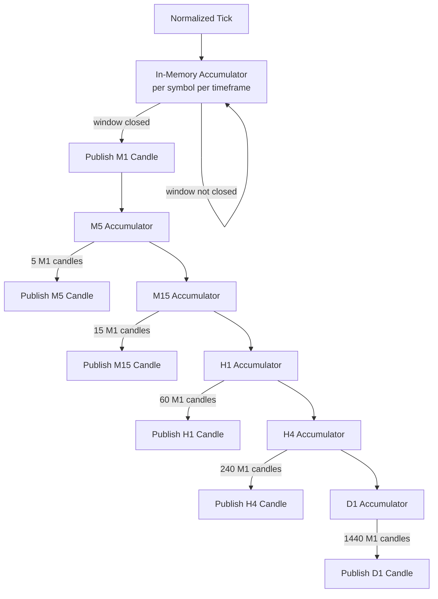

## Purpose

The CandleEngine aggregates normalized ticks into OHLCV candles, starting with M1 and cascading upward to M5, M15, H1, H4, and D1. It is the foundational data structure for all indicator computation and AI feature engineering.

## Overview

CandleEngine is a Rust service that maintains a per-symbol, per-timeframe in-memory accumulator. When a tick arrives, it is folded into the currently open candle. When the candle's time window closes (e.g., at the top of each minute for M1), the completed candle is published downstream and a new accumulator is initialized.

Higher timeframes (M5, M15, H1, H4, D1) are derived by aggregating closed M1 candles rather than re-processing raw ticks. This cascade approach ensures consistency across timeframes.

## Inputs

| Input | Type | Source | Description |
|-------|------|--------|-------------|
| Normalized tick | RabbitMQ `ticks.normalized` | TickProcessor | Validated bid/ask/mid with UTC timestamp |

## Outputs

| Output | Type | Destination | Description |
|--------|------|-------------|-------------|
| Closed M1 candle | RabbitMQ `candles.closed.m1` | IndicatorService | OHLCV + tick count for M1 |
| Closed M5 candle | RabbitMQ `candles.closed.m5` | IndicatorService | Aggregated from 5 M1 candles |
| Closed H1 candle | RabbitMQ `candles.closed.h1` | IndicatorService | Aggregated from 60 M1 candles |
| Closed D1 candle | RabbitMQ `candles.closed.d1` | IndicatorService | Aggregated from 1440 M1 candles |

## Rules

- A candle's `open` is the `mid` of the first tick in the window.
- `high` and `low` track the max/min `mid` across all ticks in the window.
- `close` is the `mid` of the last tick before the window boundary.
- `volume` is the sum of all tick volumes in the window.
- Candles with zero ticks (gap periods) are not published — gaps are handled by the downstream consumer.
- Candle boundaries are aligned to UTC clock (e.g., M1 closes exactly at :00 seconds).
- Cascade aggregation: M5 closes when 5 consecutive M1 candles for the same symbol have closed.

## Flow



## Example

```rust
// candle_engine/src/aggregator.rs
use chrono::{DateTime, Utc, Timelike, Duration};

#[derive(Debug, Clone)]
pub struct Candle {
    pub symbol: String,
    pub timeframe: String,
    pub open: f64,
    pub high: f64,
    pub low: f64,
    pub close: f64,
    pub volume: f64,
    pub tick_count: u32,
    pub open_time: DateTime<Utc>,
    pub close_time: DateTime<Utc>,
}

pub struct M1Aggregator {
    accumulators: std::collections::HashMap<String, Option<Candle>>,
}

impl M1Aggregator {
    pub fn on_tick(&mut self, symbol: &str, mid: f64, volume: f64, ts: DateTime<Utc>)
        -> Option<Candle>
    {
        let window_start = ts.with_second(0).unwrap().with_nanosecond(0).unwrap();
        let window_end = window_start + Duration::minutes(1);

        let acc = self.accumulators.entry(symbol.to_string()).or_insert(None);

        match acc {
            None => {
                // Open first candle
                *acc = Some(Candle {
                    symbol: symbol.to_string(),
                    timeframe: "M1".to_string(),
                    open: mid, high: mid, low: mid, close: mid,
                    volume, tick_count: 1,
                    open_time: window_start,
                    close_time: window_end,
                });
                None
            }
            Some(candle) if ts < candle.close_time => {
                // Update in-progress candle
                candle.high = candle.high.max(mid);
                candle.low = candle.low.min(mid);
                candle.close = mid;
                candle.volume += volume;
                candle.tick_count += 1;
                None
            }
            Some(_) => {
                // Close current candle, start new one
                let closed = acc.take().unwrap();
                *acc = Some(Candle {
                    symbol: symbol.to_string(),
                    timeframe: "M1".to_string(),
                    open: mid, high: mid, low: mid, close: mid,
                    volume, tick_count: 1,
                    open_time: window_start,
                    close_time: window_end,
                });
                Some(closed)
            }
        }
    }
}
```
