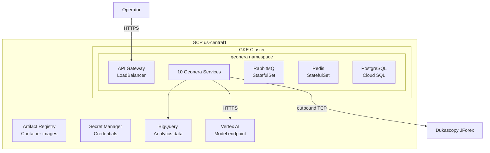

## Purpose

This page describes the production infrastructure that runs Geonera — cloud provider, Kubernetes cluster configuration, networking topology, and how secrets are managed.

## Overview

Geonera runs on **Google Cloud Platform (GCP)** using **Google Kubernetes Engine (GKE)** for container orchestration. All services run in a dedicated `geonera` namespace. External traffic is minimal — most communication is internal RabbitMQ messages. The JForex client connects outbound to Dukascopy's servers. Vertex AI is called via HTTPS from within the cluster.

Secrets are stored in **GCP Secret Manager** and injected into pods as environment variables via the GKE Secret Manager add-on. No secrets are stored in Kubernetes Secrets in plain base64.

## Inputs

| Input | Type | Source | Description |
|-------|------|--------|-------------|
| Terraform state | GCS bucket | IaC pipeline | Cluster config, VPC, firewall rules |
| Container images | Artifact Registry | CI pipeline | Service images per git SHA |
| Secrets | GCP Secret Manager | GKE add-on | API keys, connection strings |

## Outputs

| Output | Type | Destination | Description |
|--------|------|-------------|-------------|
| Running cluster | GKE | GCP us-central1 | Production Kubernetes cluster |
| Metrics | Cloud Monitoring | Grafana | Infrastructure metrics |
| Logs | Cloud Logging | Log Explorer | Aggregated container logs |

## Rules

- All services run in the `geonera` namespace — no services in `default`.
- NetworkPolicy restricts pod-to-pod communication: only RabbitMQ and Redis are accessible cluster-wide.
- External ingress is limited to the API Gateway service only (via GCP Load Balancer).
- All GCP service accounts follow the principle of least privilege.
- Terraform manages all infrastructure — no manual changes to GCP console.

## Flow



## Example

### Terraform GKE Cluster Definition

```hcl
# terraform/gke.tf
resource "google_container_cluster" "geonera_prod" {
  name     = "geonera-prod"
  location = "us-central1"

  remove_default_node_pool = true
  initial_node_count       = 1

  network    = google_compute_network.geonera_vpc.name
  subnetwork = google_compute_subnetwork.geonera_subnet.name

  workload_identity_config {
    workload_pool = "${var.project_id}.svc.id.goog"
  }
}

resource "google_container_node_pool" "geonera_nodes" {
  name       = "geonera-node-pool"
  cluster    = google_container_cluster.geonera_prod.name
  location   = "us-central1"
  node_count = 3

  node_config {
    machine_type = "n2-standard-4"
    disk_size_gb = 100

    oauth_scopes = [
      "https://www.googleapis.com/auth/cloud-platform"
    ]

    shielded_instance_config {
      enable_secure_boot = true
    }
  }

  autoscaling {
    min_node_count = 2
    max_node_count = 10
  }
}
```

### Kubernetes NetworkPolicy

```yaml
# k8s/network-policy.yaml
apiVersion: networking.k8s.io/v1
kind: NetworkPolicy
metadata:
  name: geonera-default-deny
  namespace: geonera
spec:
  podSelector: {}
  policyTypes:
    - Ingress
    - Egress
---
apiVersion: networking.k8s.io/v1
kind: NetworkPolicy
metadata:
  name: allow-rabbitmq
  namespace: geonera
spec:
  podSelector:
    matchLabels:
      app: rabbitmq
  ingress:
    - from:
        - namespaceSelector:
            matchLabels:
              kubernetes.io/metadata.name: geonera
  policyTypes:
    - Ingress
```
