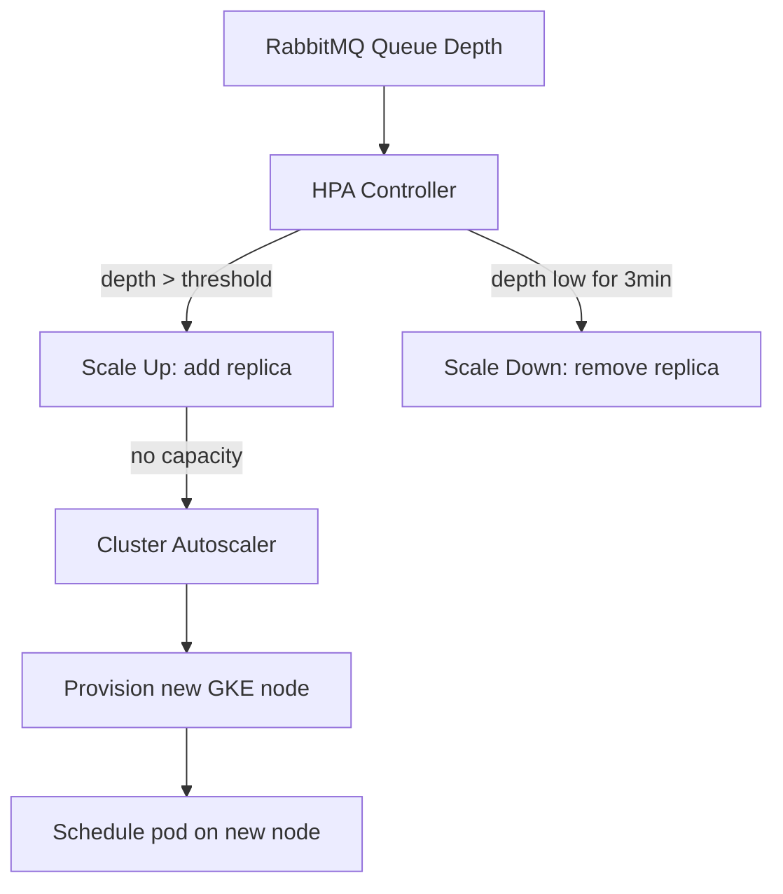

## Purpose

This page defines how Geonera scales to handle increased tick volume, additional symbols, or higher prediction throughput — and the limits of each scaling approach.

## Overview

Geonera services scale differently based on their nature. **Stateless services** (TickProcessor, IndicatorService, SignalGenerator, RiskManager, TradeExecutor) scale horizontally — multiple replicas process messages from the same queue in parallel. **Stateful services** (CandleEngine, TradeTracker) require careful scaling to avoid split-brain state issues. **External dependencies** (RabbitMQ, Redis, PostgreSQL) use vertical scaling with read replicas where applicable.

Horizontal Pod Autoscaler (HPA) is configured for stateless services based on RabbitMQ queue depth, not CPU — queue depth is a better signal of actual load for message-driven services.

## Inputs

| Input | Type | Source | Description |
|-------|------|--------|-------------|
| Queue depth metric | RabbitMQ | Prometheus exporter | Number of unprocessed messages per queue |
| CPU utilization | Kubernetes | HPA controller | Pod CPU usage for fallback scaling |
| Node capacity | GKE | Cluster Autoscaler | Available node resources |

## Outputs

| Output | Type | Destination | Description |
|--------|------|-------------|-------------|
| Additional replicas | Kubernetes HPA | GKE | New pods for high-load services |
| Additional nodes | GKE Cluster Autoscaler | GCP | New VM nodes when pods cannot be scheduled |

## Rules

- TickProcessor and CandleEngine scale based on `ticks.raw.tick-processor` queue depth — target: < 1000 messages.
- IndicatorService scales based on `candles.closed.indicator-service` queue depth — target: < 500 messages.
- CandleEngine must not have more than 1 replica per symbol group — parallel candle aggregators for the same symbol would produce duplicate candles.
- TradeTracker runs 2 replicas for redundancy but uses consumer tags to prevent duplicate order processing.
- RiskManager runs 2 replicas — all risk state is in Redis so replicas are fully stateless.
- Auto-scaling cooldown: 3 minutes before scaling down to avoid flapping.

## Flow



## Example

### HPA Configuration (RabbitMQ Queue Depth)

```yaml
# k8s/hpa/tick-processor-hpa.yaml
apiVersion: autoscaling/v2
kind: HorizontalPodAutoscaler
metadata:
  name: tick-processor-hpa
  namespace: geonera
spec:
  scaleTargetRef:
    apiVersion: apps/v1
    kind: Deployment
    name: tick-processor
  minReplicas: 1
  maxReplicas: 8
  metrics:
    - type: External
      external:
        metric:
          name: rabbitmq_queue_messages
          selector:
            matchLabels:
              queue: ticks.raw.tick-processor
        target:
          type: AverageValue
          averageValue: "1000"
  behavior:
    scaleDown:
      stabilizationWindowSeconds: 180
      policies:
        - type: Replicas
          value: 1
          periodSeconds: 60
    scaleUp:
      stabilizationWindowSeconds: 30
      policies:
        - type: Replicas
          value: 2
          periodSeconds: 30
```

### Scaling Limits Reference

| Service | Min Replicas | Max Replicas | Scaling Basis |
|---------|-------------|-------------|---------------|
| TickProcessor | 1 | 8 | Queue depth |
| CandleEngine | 1 | 4 | Queue depth (per symbol group) |
| IndicatorService | 1 | 4 | Queue depth |
| FeaturePipeline | 1 | 4 | Queue depth |
| AIPredictor | 1 | 4 | Queue depth + Vertex AI quota |
| SignalGenerator | 1 | 2 | Queue depth |
| RiskManager | 2 | 2 | Fixed (HA pair) |
| TradeExecutor | 1 | 2 | Fixed (one JForex connection) |
| TradeTracker | 2 | 2 | Fixed (HA pair) |

### Adding a New Symbol (Scaling Procedure)

```bash
# 1. Add symbol to registry
kubectl edit configmap geonera-config -n geonera
# Add XAUUSD, GBPJPY etc. to SYMBOLS list

# 2. Restart JForexClient to subscribe to new feed
kubectl rollout restart deployment/jforex-client -n geonera

# 3. Trigger BigQuery backfill for the new symbol
kubectl create job backfill-gbpjpy --from=cronjob/historical-backfill -n geonera
kubectl set env job/backfill-gbpjpy SYMBOL=GBPJPY START_DATE=2025-01-01

# 4. Monitor queue depths as new symbol data flows through
kubectl exec -it rabbitmq-0 -n geonera -- rabbitmqctl list_queues name messages
```
