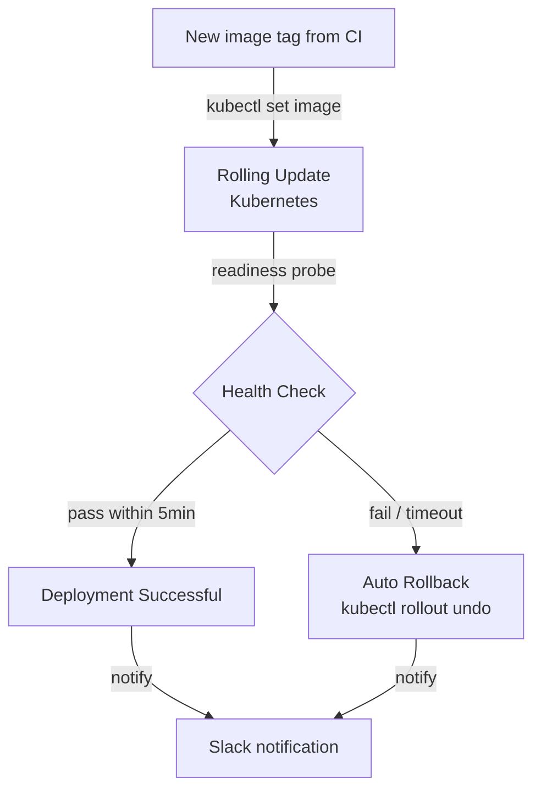

## Purpose

This page defines the exact steps for deploying a new service version to staging and production, how rollbacks are triggered, and how environment promotion is managed.

## Overview

Geonera uses a **blue-green deployment** strategy on Kubernetes. When a new version is deployed, the old pods are kept running until the new ones pass health checks. Traffic is shifted only after confirmation. Rollback restores the previous image version within 60 seconds using `kubectl rollout undo`.

Environments: **development** (local Docker Compose), **staging** (GKE cluster, 1 replica per service), **production** (GKE cluster, 2+ replicas per service with PodDisruptionBudget).

## Inputs

| Input | Type | Source | Description |
|-------|------|--------|-------------|
| Docker image tag | Git SHA | CI pipeline | New image version to deploy |
| Kubernetes manifests | YAML | `k8s/` directory | Deployment specs, services, configmaps |
| Manual approval | GitHub Actions gate | Maintainer | Required for production deployment |

## Outputs

| Output | Type | Destination | Description |
|--------|------|-------------|-------------|
| Updated deployment | Kubernetes | GKE cluster | Pods running new image version |
| Rollback | Kubernetes | GKE cluster | Previous image restored on failure |
| Deployment event | Slack notification | Engineering channel | Success or failure notification |

## Rules

- Production deployments require at least one reviewer approval in GitHub Actions.
- A deployment is considered failed if any pod fails its health check within 5 minutes.
- Failed deployments trigger automatic rollback — no manual intervention required.
- Database migrations run as Kubernetes Jobs before the new service pods start.
- PodDisruptionBudget ensures at least 1 replica remains available during rolling updates.
- All deployment events are logged to a `#deployments` Slack channel.

## Flow



## Example

### Kubernetes Deployment Manifest

```yaml
# k8s/indicator-service/deployment.yaml
apiVersion: apps/v1
kind: Deployment
metadata:
  name: indicator-service
  namespace: geonera
spec:
  replicas: 2
  strategy:
    type: RollingUpdate
    rollingUpdate:
      maxSurge: 1
      maxUnavailable: 0
  selector:
    matchLabels:
      app: indicator-service
  template:
    metadata:
      labels:
        app: indicator-service
    spec:
      containers:
        - name: indicator-service
          image: gcr.io/geonera/indicator-service:latest
          ports:
            - containerPort: 8080
          env:
            - name: RABBITMQ_URI
              valueFrom:
                secretKeyRef:
                  name: geonera-secrets
                  key: rabbitmq-uri
            - name: REDIS_CONNECTION
              valueFrom:
                secretKeyRef:
                  name: geonera-secrets
                  key: redis-connection
          readinessProbe:
            httpGet:
              path: /health
              port: 8080
            initialDelaySeconds: 10
            periodSeconds: 5
            failureThreshold: 6
          livenessProbe:
            httpGet:
              path: /health
              port: 8080
            initialDelaySeconds: 30
            periodSeconds: 10
          resources:
            requests:
              cpu: "250m"
              memory: "128Mi"
            limits:
              cpu: "1"
              memory: "256Mi"
---
apiVersion: policy/v1
kind: PodDisruptionBudget
metadata:
  name: indicator-service-pdb
  namespace: geonera
spec:
  minAvailable: 1
  selector:
    matchLabels:
      app: indicator-service
```

### Manual Rollback Command

```bash
# Roll back indicator-service to previous version
kubectl rollout undo deployment/indicator-service -n geonera

# Verify rollback
kubectl rollout status deployment/indicator-service -n geonera
kubectl get pods -n geonera -l app=indicator-service

# Check which image is running after rollback
kubectl describe deployment/indicator-service -n geonera | grep Image
```
