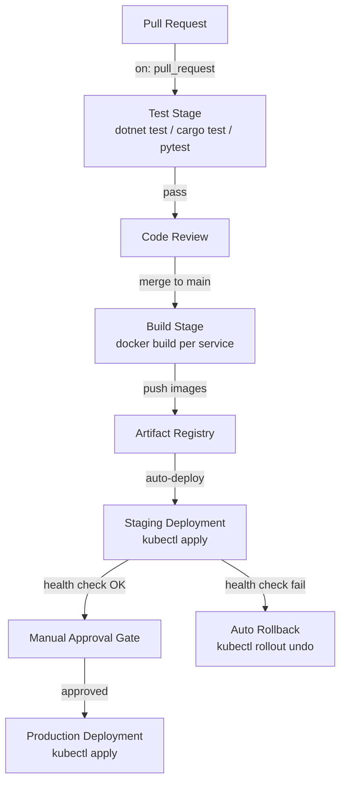

## Purpose

This page documents the CI/CD pipeline that builds, tests, and deploys every Geonera service. All automation is defined in GitHub Actions workflows.

## Overview

Geonera uses GitHub Actions for CI/CD. Every pull request triggers the full test suite. Merges to `main` trigger build, image push, and staging deployment. Promotion to production is a manual approval gate. The pipeline is language-aware — C# services use dotnet CLI, Rust services use cargo, Python services use pytest.

## Inputs

| Input | Type | Source | Description |
|-------|------|--------|-------------|
| Git push / PR | GitHub event | Developer | Triggers pipeline run |
| Secrets | GitHub Actions secrets | Repository settings | GCP credentials, registry auth |

## Outputs

| Output | Type | Destination | Description |
|--------|------|-------------|-------------|
| Test results | GitHub Actions summary | PR review | Pass/fail per service |
| Docker image | Artifact Registry | `gcr.io/geonera/<service>:<sha>` | Tagged image per commit |
| Deployment | Kubernetes apply | Staging / Production cluster | Updated pod spec |

## Rules

- No merge to `main` is allowed if any test stage fails.
- Docker images are only pushed on merge to `main`, not on PRs.
- Staging deployment is automatic on `main` merge.
- Production deployment requires manual approval from a maintainer.
- If a staging deployment fails health checks within 5 minutes, it is automatically rolled back.

## Flow



## Example

### GitHub Actions Workflow

```yaml
# .github/workflows/ci.yml
name: CI/CD Pipeline

on:
  pull_request:
    branches: [main]
  push:
    branches: [main]

env:
  REGISTRY: gcr.io/geonera

jobs:
  test-csharp:
    runs-on: ubuntu-latest
    steps:
      - uses: actions/checkout@v4
      - uses: actions/setup-dotnet@v3
        with:
          dotnet-version: "8.0.x"
      - name: Restore
        run: dotnet restore
      - name: Test
        run: dotnet test --no-restore --logger trx --results-directory ./test-results
      - name: Upload results
        uses: actions/upload-artifact@v4
        with:
          name: csharp-test-results
          path: ./test-results

  test-rust:
    runs-on: ubuntu-latest
    steps:
      - uses: actions/checkout@v4
      - uses: dtolnay/rust-toolchain@stable
      - name: Test
        run: cargo test --all

  test-python:
    runs-on: ubuntu-latest
    steps:
      - uses: actions/checkout@v4
      - uses: actions/setup-python@v5
        with:
          python-version: "3.11"
      - run: pip install -r requirements.txt
      - run: pytest tests/ -v --tb=short

  build-and-push:
    needs: [test-csharp, test-rust, test-python]
    if: github.ref == 'refs/heads/main'
    runs-on: ubuntu-latest
    strategy:
      matrix:
        service:
          - indicator-service
          - signal-generator
          - risk-manager
          - trade-executor
          - trade-tracker
          - tick-processor
          - candle-engine
    steps:
      - uses: actions/checkout@v4
      - uses: google-github-actions/auth@v2
        with:
          credentials_json: ${{ secrets.GCP_CREDENTIALS }}
      - run: gcloud auth configure-docker gcr.io
      - name: Build and push
        run: |
          IMAGE=${{ env.REGISTRY }}/${{ matrix.service }}
          SHA=${{ github.sha }}
          docker build -t $IMAGE:$SHA -t $IMAGE:latest \
            -f services/${{ matrix.service }}/Dockerfile .
          docker push $IMAGE:$SHA
          docker push $IMAGE:latest

  deploy-staging:
    needs: build-and-push
    runs-on: ubuntu-latest
    steps:
      - uses: actions/checkout@v4
      - uses: google-github-actions/get-gke-credentials@v2
        with:
          cluster_name: geonera-staging
          location: us-central1
      - run: |
          kubectl set image deployment/indicator-service \
            indicator-service=gcr.io/geonera/indicator-service:${{ github.sha }}
          kubectl rollout status deployment/indicator-service --timeout=5m
```
