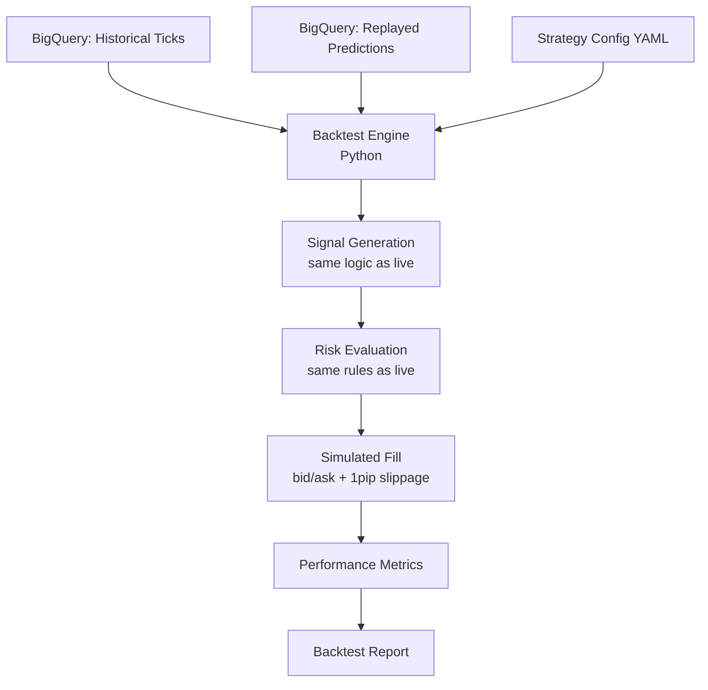

## Purpose

Backtesting validates that the trading strategy — signal rules, risk parameters, and AI model — would have been profitable and stable on historical data before deploying changes to live trading.

## Overview

Geonera's backtesting framework replays historical tick data from BigQuery through the complete signal generation and risk management pipeline (excluding live JForex execution). The backtest engine simulates order fills at the historical ask/bid prices, applies the same SL/TP logic, and computes performance metrics identical to the live system.

Backtesting is run before every major model deployment and before changes to risk rules or signal confluence parameters.

## Inputs

| Input | Type | Source | Description |
|-------|------|--------|-------------|
| Historical ticks | BigQuery `geonera.ticks_historical` | Backfill data | Full tick history per symbol |
| Historical indicators | BigQuery `geonera.indicators` | Precomputed | RSI, EMA, ATR, BB per candle |
| Strategy config | YAML | Config file | Risk params, confluence rules, model version |
| Model predictions (replayed) | BigQuery `geonera.predictions` | Prediction log | AI predictions from the period being tested |

## Outputs

| Output | Type | Destination | Description |
|--------|------|-------------|-------------|
| Backtest report | JSON + HTML | CI artifacts / dashboard | Full metrics and trade log |
| Trade log | CSV | CI artifacts | Per-trade PnL, SL/TP hit, duration |

## Rules

- Backtest must use the same SL/TP calculation logic as the live system (ATR-based).
- Slippage simulation: 1 pip is added to entry price on all market orders.
- Position sizing in backtest uses the same Kelly/volatility formula as live.
- Backtest must cover at least 6 months of data to be considered valid.
- A new model version must show positive Sharpe ratio (> 1.0) and < 15% max drawdown to be promoted.
- Walk-forward validation is required: train on N months, test on next 1 month, repeat.

## Flow



## Example

```python
# backtesting/engine.py
from dataclasses import dataclass
from typing import Optional
import pandas as pd

@dataclass
class BacktestTrade:
    symbol: str
    direction: str
    entry_price: float
    stop_loss: float
    take_profit: float
    lot_size: float
    open_time: pd.Timestamp
    close_time: Optional[pd.Timestamp] = None
    close_price: Optional[float] = None
    pnl: Optional[float] = None
    exit_reason: Optional[str] = None  # SL_HIT | TP_HIT | END_OF_DATA

class BacktestEngine:
    SLIPPAGE_PIPS = 0.0001  # 1 pip

    def __init__(self, config: dict):
        self.config = config
        self.trades: list[BacktestTrade] = []
        self.open_trade: Optional[BacktestTrade] = None
        self.equity = config["initial_equity"]
        self.peak_equity = self.equity

    def process_signal(self, signal: dict, timestamp: pd.Timestamp) -> None:
        if self.open_trade:
            return  # One position at a time

        entry = signal["entry_price"] + self.SLIPPAGE_PIPS
        trade = BacktestTrade(
            symbol=signal["symbol"],
            direction=signal["direction"],
            entry_price=entry,
            stop_loss=signal["stop_loss"],
            take_profit=signal["take_profit"],
            lot_size=signal["lot_size"],
            open_time=timestamp,
        )
        self.open_trade = trade

    def process_tick(self, tick: dict, timestamp: pd.Timestamp) -> None:
        if not self.open_trade:
            return

        trade = self.open_trade
        bid, ask = tick["bid"], tick["ask"]

        if trade.direction == "LONG":
            if bid <= trade.stop_loss:
                self._close_trade(trade, bid, timestamp, "SL_HIT")
            elif bid >= trade.take_profit:
                self._close_trade(trade, bid, timestamp, "TP_HIT")
        else:  # SHORT
            if ask >= trade.stop_loss:
                self._close_trade(trade, ask, timestamp, "SL_HIT")
            elif ask <= trade.take_profit:
                self._close_trade(trade, ask, timestamp, "TP_HIT")

    def _close_trade(self, trade: BacktestTrade, price: float,
                     timestamp: pd.Timestamp, reason: str) -> None:
        direction = 1 if trade.direction == "LONG" else -1
        trade.pnl = (price - trade.entry_price) * direction * trade.lot_size * 100000
        trade.close_price = price
        trade.close_time = timestamp
        trade.exit_reason = reason

        self.equity += trade.pnl
        self.peak_equity = max(self.peak_equity, self.equity)
        self.trades.append(trade)
        self.open_trade = None

    def metrics(self) -> dict:
        closed = [t for t in self.trades if t.pnl is not None]
        if not closed:
            return {}
        wins = [t for t in closed if t.pnl > 0]
        pnls = [t.pnl for t in closed]
        drawdown = (self.peak_equity - self.equity) / self.peak_equity * 100

        return {
            "total_trades":   len(closed),
            "win_rate":       len(wins) / len(closed),
            "total_pnl":      sum(pnls),
            "avg_pnl":        sum(pnls) / len(pnls),
            "max_drawdown_pct": drawdown,
            "sharpe_ratio":   self._sharpe(pnls),
        }

    def _sharpe(self, pnls: list[float], risk_free=0.0) -> float:
        import statistics
        if len(pnls) < 2:
            return 0.0
        mean = statistics.mean(pnls) - risk_free
        std = statistics.stdev(pnls)
        return mean / std if std > 0 else 0.0
```
