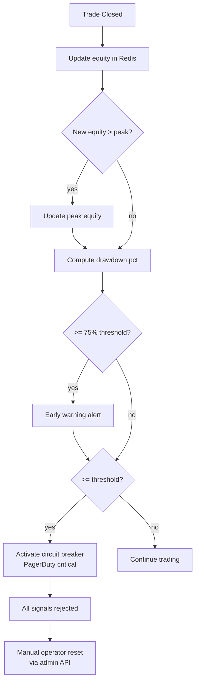

## Purpose

This page defines the drawdown control mechanisms that protect the account from catastrophic losses — the circuit breaker, equity tracking, and recovery procedures.

## Overview

Drawdown control operates at two levels: **real-time circuit breaker** (halts new trades when drawdown exceeds the threshold) and **peak equity tracking** (continuously updates the reference equity from which drawdown is measured). Recovery from a halt requires manual operator intervention via the admin API.

## Inputs

| Input | Type | Source | Description |
|-------|------|--------|-------------|
| Current equity | Redis `portfolio:equity` | TradeTracker | Live account balance |
| Peak equity | Redis `portfolio:peak_equity` | TradeTracker | Highest equity ever reached |
| Max drawdown config | Environment | Config | `MAX_DRAWDOWN_PCT` threshold (default: 10%) |

## Outputs

| Output | Type | Destination | Description |
|--------|------|-------------|-------------|
| Circuit breaker flag | Redis | RiskManager | Boolean — halts new trades |
| Drawdown alert | PagerDuty | On-call engineer | Fired when circuit breaker activates |
| Equity curve | BigQuery | Analytics dashboard | Daily equity and drawdown % |

## Rules

- Drawdown formula: `(peakEquity - currentEquity) / peakEquity × 100`.
- Circuit breaker activates at `drawdown >= config.maxDrawdownPct`.
- Once active, all new signals are rejected regardless of symbol.
- The circuit breaker does NOT close open positions — only prevents new entries.
- Manual reset via admin API (`POST /v1/admin/circuit-breaker/reset`) is required to resume.
- Early warning fires at 75% of the max drawdown threshold.

## Flow



## Example

```csharp
// RiskManager/Services/DrawdownController.cs
public class DrawdownController : IDrawdownController
{
    private const string CB_KEY = "circuit_breaker:active";

    public async Task UpdateEquityAsync(double newEquity)
    {
        await _cache.SetAsync("portfolio:equity", newEquity);

        double peak = await _cache.GetDoubleAsync("portfolio:peak_equity") ?? newEquity;
        if (newEquity > peak)
        {
            await _cache.SetAsync("portfolio:peak_equity", newEquity);
            peak = newEquity;
        }

        double drawdown = (peak - newEquity) / peak * 100.0;

        if (drawdown >= _config.MaxDrawdownPct * 0.75 && drawdown < _config.MaxDrawdownPct)
        {
            await _alerts.SendAsync(AlertSeverity.Warning,
                $"Drawdown warning: {drawdown:F1}% (threshold: {_config.MaxDrawdownPct}%)");
        }

        if (drawdown >= _config.MaxDrawdownPct)
        {
            await _cache.SetAsync(CB_KEY, true);
            await _alerts.SendAsync(AlertSeverity.Critical,
                $"CIRCUIT BREAKER: drawdown {drawdown:F1}% >= {_config.MaxDrawdownPct}%");
        }
    }

    public async Task<bool> IsCircuitBreakerActiveAsync()
        => await _cache.GetBoolAsync(CB_KEY) ?? false;

    public async Task ResetCircuitBreakerAsync(string operatorId, string reason)
    {
        await _cache.DeleteAsync(CB_KEY);
        _logger.LogWarning("Circuit breaker reset by {Operator}: {Reason}", operatorId, reason);
    }
}
```
