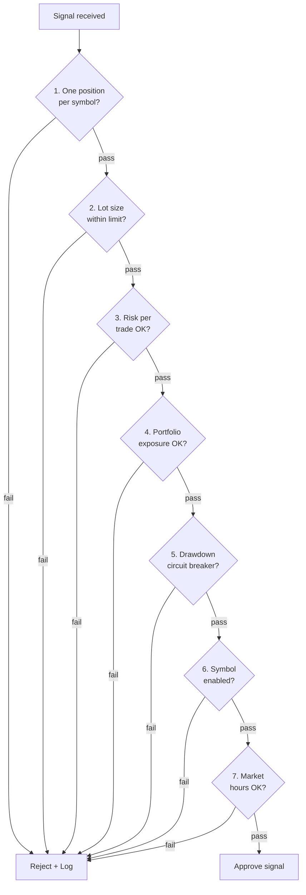

## Purpose

This page defines every risk rule enforced by the RiskManager service. No trade is executed unless all rules pass. Understanding these rules is mandatory for operators tuning the system or engineers extending the risk engine.

## Overview

The RiskManager is the last gate before a signal becomes a live trade. It evaluates seven independent rules in sequence. If any rule fails, the signal is rejected and logged. Rules are configurable via environment variables but have hard-coded minimums that cannot be overridden without a code change.

## Inputs

| Input | Type | Source | Description |
|-------|------|--------|-------------|
| Trading signal | RabbitMQ `signals.generated` | SignalGenerator | Proposed trade with SL/TP and lot size |
| Current equity | Redis | TradeTracker (updated on fill/close) | Live account equity |
| Open positions | Redis | TradeTracker | Current open positions per symbol |
| Portfolio exposure | Redis | RiskManager itself | Total current exposure as % of equity |
| Drawdown tracking | Redis | RiskManager itself | Running peak equity and current drawdown |

## Outputs

| Output | Type | Destination | Description |
|--------|------|-------------|-------------|
| Approved signal | RabbitMQ `signals.approved` | TradeExecutor | Signal cleared for execution |
| Rejected signal log | BigQuery `geonera.risk_rejections` | Analytics | Rejection with rule name and values |

## Rules

1. **One position per symbol** — Reject if an open position already exists for this symbol.
2. **Lot size limit** — Reject if `signal.lotSize > config.maxLotSize` (hard max: 5.0 lots).
3. **Risk per trade** — Reject if `(entry - stopLoss) × lotSize × contractSize > equity × riskPerTradePct`.
4. **Portfolio exposure** — Reject if total open exposure would exceed `config.maxExposurePct` of equity.
5. **Max drawdown circuit breaker** — Reject all signals if current drawdown exceeds `config.maxDrawdownPct`.
6. **Symbol enabled** — Reject if the symbol is disabled in the symbol registry.
7. **Market hours** — Reject if outside configured trading hours for the symbol (e.g., no XAUUSD trades 22:00-23:00 UTC Friday).

## Flow



## Example

```csharp
// RiskManager/Services/RiskEvaluator.cs
public class RiskEvaluator : IRiskEvaluator
{
    private readonly IRiskConfig _config;
    private readonly IPortfolioState _portfolio;

    public RiskDecision Evaluate(TradingSignal signal)
    {
        // Rule 1: One position per symbol
        if (_portfolio.HasOpenPosition(signal.Symbol))
            return RiskDecision.Reject(signal, "ONE_POSITION_PER_SYMBOL",
                $"Open position already exists for {signal.Symbol}");

        // Rule 2: Lot size limit
        double maxLot = Math.Min(_config.MaxLotSize, 5.0); // hard max 5.0
        if (signal.LotSize > maxLot)
            return RiskDecision.Reject(signal, "LOT_SIZE_EXCEEDED",
                $"LotSize {signal.LotSize} > max {maxLot}");

        // Rule 3: Risk per trade
        double equity = _portfolio.CurrentEquity;
        double riskAmount = Math.Abs(signal.EntryPrice - signal.StopLoss)
                            * signal.LotSize * 100_000;
        double maxRisk = equity * (_config.RiskPerTradePct / 100.0);
        if (riskAmount > maxRisk)
            return RiskDecision.Reject(signal, "RISK_PER_TRADE_EXCEEDED",
                $"Risk ${riskAmount:F2} > allowed ${maxRisk:F2}");

        // Rule 4: Portfolio exposure
        double newExposure = _portfolio.TotalExposure + (signal.LotSize * 100_000);
        double maxExposure = equity * (_config.MaxExposurePct / 100.0);
        if (newExposure > maxExposure)
            return RiskDecision.Reject(signal, "PORTFOLIO_EXPOSURE_EXCEEDED",
                $"New exposure ${newExposure:F2} > max ${maxExposure:F2}");

        // Rule 5: Drawdown circuit breaker
        double drawdown = _portfolio.CurrentDrawdownPct;
        if (drawdown >= _config.MaxDrawdownPct)
            return RiskDecision.Reject(signal, "CIRCUIT_BREAKER_ACTIVE",
                $"Drawdown {drawdown:F1}% >= threshold {_config.MaxDrawdownPct}%");

        // Rule 6: Symbol enabled
        if (!_config.IsSymbolEnabled(signal.Symbol))
            return RiskDecision.Reject(signal, "SYMBOL_DISABLED",
                $"{signal.Symbol} is disabled in symbol registry");

        // Rule 7: Market hours
        if (!_config.IsWithinTradingHours(signal.Symbol, DateTime.UtcNow))
            return RiskDecision.Reject(signal, "OUTSIDE_MARKET_HOURS",
                $"Outside configured trading hours for {signal.Symbol}");

        return RiskDecision.Approve(signal);
    }
}
```
