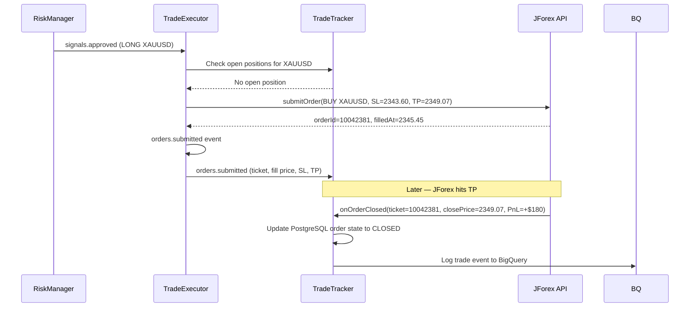

## Purpose

This page defines the exact rules governing when a trade is entered, when it is exited, and how SL/TP levels are calculated. These rules are deterministic and configuration-driven — there is no discretionary logic.

## Overview

Trade entries are triggered by approved signals from RiskManager. The TradeExecutor submits a market order immediately upon receiving an approved signal — there is no pending order waiting for price. Stop-loss and take-profit levels are embedded in the order at submission time using ATR-based calculation done by SignalGenerator.

Exits occur in three ways: (1) JForex hits the SL or TP automatically as part of the order, (2) the TradeTracker detects an opposing signal for the same symbol and closes the open position, or (3) an emergency close is triggered by the RiskManager circuit breaker (max drawdown breach).

## Inputs

| Input | Type | Source | Description |
|-------|------|--------|-------------|
| Approved signal | RabbitMQ `signals.approved` | RiskManager | Signal cleared for execution with SL/TP |
| Open position | PostgreSQL | TradeTracker | Currently open trades per symbol |
| Market price | JForex API | JForex live quote | Current bid/ask for order submission |

## Outputs

| Output | Type | Destination | Description |
|--------|------|-------------|-------------|
| Market order | JForex API | Dukascopy broker | Buy/sell with SL and TP attached |
| Order submitted event | RabbitMQ `orders.submitted` | TradeTracker | Ticket ID and order parameters |

## Rules

- Only one open position per symbol at a time. A new signal for a symbol with an existing open position is rejected by RiskManager.
- Entry is always a market order — no limit orders, no pending orders.
- Stop-loss is mandatory on every order. An order without SL is rejected before submission.
- Take-profit is mandatory on every order.
- If the signal direction opposes an existing open position for the same symbol, the existing position is closed first, then the new order is submitted.
- Trailing stop-loss is not used in production (configurable for future use).
- Slippage tolerance: if the execution price deviates more than 3 pips from `signal.entryPrice`, the trade is flagged for review but not cancelled.

## Flow



## Example

```csharp
// TradeExecutor/Services/ExecutionService.cs
public class ExecutionService : IExecutionService
{
    public async Task ExecuteSignalAsync(TradingSignal signal)
    {
        // Check for existing open position
        var openPosition = await _tradeTracker.GetOpenPositionAsync(signal.Symbol);
        if (openPosition != null)
        {
            if (openPosition.Direction != signal.Direction)
            {
                // Close opposing position before entering new
                await ClosePositionAsync(openPosition, reason: "opposing_signal");
            }
            else
            {
                _logger.LogInformation("Position already open for {Symbol} in same direction — skipping",
                    signal.Symbol);
                return;
            }
        }

        // Submit market order via JForex
        var orderRequest = new JForexOrderRequest
        {
            Symbol    = signal.Symbol,
            Direction = signal.Direction == "LONG" ? OrderCommand.BUY : OrderCommand.SELL,
            Amount    = signal.LotSize,
            StopLoss  = signal.StopLoss,
            TakeProfit = signal.TakeProfit,
            Label     = $"GEO-{signal.SignalId[..8]}", // JForex order label
        };

        var result = await _jforexGateway.SubmitOrderAsync(orderRequest);

        double slippage = Math.Abs(result.FillPrice - signal.EntryPrice);
        if (slippage > 0.0003) // 3 pips
            _logger.LogWarning("Slippage of {Pips} pips on {Symbol}", slippage / 0.0001, signal.Symbol);

        // Publish order submitted event
        _publisher.Publish("orders.exchange", "orders.submitted", new OrderSubmittedEvent
        {
            SignalId   = signal.SignalId,
            Symbol     = signal.Symbol,
            Ticket     = result.OrderId,
            Direction  = signal.Direction,
            FillPrice  = result.FillPrice,
            LotSize    = signal.LotSize,
            StopLoss   = signal.StopLoss,
            TakeProfit = signal.TakeProfit,
            SubmittedAt = DateTime.UtcNow,
        });
    }
}
```
