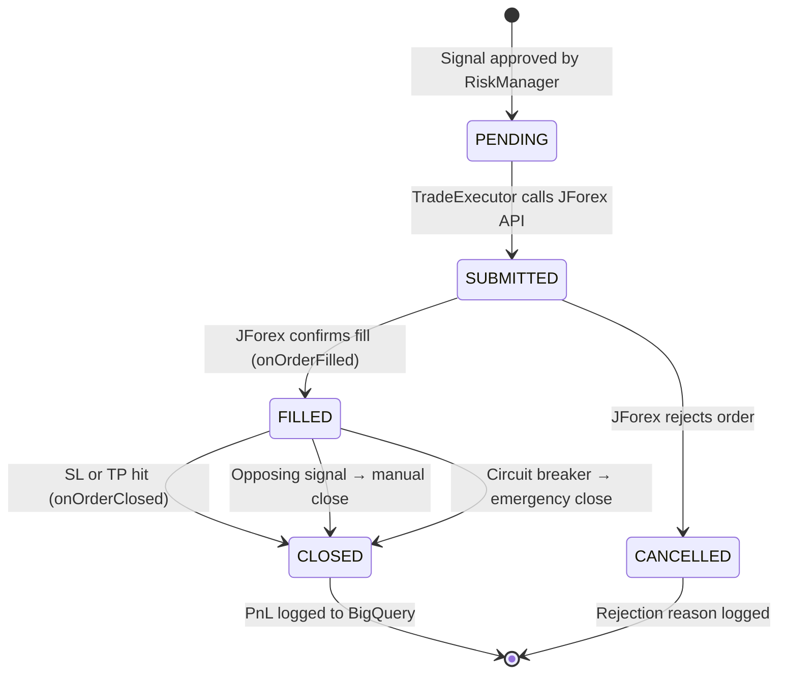

## Purpose

This page traces the complete lifecycle of a single trade from the moment an approved signal arrives at TradeExecutor to the moment the trade is closed and logged in BigQuery.

## Overview

Trade execution in Geonera is fully automated and stateful. The TradeExecutor submits orders via the JForex Java gateway. The TradeTracker maintains the order state machine in PostgreSQL and logs every state transition to BigQuery. The JForex client bridges the C# execution services to the Dukascopy broker using a shared RabbitMQ-based command/event protocol.

## Inputs

| Input | Type | Source | Description |
|-------|------|--------|-------------|
| Approved signal | RabbitMQ `signals.approved` | RiskManager | Final validated signal with lot size |
| JForex order events | RabbitMQ `jforex.events` | JForexClient | Fill confirmations, SL/TP hits, order cancellations |

## Outputs

| Output | Type | Destination | Description |
|--------|------|-------------|-------------|
| Order state | PostgreSQL `orders` table | TradeTracker | Current state of every trade |
| Trade event log | BigQuery `geonera.trade_events` | Analytics | Immutable event log per trade |
| Closed trade summary | BigQuery `geonera.trades` | Reporting | PnL, duration, fill prices |

## Rules

- Order states: `PENDING → SUBMITTED → FILLED → CLOSED` (or `CANCELLED`).
- An order stuck in `SUBMITTED` for more than 10 seconds fires an alert — JForex market orders should fill within 2 seconds.
- An order stuck in `FILLED` for more than 24 hours fires an alert for manual review.
- All state transitions are idempotent — replaying the same JForex event twice does not create duplicate records.
- PnL is calculated at close time using: `(closePrice - fillPrice) × lotSize × contractSize × direction_multiplier`.

## Flow



## Example

```csharp
// TradeTracker/Services/OrderStateMachine.cs
public class OrderStateMachine : IOrderStateMachine
{
    private readonly IPostgresRepository _db;
    private readonly IBigQueryWriter _bq;

    public async Task TransitionAsync(string ticket, OrderState newState, OrderEvent evt)
    {
        var order = await _db.GetOrderByTicketAsync(ticket);
        if (order == null)
        {
            _logger.LogWarning("Order {Ticket} not found — possible duplicate event", ticket);
            return;
        }

        // Idempotency: skip if already in this state
        if (order.State == newState) return;

        var validTransitions = new Dictionary<OrderState, OrderState[]>
        {
            [OrderState.Pending]   = [OrderState.Submitted],
            [OrderState.Submitted] = [OrderState.Filled, OrderState.Cancelled],
            [OrderState.Filled]    = [OrderState.Closed],
        };

        if (!validTransitions.TryGetValue(order.State, out var allowed) ||
            !allowed.Contains(newState))
        {
            _logger.LogError("Invalid transition {From} -> {To} for ticket {Ticket}",
                order.State, newState, ticket);
            return;
        }

        // Update PostgreSQL
        order.State = newState;
        order.UpdatedAt = DateTime.UtcNow;
        if (newState == OrderState.Filled)   order.FillPrice  = evt.Price;
        if (newState == OrderState.Closed)   order.ClosePrice = evt.Price;
        if (newState == OrderState.Closed)   order.PnL        = CalculatePnL(order, evt.Price);
        await _db.UpdateOrderAsync(order);

        // Log event to BigQuery (immutable audit log)
        await _bq.InsertAsync("geonera", "trade_events", new TradeEvent
        {
            Ticket      = ticket,
            Symbol      = order.Symbol,
            EventType   = newState.ToString(),
            Price       = evt.Price,
            Timestamp   = DateTime.UtcNow,
            SignalId    = order.SignalId,
        });
    }

    private double CalculatePnL(Order order, double closePrice)
    {
        double directionMultiplier = order.Direction == "LONG" ? 1.0 : -1.0;
        double priceDiff = (closePrice - order.FillPrice) * directionMultiplier;
        return priceDiff * order.LotSize * order.ContractSize;
    }
}
```
