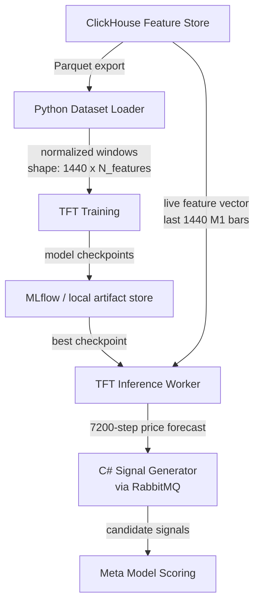

# AI/ML Pipeline

Geonera's AI/ML pipeline uses a **Temporal Fusion Transformer (TFT)** to generate multi-step price forecasts on M1 timeframe data. The pipeline covers data preparation, model architecture, training strategy, inference serving, and model lifecycle management.

---

## Table of Contents

- [Pipeline Overview](#pipeline-overview)
- [Model Selection Rationale](#model-selection-rationale)
- [Temporal Fusion Transformer Architecture](#temporal-fusion-transformer-architecture)
- [Input Feature Specification](#input-feature-specification)
- [Training Pipeline](#training-pipeline)
- [Inference Pipeline](#inference-pipeline)
- [Model Lifecycle Management](#model-lifecycle-management)
- [Hyperparameter Strategy](#hyperparameter-strategy)
- [Evaluation Metrics](#evaluation-metrics)
- [Failure Scenarios](#failure-scenarios)
- [Performance Considerations](#performance-considerations)
- [Trade-offs and Constraints](#trade-offs-and-constraints)

---

## Pipeline Overview



---

## Model Selection Rationale

### Why Temporal Fusion Transformer (TFT)

| Requirement | TFT Capability |
|---|---|
| Multi-step forecasting | TFT natively produces multi-horizon outputs in one forward pass |
| Heterogeneous features | TFT handles static, known-future, and observed covariates separately |
| Attention interpretability | TFT's attention weights expose which time steps and features matter most |
| Long-range dependency | Multi-head attention captures dependencies across the full 1440-bar lookback |
| Quantile output | TFT can produce prediction intervals (e.g., 10th/50th/90th percentile) |

### Why NOT alternatives

| Model | Rejection Reason |
|---|---|
| LSTM/GRU | Single-step or iterative multi-step (error accumulation); no native attention |
| N-BEATS | Univariate-focused; poor multi-covariate handling |
| Transformer (vanilla) | Lacks TFT's specialized gating mechanisms for time-series |
| Prophet | Insufficient for high-frequency financial data; no deep feature integration |
| ARIMA/SARIMA | Linear; cannot capture nonlinear market dynamics |

---

## Temporal Fusion Transformer Architecture

TFT is implemented via `pytorch-forecasting` (PyTorch backend) or `Darts` (unified API). The following describes the architectural components:

### Variable Selection Networks (VSN)
- Purpose: learns which input features are most predictive per time step
- Implementation: sparse soft-attention over feature embeddings
- One VSN for static inputs, one for encoder (past), one for decoder (future known)

### Gated Residual Network (GRN)
- Core building block used throughout TFT
- Formula: `GRN(x) = LayerNorm(x + GLU(Dense(ELU(Dense(x) + context))))`
- Purpose: selectively suppress irrelevant information via gating

### LSTM Encoder-Decoder
- Encoder: processes past observations (1440 M1 bars of features)
- Decoder: processes future known covariates (time features: hour, day, month for the next 7200 bars)
- Provides temporal sequence encoding as context for attention

### Multi-Head Attention
- Applied over the encoder output
- Allows the model to attend to specific past time steps regardless of distance
- Enables interpretability via attention weight extraction

### Output Layer
- Projects attention output to quantile forecasts
- Quantiles: [0.1, 0.5, 0.9] — providing point estimate (median) and confidence interval
- Shape: `[batch, 7200, 3]` for three quantiles across 7200 future steps

### Architecture Diagram

```
Input (1440 bars × N features)
        │
        ▼
Variable Selection Networks
        │
        ├──────────────────────────┐
        ▼                          ▼
Encoder LSTM (1440 steps)    Static Context
        │                          │
        └──────────┬───────────────┘
                   ▼
          Multi-Head Attention
                   │
                   ▼
          Gated Residual Networks
                   │
                   ▼
          Quantile Output Layer
                   │
                   ▼
     [7200 × 3] Forecast (Q10, Q50, Q90)
```

---

## Input Feature Specification

### Observed Past Covariates (encoder input, shape: [1440, N])
These features are known up to the current bar (t=0):
- OHLCV values: `open`, `high`, `low`, `close`, `volume` per each timeframe (M1, M5, M15, H1, H4, D1)
- Technical indicators: RSI, EMA(20/50), MACD (line/signal/hist), ATR, ADX, BB (upper/lower/width)
- Statistical: log returns (1/5/20 bar), rolling vol, Z-score of close
- Volume microstructure: tick count, volume imbalance, spread

### Known Future Covariates (decoder input, shape: [7200, M])
These features are deterministically known for future bars:
- `hour_of_day` (cyclical encoded: sin/cos of hour/24)
- `day_of_week` (cyclical encoded: sin/cos of day/7)
- `month` (cyclical encoded: sin/cos of month/12)

### Static Covariates (per sample)
- `instrument_id` (embedding; e.g., EURUSD → index 0)
- Used by TFT's static context to condition encoder/decoder

### Normalization
- All price-based features normalized using `InstanceNormalization` (normalize per-sample, not dataset-wide), preventing lookahead bias
- Indicator values normalized to `[-1, 1]` range using training-set statistics stored in PostgreSQL
- Target (close price) normalized using the last known close (relative returns basis)

---

## Training Pipeline

### Environment
- **Runtime:** Python 3.11+
- **Framework:** PyTorch 2.x + pytorch-forecasting OR Darts (TFTModel)
- **Hardware:** CUDA-capable GPU recommended (RTX 3090 or better); fallback to CPU (20-50x slower)
- **Distributed training:** PyTorch DDP for multi-GPU if available

### Data Loading
```python
# Pseudocode: dataset construction
dataset = TimeSeriesDataSet(
    data=df,                          # DataFrame with features
    time_idx="bar_index",             # integer time index
    target="close_normalized",        # prediction target
    group_ids=["instrument"],         # one model per instrument OR single multi-instrument model
    min_encoder_length=720,           # minimum lookback
    max_encoder_length=1440,          # maximum lookback (1440 M1 bars = 24h)
    min_prediction_length=1,
    max_prediction_length=7200,       # 5 days forward on M1
    time_varying_known_reals=["hour_sin", "hour_cos", "dow_sin", "dow_cos"],
    time_varying_unknown_reals=["close", "volume", "rsi_14", ...],
    static_categoricals=["instrument"],
)
```

### Training Configuration
- **Loss function:** QuantileLoss with quantiles `[0.1, 0.5, 0.9]`
- **Optimizer:** Adam with learning rate warmup
- **Learning rate:** 1e-3 initial, cosine annealing schedule
- **Batch size:** 64 samples (reduce to 32 if OOM on GPU)
- **Max epochs:** 100; early stopping on validation QuantileLoss (patience=10)
- **Gradient clipping:** max_norm=1.0 (prevents exploding gradients on long sequences)
- **Validation split:** Last 20% of time period (NOT random split — must preserve temporal order)

### Checkpointing
- Save best checkpoint based on validation loss after each epoch
- Checkpoints stored in: `artifacts/models/{instrument}/{run_id}/checkpoint_best.pt`
- Model metadata (hyperparameters, training data range, normalization params) stored in PostgreSQL `model_registry` table

### Experiment Tracking
- MLflow for experiment tracking (optional; can be replaced with custom logging)
- Logs: epoch loss, validation metrics, learning rate, GPU utilization
- Artifacts: model checkpoint, normalization parameters, feature list

---

## Inference Pipeline

### Deployment Model
- Python workers run as long-lived processes (not serverless)
- Workers consume from RabbitMQ queue `geonera.inference.requests`
- Each worker loads model into GPU/CPU memory on startup
- Worker pool size scales horizontally by instrument count or load

### Inference Request
```json
{
  "instrument": "EURUSD",
  "as_of_timestamp": "2024-01-15T14:00:00Z",
  "model_version": "v2024.01.10",
  "features": { "...1440 bars of feature data..." }
}
```

### Inference Response (published to RabbitMQ)
```json
{
  "instrument": "EURUSD",
  "as_of_timestamp": "2024-01-15T14:00:00Z",
  "model_version": "v2024.01.10",
  "forecast": {
    "q10": [1.09231, 1.09245, ...],
    "q50": [1.09250, 1.09268, ...],
    "q90": [1.09269, 1.09291, ...]
  },
  "horizon_minutes": 7200,
  "inference_latency_ms": 142
}
```

### Model Loading Strategy
- Model loaded once at worker startup; held in memory
- Model reload triggered by `model.reload` event on RabbitMQ fanout exchange
- Zero-downtime reload: new model loaded in background; traffic switched after validation pass

---

## Model Lifecycle Management

| Stage | Description | Tooling |
|---|---|---|
| Training | Full retraining on updated historical data | Scheduled job (weekly or triggered) |
| Validation | Backtesting on holdout period; must pass min accuracy threshold | Python backtesting harness |
| Registration | Metadata and checkpoint stored in PostgreSQL `model_registry` | Automated post-training |
| Promotion | Manual approval (or automated if metric gates pass) to production | Admin UI action |
| Serving | Inference workers load from model registry | Auto-reload on promotion event |
| Deprecation | Old model versions retained for 90 days; rolled back on performance degradation | Monitoring alert triggers rollback |

### Model Registry Schema (PostgreSQL)
```sql
CREATE TABLE model_registry (
    id              UUID PRIMARY KEY,
    instrument      VARCHAR(20),
    version         VARCHAR(50),
    training_from   TIMESTAMP,
    training_to     TIMESTAMP,
    artifact_path   TEXT,
    val_q50_mae     FLOAT,
    val_q50_rmse    FLOAT,
    val_wql         FLOAT,      -- weighted quantile loss
    status          VARCHAR(20) CHECK (status IN ('candidate', 'production', 'deprecated')),
    promoted_at     TIMESTAMP,
    created_at      TIMESTAMP DEFAULT NOW()
);
```

---

## Hyperparameter Strategy

| Hyperparameter | Default Value | Tuning Range | Notes |
|---|---|---|---|
| `hidden_size` | 256 | [128, 512] | VSN and GRN hidden dimension |
| `attention_head_size` | 4 | [2, 8] | Multi-head attention heads |
| `dropout` | 0.1 | [0.05, 0.3] | Applied in GRN and attention |
| `hidden_continuous_size` | 64 | [32, 128] | Continuous variable embedding |
| `lstm_layers` | 2 | [1, 4] | Encoder/decoder LSTM depth |
| `max_encoder_length` | 1440 | [720, 2880] | Lookback window in M1 bars |
| `max_prediction_length` | 7200 | [1440, 7200] | Forecast horizon |
| `learning_rate` | 1e-3 | [1e-4, 1e-2] | Adam lr |

Tuning method: Optuna Bayesian optimization over 50 trials on a fixed validation fold.

---

## Evaluation Metrics

| Metric | Formula | Threshold |
|---|---|---|
| MAE (Q50) | Mean absolute error of median forecast | `< 0.001` for EURUSD (1 pip = 0.00010) |
| RMSE (Q50) | Root mean squared error of median | Lower is better; no hard threshold |
| WQL | Weighted quantile loss across Q10/Q50/Q90 | Primary training metric |
| MAPE | Mean absolute percentage error | `< 0.1%` for FX instruments |
| Directional Accuracy | % of bars where forecast direction matches actual | `> 52%` (random baseline = 50%) |
| Coverage (Q10/Q90) | % of actuals within predicted interval | Should be ~80% for Q10/Q90 interval |

---

## Failure Scenarios

| Scenario | Impact | Mitigation |
|---|---|---|
| GPU OOM during training | Training crash | Reduce batch size; use gradient checkpointing |
| NaN loss during training | Model divergence | Gradient clipping; lower learning rate; check for NaN in input features |
| Inference worker crashes | Queue messages accumulate | Auto-restart via process supervisor (systemd/Docker restart policy) |
| Model produces NaN output | Signal generator receives invalid forecast | Validate inference output; reject NaN predictions; alert |
| Stale model in production | Model accuracy degrades as market regime changes | Monitoring: track prediction error on realized data; alert on drift |
| Training data too short | Model underfits; poor generalization | Minimum 2 years of M1 data required before training |
| Feature mismatch at inference | Model trained on different feature set than live feed | Feature list hash stored in model registry; validated at load time |

---

## Performance Considerations

- **Training time:** Full TFT training on 5 years of EURUSD M1 (2.6M bars, encoder=1440, horizon=7200): approximately 4-12 hours on RTX 3090 depending on hyperparameters
- **Inference latency:** Single sample forward pass: ~50-200ms on GPU; ~2-10s on CPU. For real-time signal generation, GPU inference is required
- **Memory footprint:** TFT model with hidden_size=256: ~500MB on GPU; full inference batch of 32 samples: ~2GB VRAM
- **Throughput:** Single GPU worker can process ~20-50 inference requests per minute (each request = one 7200-step forecast)
- **Batch inference:** If multiple instruments are processed simultaneously, batch them in a single forward pass for GPU efficiency
- **Model artifact size:** Checkpoint file: ~200-500MB; compressed: ~150-300MB

---

## Trade-offs and Constraints

- **Forecast horizon vs accuracy:** 7200-step forecasts degrade rapidly in accuracy beyond the first 500-1000 steps. The meta model compensates by evaluating signal quality at the expected trade duration, not at the full horizon.
- **Single model vs multi-instrument:** Training one model per instrument is more accurate but multiplies training cost. Multi-instrument models with instrument embeddings reduce cost but may underfit instrument-specific dynamics.
- **Quantile loss vs point forecast:** Quantile output provides uncertainty bounds useful for signal filtering, but adds model complexity and training time.
- **Lookahead bias risk:** Normalization parameters MUST be computed on training data only and stored separately; applying test-set statistics to training data invalidates all metrics.
- **Market regime change:** TFT is a static model trained on historical data. It cannot adapt to sudden regime changes (e.g., COVID-19 crash) without retraining. Monitoring and frequent retraining cycles are critical.
