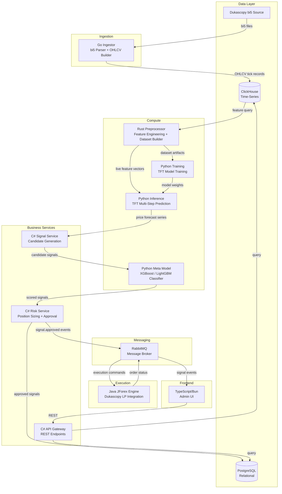

# System Architecture

Geonera is built on a **polyglot microservices architecture** where each language is selected for its specific performance and ecosystem advantages. Services communicate asynchronously via RabbitMQ and synchronously via REST. Data is partitioned across ClickHouse (time-series) and PostgreSQL (relational).

---

## Table of Contents

- [Architectural Philosophy](#architectural-philosophy)
- [Service Topology](#service-topology)
- [Polyglot Rationale](#polyglot-rationale)
- [Data Store Architecture](#data-store-architecture)
- [Communication Patterns](#communication-patterns)
- [Service Responsibilities Matrix](#service-responsibilities-matrix)
- [Deployment Boundaries](#deployment-boundaries)
- [Failure Domains](#failure-domains)
- [Trade-offs and Constraints](#trade-offs-and-constraints)

---

## Architectural Philosophy

Geonera follows three core architectural principles:

1. **Separation of concerns by performance profile** — Computationally intensive work (preprocessing, inference) is isolated in Rust and Python respectively; business logic lives in C#; I/O-intensive ingestion lives in Go.
2. **Asynchronous-first communication** — Services do not block on downstream consumers. RabbitMQ decouples producers from consumers and provides backpressure handling.
3. **Immutable data lineage** — Raw tick data is never modified after ingestion. All transformations produce new data artifacts stored in separate ClickHouse tables/schemas.

---

## Service Topology



---

## Polyglot Rationale

Each language was selected for a non-negotiable reason:

### Go — Data Ingestion
- **Why:** Goroutines provide massive concurrency for downloading and parsing bi5 files in parallel. Go's net/http and file I/O primitives handle the throughput requirements without the overhead of JVM warm-up or Python's GIL.
- **Constraint:** Go owns only the ingestion boundary. It does NOT perform feature computation.
- **Trade-off:** Lacks mature ML ecosystem; strictly kept out of AI pipeline.

### Rust — Preprocessing and Dataset Builder
- **Why:** bi5 parsing produces tens of millions of tick records. Transforming this into multi-timeframe OHLCV feature matrices requires zero-copy operations, SIMD-friendly data layouts, and guaranteed memory bounds. Rust delivers this without garbage collector pauses.
- **Constraint:** Rust components run as batch jobs or stream processors. They do not serve HTTP in the hot path.
- **Trade-off:** Higher developer onboarding cost. Justified by 10-50x throughput improvement over Python for equivalent transform pipelines.

### Python — AI/ML
- **Why:** PyTorch (TFT via pytorch-forecasting or Darts), XGBoost, LightGBM, SHAP, and scikit-learn are Python-native. No viable alternative ecosystem exists for the model types required.
- **Constraint:** Python services are never in the synchronous trading execution path. They run as inference workers consuming from RabbitMQ or exposing gRPC/REST endpoints with pre-loaded models.
- **Trade-off:** GIL limits true parallelism within a single process; solved via multi-process workers (Gunicorn/Uvicorn) or GPU offloading.

### C# (.NET) — Backend Microservices
- **Why:** Strong typing, mature ASP.NET Core ecosystem, first-class async/await, and enterprise-grade tooling for building REST APIs and domain services. Integrates cleanly with RabbitMQ via MassTransit or raw AMQP client.
- **Constraint:** C# services orchestrate business logic but delegate ML inference to Python workers via message queue or internal HTTP.
- **Trade-off:** Heavier runtime than Go for raw throughput workloads; not used in I/O-first ingestion roles.

### Java — JForex Execution
- **Why:** Dukascopy's JForex SDK is Java-only. There is no officially supported binding for any other language. Interoperability via JNI, gRPC bridge, or subprocess would introduce unacceptable latency and reliability risk in an execution-critical path.
- **Constraint:** Java service handles ONLY JForex API interaction. No business logic, no ML, no storage.
- **Trade-off:** JVM warm-up time must be accounted for in deployment; mitigated by keeping the JVM process alive (not restarting per trade).

### TypeScript + Bun — Admin UI Backend
- **Why:** Bun provides a fast TypeScript runtime with native bundling and faster startup than Node.js. Admin UI requires real-time signal streaming (WebSocket), REST consumption, and light server-side processing.
- **Constraint:** Bun/TypeScript layer serves the admin frontend only. It does not participate in the trading pipeline.
- **Trade-off:** Bun ecosystem is less mature than Node.js; acceptable for an internal admin tool with lower reliability SLA than the trading core.

---

## Data Store Architecture

### ClickHouse
- **Role:** Primary store for all time-series data
- **Data types stored:**
  - Raw tick records (bid/ask/volume from bi5)
  - OHLCV records per timeframe (M1, M5, M15, H1, H4, D1)
  - Computed feature vectors (indicators, statistical features)
  - Model inference outputs (predicted price series)
- **Engine choice:** `ReplicatedMergeTree` for production; `MergeTree` for single-node dev
- **Partitioning:** By instrument + date (`toYYYYMM(timestamp)`)
- **Why ClickHouse over TimescaleDB/InfluxDB:** Superior aggregation performance on ORDER BY queries across millions of rows; native support for columnar compression reduces storage 5-10x vs row-based; SQL dialect is familiar

### PostgreSQL
- **Role:** Source of truth for business-layer relational state
- **Data types stored:**
  - Signal records (candidate + scored + approved)
  - Position state (open, closed, PnL)
  - Strategy configurations
  - User/account state (future SaaS layer)
  - Audit log (signal lifecycle events)
- **Why PostgreSQL:** ACID compliance, mature JSON support, strong migration tooling (Flyway/EF Core)

---

## Communication Patterns

### Asynchronous — RabbitMQ
- **Used for:** Event-driven pipeline steps where producer and consumer can operate at different rates
- **Exchange types used:**
  - `direct` — point-to-point routing (e.g., risk-approved signal → JForex executor)
  - `topic` — fan-out to multiple consumers (e.g., signal.generated → admin UI + risk service)
  - `fanout` — broadcast (e.g., model reload events)
- **Durability:** All queues and messages are durable (persistent to disk)
- **Consumer acknowledgment:** Manual ACK after processing; failed messages go to Dead Letter Queue (DLQ)

```
Exchange: geonera.signals
  Routing key: signal.generated   → Risk Service queue
  Routing key: signal.approved    → JForex Executor queue
  Routing key: signal.approved    → Admin UI notification queue
  Routing key: signal.rejected    → Audit log queue

Exchange: geonera.execution
  Routing key: order.submitted    → Admin UI queue
  Routing key: order.filled       → Position tracker queue
  Routing key: order.rejected     → Risk Service queue (for retry decision)
```

### Synchronous — REST (HTTP/JSON)
- **Used for:** Request-response operations where the caller needs an immediate answer
- **Locations:**
  - Admin UI → C# API Gateway (signal queries, config updates)
  - C# Signal Service → Python Inference (if pull-based; alternative to MQ push)
  - Internal health check endpoints

---

## Service Responsibilities Matrix

| Service | Language | Reads From | Writes To | Consumes MQ | Publishes MQ |
|---|---|---|---|---|---|
| Go Ingestor | Go | Dukascopy bi5 | ClickHouse | No | No |
| Rust Preprocessor | Rust | ClickHouse | ClickHouse (feature store) | No | No |
| Python TFT Trainer | Python | ClickHouse (feature store) | Model artifact store | No | No |
| Python TFT Inference | Python | Feature store + Model | ClickHouse (predictions) | signal.infer.requested | signal.forecast.ready |
| C# Signal Service | C# | ClickHouse (predictions) + PG | PostgreSQL | signal.forecast.ready | signal.generated |
| Python Meta Model | Python | PostgreSQL (candidates) | PostgreSQL (scored) | signal.generated | signal.scored |
| C# Risk Service | C# | PostgreSQL (scored) | PostgreSQL (approved) | signal.scored | signal.approved / signal.rejected |
| Java JForex Engine | Java | — | — | signal.approved | order.submitted, order.filled |
| C# API Gateway | C# | PostgreSQL + ClickHouse | — | No | No |
| Admin UI (Bun) | TypeScript | C# API Gateway | — | WebSocket feed | No |

---

## Deployment Boundaries

Each service is independently deployable as a container (Docker). Recommended deployment unit:

- **Go Ingestor:** Single instance or horizontally scaled by instrument partition
- **Rust Preprocessor:** Batch job (cron-triggered or event-triggered); runs to completion
- **Python Training:** Offline batch job; GPU-enabled node; not in real-time path
- **Python Inference:** Long-running worker process; horizontally scalable by queue consumer count
- **Python Meta Model:** Long-running worker; horizontally scalable
- **C# Services:** Horizontally scalable stateless instances behind load balancer
- **Java JForex Engine:** Single instance per JForex account (JForex SDK constraints); active-standby HA
- **RabbitMQ:** Clustered (3 nodes minimum for quorum queues)
- **ClickHouse:** Replicated cluster (sharded by instrument)
- **PostgreSQL:** Primary + read replica; or managed service (RDS/CloudSQL)

---

## Failure Domains

| Failure | Impact | Mitigation |
|---|---|---|
| Go Ingestor down | No new tick data ingested; existing data unaffected | Restart + backfill from bi5 archive |
| Rust Preprocessor fails | Feature store not updated; inference uses stale features | Alert + re-trigger batch job |
| Python Inference down | No new forecasts; signals blocked at MQ | Queue messages accumulate; consumer auto-restarts |
| C# Signal Service down | Forecasts accumulate in MQ; no signals generated | Auto-restart; DLQ prevents message loss |
| Python Meta Model down | Signals not scored; Risk Service blocked | DLQ + alert; signals can be manually reviewed |
| C# Risk Service down | Scored signals not approved; no orders sent | DLQ; no trades executed (safe failure mode) |
| Java JForex Engine down | No order execution | Active-standby failover; unprocessed messages in DLQ |
| RabbitMQ down | All async communication halted | Cluster + quorum queues; persistent messages survive broker restart |
| ClickHouse down | No time-series reads or writes; pipeline halted | Replication; read from replica during primary recovery |
| PostgreSQL down | No relational reads/writes; API returns errors | Read replica failover; write-ahead log ensures durability |

---

## Trade-offs and Constraints

- **Operational complexity:** Polyglot stack requires per-language CI/CD, monitoring agents, and developer expertise. Justified by performance requirements.
- **No shared memory between services:** All inter-service state is via message queue or database. This eliminates distributed shared memory bugs at the cost of latency on each hop.
- **JForex single-instance constraint:** The Java execution engine cannot be horizontally scaled due to JForex SDK session limitations. HA requires active-standby, not active-active.
- **Python GIL in inference path:** Multi-step TFT inference is CPU/GPU-bound; solved by multi-process (not multi-thread) workers. Memory footprint scales with worker count.
- **ClickHouse eventual consistency on replicas:** Read replicas may lag behind primary by milliseconds to seconds. Inference queries must target the primary or account for replication lag.
