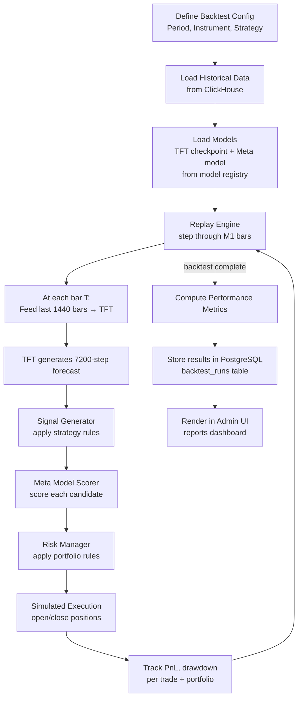

# Backtesting & Validation

Geonera's backtesting system validates the end-to-end trading strategy — from TFT forecasts through signal generation, meta-model scoring, and risk management — against historical price data. It measures strategy robustness, detects overfitting, and provides performance benchmarks before promoting a model or strategy configuration to production.

---

## Table of Contents

- [Backtesting Philosophy](#backtesting-philosophy)
- [Backtesting Architecture](#backtesting-architecture)
- [Simulation Engine](#simulation-engine)
- [Performance Metrics](#performance-metrics)
- [Walk-Forward Validation](#walk-forward-validation)
- [Out-of-Sample Testing Protocol](#out-of-sample-testing-protocol)
- [Overfitting Detection](#overfitting-detection)
- [Results Storage and Reporting](#results-storage-and-reporting)
- [Failure Scenarios](#failure-scenarios)
- [Trade-offs and Constraints](#trade-offs-and-constraints)

---

## Backtesting Philosophy

Geonera's backtest is NOT a simple price-replay simulation. It is a **full pipeline replay** that:

1. Uses the same TFT model (or a trained historical version) to regenerate forecasts on historical data
2. Applies the same signal generation algorithm
3. Scores signals with the meta model (trained on data strictly before the test period)
4. Applies risk management rules using simulated account state
5. Simulates trade execution with realistic assumptions (spread, slippage, swap)

This approach catches pipeline-level bugs and biases that simple strategy backtests miss.

### Strict anti-lookahead principles:
- **No future data leakage:** At each backtest step `t`, only data available at `t` is used
- **Model separation:** TFT and meta models used in backtest must be trained exclusively on data before the test period start
- **Feature construction:** Features computed using only past data at each step (no look-forward in rolling windows)
- **No bar-filling assumptions:** Entry/exit assumed at open of next bar after signal confirmation, not at signal bar close

---

## Backtesting Architecture



---

## Simulation Engine

### Bar-by-Bar Replay

The engine advances one M1 bar at a time:

```python
def run_backtest(config: BacktestConfig) -> BacktestResult:
    account = SimulatedAccount(initial_equity=config.initial_equity)
    open_positions = []
    trade_log = []

    bars = load_ohlcv_m1(config.instrument, config.start, config.end)

    for i, bar in enumerate(bars):
        # 1. Check existing positions: did any hit target or stop?
        for pos in list(open_positions):
            outcome = check_exit(pos, bar)
            if outcome:
                account.realize_pnl(outcome.pnl)
                trade_log.append(outcome)
                open_positions.remove(pos)

        # 2. Check if horizon expired for any position
        for pos in list(open_positions):
            if bar.index - pos.entry_bar_index >= pos.horizon_bars:
                outcome = close_at_market(pos, bar.open)  # expire at bar open
                account.realize_pnl(outcome.pnl)
                trade_log.append(outcome)
                open_positions.remove(pos)

        # 3. Only generate new signal every N bars (inference frequency)
        if i % config.inference_every_n_bars == 0:
            lookback = bars[max(0, i-1440):i]
            if len(lookback) == 1440:
                features = extract_features(lookback)
                forecast = tft_model.predict(features)
                candidates = signal_generator.generate(forecast, bar.close, strategy_config)
                scored = meta_model.score_batch(candidates, context_at=bar.timestamp)
                approved = risk_manager.evaluate_batch(scored, account, open_positions)

                for signal in approved:
                    position = open_position(signal, entry_price=bars[i+1].open)  # next bar open
                    open_positions.append(position)

    return compute_metrics(trade_log, account)
```

### Execution Assumptions

| Assumption | Value | Rationale |
|---|---|---|
| Entry execution | Next M1 bar open | Conservative; avoids bar-open fill assumption |
| Spread | Instrument-specific historical spread | Loaded from ClickHouse `ticks` bid-ask spread data |
| Slippage | 0.5 pips (configurable) | Conservative estimate for liquid FX pairs |
| Commission | $3.5 per lot per side (configurable) | Approximate Dukascopy commission |
| Swap | Not modeled in base case | Can be added per instrument/direction |
| Partial fills | Not modeled | Position always fully filled at computed size |
| Position expiry | Close at next bar open after `horizon_bars` elapsed | Conservative; penalizes slow signals |

### Stop and Target Execution

```
For LONG position with target T and stop S:
  If bar.low <= S:   → stop hit → close at S (worst case)
  If bar.high >= T:  → target hit → close at T
  If bar.low <= S AND bar.high >= T: → assume stop hit (conservative)
  Neither: → position remains open
```

---

## Performance Metrics

### Trade-Level Metrics

| Metric | Formula | Target |
|---|---|---|
| Win Rate | `wins / total_trades` | > 45% |
| Average R:R (realized) | `avg(profit_pips) / avg(loss_pips)` | > 1.5 |
| Expectancy | `win_rate × avg_win - loss_rate × avg_loss` | > 0 pips |
| Average trade duration | `avg(close_bar - entry_bar)` | < 1440 bars |
| Max consecutive losses | `max sequence of losses` | < 8 |
| Profit factor | `sum(wins) / sum(losses)` | > 1.3 |

### Portfolio-Level Metrics

| Metric | Formula | Target |
|---|---|---|
| Total Return | `(final_equity - initial_equity) / initial_equity` | > 0% |
| CAGR | `(final/initial)^(1/years) - 1` | > 15% annually |
| Max Drawdown | `max(peak - trough) / peak` | < 20% |
| Sharpe Ratio | `mean(daily_returns) / std(daily_returns) × √252` | > 1.0 |
| Calmar Ratio | `CAGR / max_drawdown` | > 1.0 |
| Sortino Ratio | `mean(daily_returns) / downside_std × √252` | > 1.5 |
| Recovery Factor | `total_return / max_drawdown` | > 3.0 |

### Model-Level Metrics (for TFT evaluation)

| Metric | Description |
|---|---|
| Directional Accuracy | % of signals where forecast direction matched outcome |
| Signal Yield | % of candidates surviving meta model threshold |
| Meta Model Precision | `true_profits / (true_profits + false_profits)` on test period |
| Meta Model Recall | `true_profits / all_actual_profits` |

---

## Walk-Forward Validation

Walk-forward validation simulates the real-world model update cycle.

### Structure

```
Total data: 2019 – 2024 (5 years)

Fold 1: Train [2019-2021] → Test [2022-01 to 2022-06]
Fold 2: Train [2019-2022] → Test [2022-07 to 2023-01]
Fold 3: Train [2019-2023] → Test [2023-02 to 2023-07]
Fold 4: Train [2019-2023-07] → Test [2023-08 to 2024-01]
Fold 5: Train [2019-2024-01] → Test [2024-02 to 2024-06]
```

- Each fold retrains both TFT and meta model
- Test periods are contiguous and non-overlapping
- Performance metrics averaged across folds
- High variance across folds = unstable strategy

### Purge Period
- 30-day gap between train end and test start
- Prevents data contamination from signals near the fold boundary

---

## Out-of-Sample Testing Protocol

Beyond walk-forward CV, a **final holdout period** is preserved:

- **Holdout period:** Last 6 months of available data (never used in any training fold)
- **Access rule:** Holdout is evaluated ONCE per model generation, immediately before production promotion
- **Purpose:** Provides unbiased final estimate of real-world performance
- **Access gate:** Only accessible via Admin UI with explicit "Release Holdout" approval action; prevents accidental evaluation

---

## Overfitting Detection

| Warning Sign | Detection Method | Response |
|---|---|---|
| Train metrics >> Test metrics | Compare in-sample vs out-of-sample Sharpe | Reduce model complexity; add regularization |
| Performance varies widely across folds | High std of Sharpe across WFV folds | Investigate regime sensitivity; test on more instruments |
| Strategy profits only in trending months | Monthly breakdown of returns | Add regime filter or reduce forecast horizon |
| Meta model AUC >> 0.75 on training | May be overfitted to historical quirks | Increase purge window; reduce feature set |
| Win rate drops > 10% OOS vs IS | Systematic lookahead or data leakage | Audit feature construction for leakage |

---

## Results Storage and Reporting

### PostgreSQL: `backtest_runs` Table

```sql
CREATE TABLE backtest_runs (
    id                  UUID PRIMARY KEY DEFAULT gen_random_uuid(),
    name                VARCHAR(200),
    instrument          VARCHAR(20),
    start_date          DATE,
    end_date            DATE,
    initial_equity      DECIMAL(18, 2),
    final_equity        DECIMAL(18, 2),
    total_trades        INT,
    win_rate            DECIMAL(6, 4),
    profit_factor       DECIMAL(8, 4),
    max_drawdown_pct    DECIMAL(6, 4),
    sharpe_ratio        DECIMAL(8, 4),
    calmar_ratio        DECIMAL(8, 4),
    cagr_pct            DECIMAL(6, 4),
    tft_model_version   VARCHAR(50),
    meta_model_version  VARCHAR(50),
    strategy_config_id  UUID REFERENCES strategy_configs(id),
    risk_config_id      UUID REFERENCES risk_configs(id),
    status              VARCHAR(20) DEFAULT 'running',
    config_json         JSONB,         -- full config snapshot
    created_at          TIMESTAMP DEFAULT NOW(),
    completed_at        TIMESTAMP
);

CREATE TABLE backtest_trades (
    id                  UUID PRIMARY KEY DEFAULT gen_random_uuid(),
    backtest_run_id     UUID REFERENCES backtest_runs(id),
    instrument          VARCHAR(20),
    direction           VARCHAR(5),
    entry_bar_index     BIGINT,
    exit_bar_index      BIGINT,
    entry_price         DECIMAL(18, 8),
    exit_price          DECIMAL(18, 8),
    position_size_lots  DECIMAL(10, 4),
    pnl_pips            DECIMAL(10, 4),
    pnl_usd             DECIMAL(12, 4),
    exit_reason         VARCHAR(20),  -- 'target', 'stop', 'expired'
    meta_score          DECIMAL(6, 4),
    signal_id           UUID
);
```

### Reporting via Admin UI
- Table view of all backtest runs with sortable metrics
- Equity curve chart (line chart of cumulative PnL over time)
- Monthly heatmap of returns
- Trade scatter plot: entry time vs PnL
- Metric comparison between backtest runs (A/B view)
- Export to CSV for external analysis

---

## Failure Scenarios

| Scenario | Impact | Mitigation |
|---|---|---|
| TFT inference OOM during backtest replay | Backtest crashes mid-run | Checkpoint progress per month; resume from last checkpoint |
| ClickHouse historical data gap | Missing bars produce incorrect simulation | Fill gaps before backtest; flag runs with detected gaps |
| Meta model not yet trained | Cannot score signals | Require meta model artifact before starting backtest |
| Backtest takes too long | Blocks CI pipeline or admin usage | Run backtests asynchronously; real-time progress via WebSocket |
| Lookahead leakage discovered post-run | All backtest results invalid | Mark run as `invalid`; require re-run with fixed pipeline |
| Position sizing produces 0 lots | Trade not opened; silent bias | Log all zero-size decisions; include in trade log as skipped |

---

## Trade-offs and Constraints

- **Speed vs realism:** Full pipeline replay (running TFT inference at every bar) is slow (~hours). Faster mode: use pre-computed TFT forecasts (risk: forecast may not reflect feature state at each bar exactly). Default: pre-computed forecasts at configurable inference frequency (e.g., every 60 bars).
- **Simulation fidelity:** Bar-level OHLCV simulation cannot capture intrabar stop hunting or spread widening during news events. Tick-level simulation is possible but requires 100x more compute.
- **Survivor bias in instruments:** Only testing on available instruments (those with long data history) may bias results toward historically liquid, stable pairs. Include more instruments to mitigate.
- **Strategy curve-fitting risk:** Even walk-forward validation can overfit if the optimization target (e.g., Sharpe) guides model selection too aggressively. Final holdout is the only true unbiased estimate.
