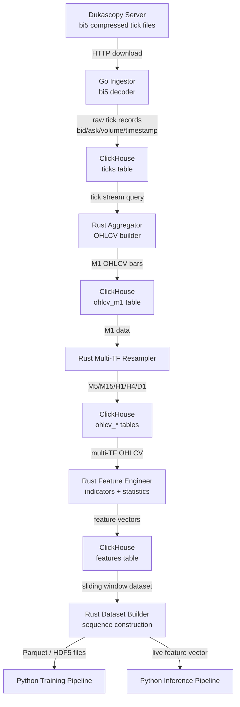

# Data Pipeline

The Geonera data pipeline transforms raw Dukascopy bi5 tick data into clean, multi-timeframe OHLCV datasets enriched with technical indicators and statistical market features. This pipeline is the foundation of all downstream AI/ML processes.

---

## Table of Contents

- [Pipeline Overview](#pipeline-overview)
- [Data Source: Dukascopy bi5](#data-source-dukascopy-bi5)
- [Go Ingestion Service](#go-ingestion-service)
- [ClickHouse Schema Design](#clickhouse-schema-design)
- [Rust Preprocessing and Feature Engineering](#rust-preprocessing-and-feature-engineering)
- [Multi-Timeframe Aggregation](#multi-timeframe-aggregation)
- [Feature Engineering Catalog](#feature-engineering-catalog)
- [Dataset Builder](#dataset-builder)
- [Data Quality and Validation](#data-quality-and-validation)
- [Failure Scenarios](#failure-scenarios)
- [Performance Considerations](#performance-considerations)

---

## Pipeline Overview



---

## Data Source: Dukascopy bi5

### Format Specification
- **File format:** LZMA-compressed binary (`.bi5`)
- **File naming convention:** `YYYY/MM/DD/HH_ticks.bi5` per instrument
- **Record structure (per tick):**
  - `time_ms` (uint32) — milliseconds offset from hour start
  - `ask` (uint32) — ask price × point value (e.g., × 100000 for EURUSD)
  - `bid` (uint32) — bid price × point value
  - `ask_vol` (float32) — ask-side volume in millions
  - `bid_vol` (float32) — bid-side volume in millions
- **Encoding:** Big-endian
- **Total record size:** 20 bytes per tick after decompression

### Instruments
- Forex pairs (EURUSD, GBPUSD, USDJPY, etc.)
- Future: CFDs, indices (architecture-agnostic; instrument is a parameter)

### Historical Coverage
- Dukascopy provides tick data from approximately 2003 onward
- Full coverage back-fill is run once during system initialization
- Incremental updates run on a scheduled basis (daily or hourly)

### Acquisition Strategy
- Files downloaded via HTTP from Dukascopy's historical data API
- Parallelized by hour-of-day using Go goroutines (one goroutine per file)
- Retry with exponential backoff on 4xx/5xx or network timeout
- Rate limiting: respect Dukascopy's download rate limits to avoid IP bans

---

## Go Ingestion Service

### Responsibilities
- Download bi5 files from Dukascopy for configured instruments and date ranges
- Decompress LZMA payload
- Parse binary tick records (20-byte structs, big-endian)
- Reconstruct absolute timestamps from file path + `time_ms` offset
- Normalize price values (divide by point multiplier to get decimal price)
- Batch-insert tick records into ClickHouse

### Implementation Notes
- Uses `github.com/ulikunitz/xz` or equivalent for LZMA decompression
- Binary parsing with `encoding/binary` (big-endian)
- ClickHouse insertion via `clickhouse-go` driver using batch insert (`INSERT INTO ... VALUES (...)`)
- Idempotent: checks existence of records by `(instrument, timestamp)` before inserting to avoid duplicates on re-run
- Configurable concurrency: `INGEST_PARALLELISM=N` controls goroutine pool size

### Pseudocode: Core ingestion loop

```go
func ingestInstrument(instrument string, from, to time.Time) {
    hours := enumerateHours(from, to)
    sem := make(chan struct{}, parallelism)

    for _, hour := range hours {
        sem <- struct{}{}
        go func(h time.Time) {
            defer func() { <-sem }()
            url := buildBI5URL(instrument, h)
            data, err := downloadWithRetry(url, maxRetries)
            if err != nil { logError(err); return }

            ticks, err := parseBI5(data, h)
            if err != nil { logError(err); return }

            if err := batchInsert(ticks); err != nil { logError(err) }
        }(hour)
    }
}
```

### Batch Insert Strategy
- Buffer size: 10,000 records per batch (configurable)
- Uses ClickHouse's native protocol (not HTTP) for throughput
- Flush on buffer full OR on timeout (5 seconds), whichever comes first

---

## ClickHouse Schema Design

### Table: `ticks`

```sql
CREATE TABLE ticks (
    instrument  LowCardinality(String),
    timestamp   DateTime64(3, 'UTC'),  -- millisecond precision
    bid         Float64,
    ask         Float64,
    bid_vol     Float32,
    ask_vol     Float32
) ENGINE = ReplicatedMergeTree('/clickhouse/tables/{shard}/ticks', '{replica}')
PARTITION BY (instrument, toYYYYMM(timestamp))
ORDER BY (instrument, timestamp)
TTL timestamp + INTERVAL 10 YEAR
SETTINGS index_granularity = 8192;
```

**Design decisions:**
- `LowCardinality(String)` for instrument reduces dictionary overhead significantly
- `DateTime64(3)` preserves millisecond precision from bi5 source
- `PARTITION BY` on month enables efficient range scans and data expiry
- `ORDER BY (instrument, timestamp)` matches primary query pattern

### Table: `ohlcv_m1`

```sql
CREATE TABLE ohlcv_m1 (
    instrument  LowCardinality(String),
    timestamp   DateTime('UTC'),  -- minute precision (bar open time)
    open        Float64,
    high        Float64,
    low         Float64,
    close       Float64,
    volume      Float64,
    tick_count  UInt32
) ENGINE = ReplicatedMergeTree(...)
PARTITION BY (instrument, toYYYYMM(timestamp))
ORDER BY (instrument, timestamp);
```

### Tables: `ohlcv_m5`, `ohlcv_m15`, `ohlcv_h1`, `ohlcv_h4`, `ohlcv_d1`
Same schema as `ohlcv_m1`, different `timestamp` granularity per table.

### Table: `features`

```sql
CREATE TABLE features (
    instrument  LowCardinality(String),
    timeframe   LowCardinality(String),  -- 'M1', 'M5', ...
    timestamp   DateTime('UTC'),
    -- Technical indicators (Float32 for memory efficiency)
    rsi_14      Float32,
    ema_20      Float32,
    ema_50      Float32,
    macd_line   Float32,
    macd_signal Float32,
    macd_hist   Float32,
    bb_upper    Float32,
    bb_lower    Float32,
    bb_width    Float32,
    atr_14      Float32,
    adx_14      Float32,
    -- Statistical features
    returns_1   Float32,  -- 1-bar return
    returns_5   Float32,
    returns_20  Float32,
    vol_20      Float32,  -- rolling std of returns
    -- ... additional features per catalog
) ENGINE = ReplicatedMergeTree(...)
PARTITION BY (instrument, timeframe, toYYYYMM(timestamp))
ORDER BY (instrument, timeframe, timestamp);
```

---

## Rust Preprocessing and Feature Engineering

### Why Rust at This Layer
- Processing 10+ years of M1 data (5+ million bars per instrument) requires tight memory control
- Rolling window computations (EMA, ATR, Bollinger) must be computed incrementally without copying entire arrays
- Rust's iterator model and zero-copy slices enable this without garbage collection pauses

### Processing Stages

**Stage 1: Tick → M1 OHLCV**
- Groups ticks by `(instrument, minute_bucket)`
- Computes OHLCV: first tick = open, max ask = high, min bid = low, last tick = close, sum(bid_vol + ask_vol) = volume
- Handles gaps: if no tick in a minute, carries forward the previous close as open=high=low=close with zero volume
- Output: `ohlcv_m1` records

**Stage 2: M1 → Multi-Timeframe Resampling**
- Groups M1 bars into M5/M15/H1/H4/D1 buckets
- OHLCV aggregation rules: first open, max high, min low, last close, sum volume
- Produces `ohlcv_m5`, `ohlcv_m15`, `ohlcv_h1`, `ohlcv_h4`, `ohlcv_d1`

**Stage 3: Technical Indicator Computation**
- All indicators computed per timeframe independently
- Stateful incremental computation: maintains running state (e.g., EMA previous value, Wilder's smoothing)
- Output written to `features` table

**Stage 4: Statistical Feature Computation**
- Rolling returns, rolling volatility (std of log returns), skewness, kurtosis
- Z-score normalization applied at feature store level (parameters stored in PostgreSQL for reproducibility)

---

## Multi-Timeframe Aggregation

Multi-timeframe (MTF) features are critical because market structure at higher timeframes provides context for lower-timeframe signals.

| Timeframe | Minutes per Bar | Usage |
|---|---|---|
| M1 | 1 | Primary forecasting timeframe; TFT prediction target |
| M5 | 5 | Short-term momentum context |
| M15 | 15 | Intraday structure |
| H1 | 60 | Session-level trend |
| H4 | 240 | Swing-level trend |
| D1 | 1440 | Daily bias / major S/R levels |

When building the input feature matrix for TFT, features from all timeframes are aligned to the M1 bar timestamp by:
1. Each higher-TF feature is repeated for all M1 bars within that higher-TF bar
2. This produces a flat feature vector at M1 resolution that incorporates context from all timeframes

---

## Feature Engineering Catalog

### Trend Indicators
- EMA(20), EMA(50), EMA(100), EMA(200)
- SMA(20), SMA(50)
- ADX(14) — trend strength

### Momentum Indicators
- RSI(14) — relative strength
- MACD(12,26,9) — line, signal, histogram
- Stochastic(14,3,3) — %K, %D
- CCI(20) — commodity channel index
- Williams %R(14)

### Volatility Indicators
- ATR(14) — average true range
- Bollinger Bands(20,2) — upper, lower, width, %B
- Historical Volatility (20-bar rolling std of log returns)

### Volume / Market Microstructure
- Tick count per bar
- Volume imbalance: `(ask_vol - bid_vol) / (ask_vol + bid_vol)`
- Spread: `ask - bid` (from raw ticks, averaged per bar)

### Statistical Features
- Log returns: `ln(close[t] / close[t-1])`
- Rolling returns: 1-bar, 5-bar, 20-bar
- Rolling volatility: 20-bar std of log returns
- Z-score of close relative to 20-bar mean

### Time Features
- Hour of day (0-23) — market session context
- Day of week (0-6) — weekly seasonality
- Month (1-12) — seasonal bias

---

## Dataset Builder

The Dataset Builder (Rust) produces windowed sequence datasets for model training and live inference.

### Training Dataset
- **Window size:** 1440 M1 bars (lookback = 24 hours of M1 data)
- **Target:** 7200 M1 bars forward (close price sequence)
- **Stride:** configurable (e.g., every 60 minutes)
- **Output format:** Apache Parquet (chunked by month) or HDF5
- **Schema per sample:**
  - `x`: shape `[1440, num_features]` — input feature matrix
  - `y`: shape `[7200]` — target close price sequence
  - `metadata`: instrument, start timestamp, normalization params

### Live Inference Dataset
- Same feature extraction as training, but only the last 1440 M1 bars
- Output: single feature vector batch streamed to Python inference service

---

## Data Quality and Validation

| Check | Implementation | Action on Failure |
|---|---|---|
| Duplicate ticks | Dedup by `(instrument, timestamp)` at insert | Skip duplicate; log warning |
| Gap detection | Identify missing M1 bars (>5 min gap in M1) | Flag bars as `has_gap=true`; exclude from training windows |
| Extreme value check | Price > 3σ from 20-bar mean | Flag as outlier; exclude from training |
| OHLCV consistency | `high >= max(open,close)` and `low <= min(open,close)` | Log error; mark bar invalid |
| Volume zero | `volume == 0` bars outside known market closure hours | Flag; carry forward if isolated gap |
| Normalization bounds | Feature z-scores outside `[-5, 5]` | Clip to bounds; log; do not fail pipeline |

---

## Failure Scenarios

| Scenario | Impact | Mitigation |
|---|---|---|
| Dukascopy server unreachable | Download fails; no new data for affected hours | Retry with exponential backoff; alert after 3 failures |
| bi5 file corrupted | LZMA decompression error | Skip file; log; trigger re-download on next run |
| ClickHouse write timeout | Batch insert fails | Retry batch; circuit breaker after 5 consecutive failures |
| Rust preprocessor OOM | Process killed mid-job | Checkpoint progress by partition; resume from last checkpoint |
| Feature computation produces NaN | NaN propagates into training data | Validate feature output; replace NaN with forward-fill or zero depending on feature type |
| Clock skew on ingestion host | Timestamp misalignment in tick records | NTP sync required; alert if host clock drift > 100ms |

---

## Performance Considerations

- **Go ingestion throughput:** ~50,000 ticks/second to ClickHouse on local network; limited by ClickHouse insert buffer, not Go parsing
- **ClickHouse insert buffer:** Configure `max_insert_block_size = 100000` and `insert_quorum = 2` for durability
- **Rust preprocessing:** Full historical backfill (10 years, 5M M1 bars) completes in approximately 30–90 minutes on a 16-core machine depending on indicator complexity
- **Feature table size:** Approximately 500 bytes per row × 5M bars × 6 timeframes = ~15 GB uncompressed; ClickHouse LZ4 compression reduces to ~3-4 GB
- **Dataset builder output:** 1 year of M1 training samples (stride=60) ≈ 8,760 samples × 1440 bars × 100 features = ~5 GB Parquet per instrument
- **Incremental update latency:** Go ingestor can process the current hour's bi5 file within seconds of it becoming available; end-to-end from new tick to feature store update: ~30 seconds
