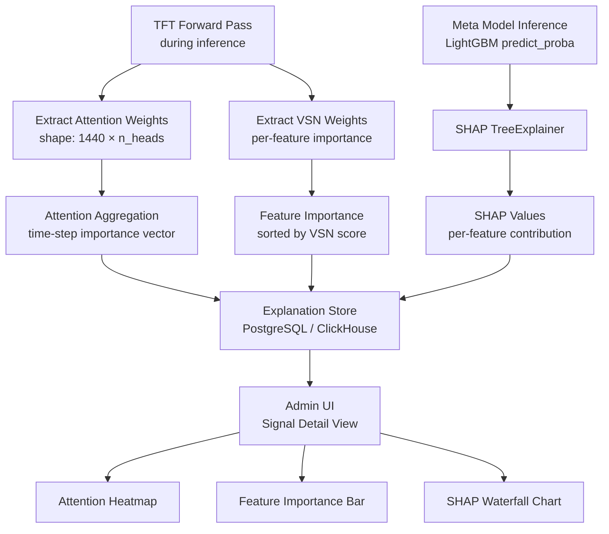

# Explainability

Geonera integrates model interpretability mechanisms to make AI-driven trading decisions transparent and auditable. Explainability serves both operational and compliance purposes: engineers need to understand why a specific signal was generated, and stakeholders need confidence that decisions are based on meaningful market factors — not statistical noise.

---

## Table of Contents

- [Why Explainability Matters in Trading](#why-explainability-matters-in-trading)
- [Explainability Architecture](#explainability-architecture)
- [TFT Attention-Based Interpretation](#tft-attention-based-interpretation)
- [Variable Importance via TFT VSN](#variable-importance-via-tft-vsn)
- [Meta Model Explanations with SHAP](#meta-model-explanations-with-shap)
- [Signal-Level Explanation Output](#signal-level-explanation-output)
- [Explanation Storage](#explanation-storage)
- [Admin UI Integration](#admin-ui-integration)
- [Limitations](#limitations)
- [Trade-offs](#trade-offs)

---

## Why Explainability Matters in Trading

Trading systems without explainability create two operational risks:

1. **Silent model failure:** A model may produce plausible-looking predictions for entirely wrong reasons (spurious correlations). Without interpretability, this goes undetected until losses occur.
2. **Debugging difficulty:** When a signal fails to reach its target, engineers need to understand what the model was "seeing" — which features drove the forecast direction and which factors the meta model used to assign the probability score.

Geonera addresses this via:
- **TFT attention weights:** Time-step importance in the lookback window
- **TFT Variable Selection Network (VSN) weights:** Feature importance at inference time
- **SHAP values:** Per-feature contribution to the meta model's profit probability score

---

## Explainability Architecture



---

## TFT Attention-Based Interpretation

### What TFT Attention Reveals
The TFT multi-head attention mechanism learns which past time steps (M1 bars in the 1440-bar lookback) were most influential when producing the forecast. High attention weight at `t - N` means the model weighted that bar heavily in its prediction.

### Extraction During Inference

```python
from pytorch_forecasting import TemporalFusionTransformer

model: TemporalFusionTransformer  # loaded model

# Forward pass with interpretation outputs enabled
predictions, interpretation = model.predict(
    dataloader,
    mode="raw",
    return_x=True
)

# interpretation contains:
# - attention: shape [batch, n_heads, prediction_length, encoder_length]
# - encoder_variables: VSN weights for observed variables
# - decoder_variables: VSN weights for known future variables
# - static_variables: VSN weights for static inputs

attention_weights = interpretation["attention"]  # [batch, heads, horizon, 1440]
# Aggregate over heads and horizon for per-timestep importance
timestep_importance = attention_weights.mean(dim=[1, 2])  # [batch, 1440]
```

### Aggregation Strategy
1. Average attention weights across all heads (reduces to single attention distribution)
2. Average across the forecast horizon (produces a single importance weight per past bar)
3. Normalize to sum to 1.0 (probability distribution over past bars)
4. Extract top-K most attended bars (K=10) for visualization

### Interpretation Example

```
Signal: EURUSD LONG, 2024-01-15 14:00 UTC
Top attended past bars:
  t-12  (13:48 UTC): weight=0.089 → H1 bar close, major EMA cross
  t-60  (13:00 UTC): weight=0.073 → Start of London session
  t-240 (10:00 UTC): weight=0.062 → Session open range established
  t-1   (13:59 UTC): weight=0.057 → Immediately prior bar
```

This reveals that the model considered the H1 close and session open as particularly informative — a meaningful result aligned with known market structure.

---

## Variable Importance via TFT VSN

### What VSN Weights Reveal
The Variable Selection Network learns a sparse weighting of input features, dynamically selecting which features matter for each time step. VSN weights expose which indicators and price inputs the model found most informative during a specific inference.

### Extraction

```python
# VSN weights from interpretation
encoder_vars = interpretation["encoder_variables"]  # [batch, n_features]
feature_names = model.hparams.time_varying_reals_encoder

# Sort by importance
importance = encoder_vars.mean(dim=0)  # average over batch
sorted_features = sorted(zip(feature_names, importance.tolist()), key=lambda x: -x[1])

# Output: [(feature_name, importance_score), ...]
# e.g., [("close", 0.31), ("ema_50_h1", 0.18), ("rsi_14_m1", 0.12), ...]
```

### Example VSN Output

```
Signal: EURUSD LONG, 2024-01-15 14:00 UTC
Variable Selection (top 10 features):
  close             : 0.31
  ema_50_h1         : 0.18
  rsi_14_m1         : 0.12
  volume_m1         : 0.09
  atr_14_m1         : 0.08
  macd_hist_m15     : 0.07
  adx_14_h4         : 0.06
  bb_width_m1       : 0.04
  hour_sin          : 0.03
  close_z_score_m1  : 0.02
```

---

## Meta Model Explanations with SHAP

### SHAP for LightGBM
SHAP (SHapley Additive exPlanations) computes the contribution of each feature to the model's output for a specific prediction. For LightGBM, SHAP TreeExplainer runs in O(T × D) time (T = trees, D = max depth), making it efficient even in near-real-time contexts.

### Implementation

```python
import shap
import lightgbm as lgb

model: lgb.LGBMClassifier  # trained meta model
explainer = shap.TreeExplainer(model)

def explain_signal(meta_features: dict) -> dict:
    feature_vector = np.array([list(meta_features.values())])
    shap_values = explainer.shap_values(feature_vector)

    # shap_values[1] = SHAP for class 1 (profit)
    explanation = {
        "base_value": explainer.expected_value[1],
        "prediction": float(model.predict_proba(feature_vector)[0][1]),
        "shap_values": {
            name: float(val)
            for name, val in zip(meta_features.keys(), shap_values[1][0])
        }
    }
    return explanation
```

### Example SHAP Output

```json
{
  "signal_id": "uuid",
  "meta_score": 0.72,
  "base_value": 0.48,
  "shap_values": {
    "rr_ratio": +0.08,
    "rsi_14_h1": +0.06,
    "adx_14_h4": +0.05,
    "win_rate_last_20": +0.04,
    "atr_14_m1": -0.03,
    "forecast_confidence": +0.03,
    "hour_of_day": -0.02,
    "consecutive_losses": -0.01,
    "...": "..."
  }
}
```

**Interpretation:** The base rate is 0.48. The high RR ratio (+0.08), strong RSI on H1 (+0.06), and trending ADX on H4 (+0.05) pushed the score up to 0.72. High ATR (-0.03) and unfavorable hour (-0.02) partially counteracted.

### SHAP Computation Timing
- SHAP computation for a single signal: < 5ms (LightGBM TreeExplainer on CPU)
- Acceptable to compute synchronously during meta model inference
- Can be disabled in high-throughput backtesting mode to reduce overhead

---

## Signal-Level Explanation Output

Every approved signal in Geonera carries a full explanation payload:

```json
{
  "signal_id": "uuid",
  "instrument": "EURUSD",
  "direction": "LONG",
  "entry_price": 1.09250,
  "meta_score": 0.72,

  "tft_explanation": {
    "top_attended_bars": [
      { "bars_ago": 12, "timestamp": "2024-01-15T13:48:00Z", "weight": 0.089 },
      { "bars_ago": 60, "timestamp": "2024-01-15T13:00:00Z", "weight": 0.073 }
    ],
    "top_features_vsn": [
      { "feature": "close", "importance": 0.31 },
      { "feature": "ema_50_h1", "importance": 0.18 }
    ]
  },

  "meta_explanation": {
    "base_value": 0.48,
    "shap_values": {
      "rr_ratio": 0.08,
      "rsi_14_h1": 0.06,
      "adx_14_h4": 0.05,
      "atr_14_m1": -0.03
    }
  }
}
```

---

## Explanation Storage

### PostgreSQL: `signal_explanations` Table

```sql
CREATE TABLE signal_explanations (
    signal_id           UUID PRIMARY KEY REFERENCES signals(id),
    tft_attention_json  JSONB,    -- top attended bars + weights
    tft_vsn_json        JSONB,    -- feature importance from VSN
    meta_shap_json      JSONB,    -- SHAP values per feature
    meta_base_value     DECIMAL(8, 6),
    created_at          TIMESTAMP DEFAULT NOW()
);

CREATE INDEX idx_signal_explanations_created ON signal_explanations(created_at DESC);
```

**Why JSONB:** Explanation payloads are variable-length and schema-flexible. JSONB allows querying specific fields (e.g., `WHERE meta_shap_json->>'rsi_14_h1' > '0.05'`) without requiring predefined columns for every feature.

**Retention:** Signal explanations stored for 90 days; older records archived to cold storage (S3 Parquet) and deleted from PostgreSQL.

---

## Admin UI Integration

### Signal Detail Page
Each signal in the Admin UI's signal table has a detail page showing:

1. **Attention Heatmap** — Timeline chart of the 1440-bar lookback with color intensity representing attention weight. Peaks indicate which past bars the model focused on.
2. **Feature Importance Bar Chart** — Horizontal bar chart of VSN weights; sorted by importance; shows top 15 features.
3. **SHAP Waterfall Chart** — Shows contribution of each meta feature from base rate to final score. Positive contributions shown in blue, negative in red.
4. **Signal Decision Summary** — Human-readable explanation: "The model predicted a LONG move of 30 pips over 1440 bars with 72% confidence. Key drivers: high R:R ratio (2.1), H1 RSI in bullish zone (62), strong H4 trend (ADX 28)."

---

## Limitations

| Limitation | Description |
|---|---|
| Attention ≠ causation | High attention weight means the model weighted that bar heavily; it does NOT mean that bar caused the price movement |
| VSN weights are non-linear | VSN importance is not directly interpretable as a linear coefficient; it represents a learned gating weight |
| SHAP approximation | SHAP for LightGBM is exact (not approximate) for tree models; however, the meta features themselves may not perfectly represent all signal quality factors |
| TFT explanation instability | Small changes in the input can shift attention distributions significantly; explanations should be interpreted in aggregate, not as precise causal attribution |
| Explanation lag | Explanations are generated asynchronously and may be unavailable in the Admin UI for a few seconds after signal creation |
| No natural-language generation | Current implementation outputs raw SHAP values and attention weights; natural-language summarization is a planned feature |

---

## Trade-offs

- **Computation overhead:** SHAP and attention extraction add ~10-20% overhead to inference time. This is acceptable for Geonera's throughput (1-50 signals per inference cycle). If throughput increases significantly, SHAP can be computed asynchronously post-inference.
- **Storage overhead:** Full explanation JSONBs average ~5KB per signal. At 10,000 signals/day, this is 50MB/day or ~18GB/year in PostgreSQL. Managed via 90-day retention + cold archive.
- **Interpretability vs performance tradeoff:** More complex models (larger TFT, deeper LightGBM) may be more accurate but harder to interpret. Geonera maintains a deliberate preference for models where interpretability is viable, even at slight accuracy cost.
- **Feature importance stability:** On a fresh day with a new market regime, VSN weights may shift significantly from the training-time distribution. This instability is informative (it signals regime change) but can confuse users expecting stable explanations.
