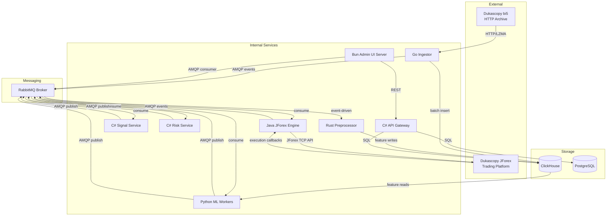

# Integration Layer

Geonera's integration layer defines how internal services communicate with each other and with external systems (Dukascopy/JForex). It covers the REST API contracts exposed by the C# API Gateway, the RabbitMQ message topology, the JForex Java execution integration, and the inter-service authentication model.

---

## Table of Contents

- [Integration Architecture](#integration-architecture)
- [C# API Gateway: REST Contracts](#c-api-gateway-rest-contracts)
- [RabbitMQ Message Topology](#rabbitmq-message-topology)
- [Message Schema Definitions](#message-schema-definitions)
- [JForex Java Integration](#jforex-java-integration)
- [Inter-Service Authentication](#inter-service-authentication)
- [External Data Integration (Dukascopy bi5)](#external-data-integration-dukascopy-bi5)
- [Error Handling and Retry Policies](#error-handling-and-retry-policies)
- [Failure Scenarios](#failure-scenarios)
- [Trade-offs](#trade-offs)

---

## Integration Architecture



---

## C# API Gateway: REST Contracts

The C# API Gateway (ASP.NET Core) is the single synchronous REST interface for the Admin UI and any future external consumers.

### Base URL
`http://api-gateway:8080/api/v1/`

### Common Headers

```
Authorization: Bearer <internal-service-jwt>
Content-Type: application/json
X-Request-ID: <uuid>  (for trace correlation)
```

### Signals API

#### GET /api/v1/signals
Returns paginated list of signals.

**Query Parameters:**
| Parameter | Type | Default | Description |
|---|---|---|---|
| `status` | string | all | Filter by status: candidate/scored/approved/rejected/filled/stopped/expired |
| `instrument` | string | all | Filter by instrument (e.g., EURUSD) |
| `direction` | string | all | LONG or SHORT |
| `from` | ISO8601 | -7d | Start of created_at range |
| `to` | ISO8601 | now | End of created_at range |
| `meta_score_min` | float | 0.0 | Minimum meta score |
| `limit` | int | 50 | Page size (max 200) |
| `offset` | int | 0 | Pagination offset |

**Response 200:**
```json
{
  "total": 4521,
  "limit": 50,
  "offset": 0,
  "items": [
    {
      "id": "uuid",
      "instrument": "EURUSD",
      "direction": "LONG",
      "status": "approved",
      "entry_price": 1.09250,
      "target_price": 1.09550,
      "stop_price": 1.09100,
      "risk_reward_ratio": 2.0,
      "target_move_pips": 30.0,
      "horizon_bars": 1440,
      "meta_score": 0.72,
      "meta_label": "profit",
      "model_version": "v2024.01.10",
      "created_at": "2024-01-15T14:00:00Z",
      "updated_at": "2024-01-15T14:01:23Z"
    }
  ]
}
```

#### GET /api/v1/signals/{id}/explanation
Returns the explanation payload for a specific signal.

**Response 200:**
```json
{
  "signal_id": "uuid",
  "tft_explanation": {
    "top_attended_bars": [
      { "bars_ago": 12, "timestamp": "2024-01-15T13:48:00Z", "weight": 0.089 }
    ],
    "top_features_vsn": [
      { "feature": "close", "importance": 0.31 },
      { "feature": "ema_50_h1", "importance": 0.18 }
    ]
  },
  "meta_explanation": {
    "base_value": 0.48,
    "prediction": 0.72,
    "shap_values": {
      "rr_ratio": 0.08,
      "rsi_14_h1": 0.06
    }
  }
}
```

#### POST /api/v1/signals/{id}/approve
Manually approve a signal (bypasses meta model gate; restricted to `operator` role).

**Request body:** `{}` (no body required)
**Response 200:** Updated signal object
**Response 403:** Insufficient role
**Response 409:** Signal already in terminal state

#### POST /api/v1/signals/{id}/reject
Manually reject a signal.

### Positions API

#### GET /api/v1/positions
Returns current open positions with real-time PnL.

**Response 200:**
```json
{
  "items": [
    {
      "id": "uuid",
      "signal_id": "uuid",
      "instrument": "EURUSD",
      "direction": "LONG",
      "entry_price": 1.09250,
      "target_price": 1.09550,
      "stop_price": 1.09100,
      "current_price": 1.09380,
      "position_size_lots": 0.67,
      "unrealized_pnl_pips": 13.0,
      "unrealized_pnl_usd": 87.10,
      "entry_time": "2024-01-15T14:01:30Z",
      "elapsed_bars": 312,
      "jforex_order_id": "123456"
    }
  ]
}
```

### Account API

#### GET /api/v1/account/state

**Response 200:**
```json
{
  "equity": 10450.23,
  "balance": 10200.00,
  "open_positions_count": 3,
  "daily_pnl": 250.23,
  "weekly_pnl": -120.10,
  "daily_drawdown_pct": -1.15,
  "weekly_drawdown_pct": -1.16,
  "drawdown_halt_active": false,
  "as_of": "2024-01-15T14:05:00Z"
}
```

### Backtest API

#### POST /api/v1/backtest-runs
Trigger a new backtest.

**Request body:**
```json
{
  "name": "eurusd-conservative-2024q1",
  "instrument": "EURUSD",
  "start_date": "2024-01-01",
  "end_date": "2024-03-31",
  "initial_equity": 10000.00,
  "tft_model_version": "v2024.01.10",
  "meta_model_version": "v2024.01.10",
  "strategy_config_id": "uuid",
  "risk_config_id": "uuid"
}
```

**Response 202:** `{ "backtest_run_id": "uuid", "status": "running" }`

---

## RabbitMQ Message Topology

### Exchange Definitions

```
Exchange: geonera.ticks
  Type: topic
  Durable: true
  Bindings: tick.{instrument} → queue: go-ingestor.ticks.{instrument}

Exchange: geonera.bars
  Type: topic
  Durable: true
  Bindings:
    bar.closed.m1.{instrument} → queue: rust-preprocessor.bars.m1
    bar.closed.h1.{instrument} → queue: inference-trigger.h1

Exchange: geonera.inference
  Type: direct
  Durable: true
  Bindings: inference.request → queue: tft-inference.requests

Exchange: geonera.forecasts
  Type: direct
  Durable: true
  Bindings: forecast.ready → queue: signal-generator.forecasts

Exchange: geonera.signals
  Type: topic
  Durable: true
  Bindings:
    signal.generated → queue: meta-model.signals
    signal.scored    → queue: risk-service.signals
    signal.approved  → queue: jforex-executor.signals
    signal.approved  → queue: admin-ui.events
    signal.rejected  → queue: audit-logger.signals
    signal.*         → queue: admin-ui.events (all signal events)

Exchange: geonera.execution
  Type: topic
  Durable: true
  Bindings:
    order.submitted → queue: admin-ui.events
    order.filled    → queue: position-tracker.fills
    order.rejected  → queue: risk-service.rejections

Exchange: geonera.system
  Type: fanout
  Durable: true
  Bindings: → queue: all-services.system  (model.reload, config.updated, halt.issued)

Exchange: geonera.dlx (Dead Letter Exchange)
  Type: direct
  All queues have x-dead-letter-exchange: geonera.dlx
```

### Queue Configuration Template

```
Queue: {service}.{event-type}
  Durable: true
  Type: quorum (all critical queues)
  Arguments:
    x-dead-letter-exchange: geonera.dlx
    x-dead-letter-routing-key: dlq.{service}.{event-type}
    x-message-ttl: 86400000  (24 hours; messages expire if not consumed)
    x-max-length: 10000      (prevent unbounded queue growth)
```

---

## Message Schema Definitions

All messages use JSON encoding. Schemas defined as TypeScript types (canonical reference):

```typescript
// Published by Python TFT Inference
interface ForecastReadyMessage {
  message_id: string;          // UUID
  instrument: string;          // e.g., "EURUSD"
  as_of_timestamp: string;     // ISO8601 UTC
  model_version: string;
  forecast_run_id: string;     // UUID for dedup
  horizon_bars: number;        // 7200
  q10: number[];               // length = 7200
  q50: number[];
  q90: number[];
  entry_price: number;
  inference_latency_ms: number;
}

// Published by C# Signal Service
interface SignalGeneratedMessage {
  message_id: string;
  signal_id: string;
  instrument: string;
  direction: 'LONG' | 'SHORT';
  entry_price: number;
  target_price: number;
  stop_price: number;
  risk_reward_ratio: number;
  target_move_pips: number;
  horizon_bars: number;
  forecast_confidence: number;
  model_version: string;
  strategy_config_id: string;
  created_at: string;
}

// Published by C# Risk Service
interface SignalApprovedMessage {
  message_id: string;
  signal_id: string;
  instrument: string;
  direction: 'LONG' | 'SHORT';
  entry_price: number;
  target_price: number;
  stop_price: number;
  position_size_lots: number;
  meta_score: number;
  approved_at: string;
}

// Published by Java JForex Engine
interface OrderFilledMessage {
  message_id: string;
  signal_id: string;
  jforex_order_id: string;
  instrument: string;
  direction: 'LONG' | 'SHORT';
  filled_price: number;
  filled_lots: number;
  filled_at: string;
}
```

---

## JForex Java Integration

### JForex API Overview
- JForex is a proprietary Java trading SDK provided by Dukascopy
- Connects to Dukascopy's trading infrastructure via a proprietary TCP protocol
- SDK provides: account management, order submission, tick subscriptions, historical data access

### Java Service Responsibilities (Strict Boundary)
The Java JForex Engine does ONLY:
1. Maintain a live JForex API session (authentication + keepalive)
2. Subscribe to live tick streams → publish to RabbitMQ `geonera.ticks`
3. Consume `signal.approved` messages → submit market/limit orders to JForex
4. Receive order execution callbacks (filled, rejected, closed) → publish to `geonera.execution`
5. Monitor open positions → publish position updates to RabbitMQ

It does NOT:
- Contain business logic (position sizing, risk management)
- Access ClickHouse or PostgreSQL directly
- Make decisions about which signals to execute

### Order Submission Flow

```java
// Pseudocode: JForex order submission
public void onSignalApproved(SignalApprovedMessage signal) {
    IEngine engine = context.getEngine();

    // Select order type (market order at current price)
    IOrder order = engine.submitOrder(
        signal.getSignalId(),           // unique label
        toJForexInstrument(signal.getInstrument()),
        signal.getDirection() == LONG ? IEngine.OrderCommand.BUY : IEngine.OrderCommand.SELL,
        signal.getPositionSizeLots(),
        0,                              // price = 0 for market order
        2,                              // slippage = 2 pips
        signal.getStopPrice(),
        signal.getTargetPrice(),
        System.currentTimeMillis() + (signal.getHorizonBars() * 60 * 1000L)  // GTT
    );

    rabbitMQ.publish("order.submitted", new OrderSubmittedMessage(
        signal.getSignalId(), order.getId(), signal.getInstrument()
    ));
}

// JForex callback: order state change
@Override
public void onOrderChanged(IOrder order) {
    if (order.getState() == IOrder.State.FILLED) {
        rabbitMQ.publish("order.filled", buildFilledMessage(order));
    } else if (order.getState() == IOrder.State.CLOSED) {
        rabbitMQ.publish("order.closed", buildClosedMessage(order));
    } else if (order.getState() == IOrder.State.CANCELED) {
        rabbitMQ.publish("order.rejected", buildRejectedMessage(order));
    }
}
```

### JForex Session Management
- Session initialized at startup with stored credentials (from Vault)
- Heartbeat: JForex SDK manages keepalive internally; Java service monitors for disconnection
- Reconnection: exponential backoff on reconnect (2s, 4s, 8s, 16s, max 60s); alert after 3 attempts
- Graceful shutdown: cancel all pending (not yet filled) orders before disconnecting

### JForex Credential Security
- Login and password never stored in code or environment variables
- Retrieved from HashiCorp Vault at startup via AppRole auth
- Rotated quarterly by operations team

---

## Inter-Service Authentication

### Internal Service Auth
- Services communicate with the C# API Gateway using a shared internal JWT
- JWT signed with `INTERNAL_JWT_SECRET` (from Kubernetes Secret)
- Token issued by an internal auth service or pre-generated per deployment
- Token TTL: 24 hours; rotated by CI/CD on deployment

### External Ingress Auth (Admin UI → Bun → C# Gateway)
- Admin UI users authenticate with username/password → receive session JWT (8h TTL)
- Bun server attaches internal service JWT when forwarding to C# Gateway
- C# Gateway validates internal service JWT (not the user session JWT)

### RabbitMQ Auth
- Each service has a dedicated RabbitMQ user with minimum permissions:
  - Go Ingestor: publish to `geonera.ticks`, `geonera.bars`
  - Python TFT Inference: consume `geonera.inference`, publish `geonera.forecasts`
  - C# Signal Service: consume `geonera.forecasts`, publish `geonera.signals`
  - etc.
- RabbitMQ vhost: `geonera` (all services operate in same vhost)
- TLS required on all AMQP connections

---

## External Data Integration (Dukascopy bi5)

### Protocol
- HTTP/HTTPS download of `.bi5` files from `https://datafeed.dukascopy.com/datafeed/{INSTRUMENT}/{YYYY}/{MM}/{DD}/{HH}h_ticks.bi5`
- No API key required; publicly accessible data
- Rate limiting applies; Go ingestor respects download rate with configured RPS limit

### bi5 File Availability
- Files become available approximately 1 hour after the hour end
- Go ingestor schedules downloads with a 1-hour delay to avoid downloading incomplete files
- Historical files (> 1 day old) are considered stable and can be downloaded without delay on backfill

### Data Contract
- bi5 format is Dukascopy proprietary; format documented informally by community
- **Risk:** Dukascopy has historically changed bi5 format without notice. Go ingestor includes format version detection; alerts if unexpected byte patterns detected.

---

## Error Handling and Retry Policies

### HTTP (Go Ingestor → Dukascopy)
| Error | Retry Strategy |
|---|---|
| 5xx server error | Exponential backoff: 2s, 4s, 8s, 16s; max 4 retries |
| 429 Rate Limited | Wait for `Retry-After` header; default 60s |
| 404 Not Found | Skip (file doesn't exist for this hour); log WARN |
| Network timeout | Retry up to 3 times; then log ERROR; continue with next file |
| Connection refused | Alert immediately; do not retry endlessly |

### AMQP (all services → RabbitMQ)
| Error | Retry Strategy |
|---|---|
| Publish fails (channel closed) | Reconnect channel; retry publish once |
| Consume fails (processing error) | NAK message; max 3 redeliveries; then DLQ |
| Connection lost | Reconnect with exponential backoff; all pending operations queued in-memory |

### SQL (C# services → PostgreSQL)
| Error | Retry Strategy |
|---|---|
| Transient connection error | Retry 3 times with 100ms backoff |
| Deadlock | Retry 3 times with random jitter |
| Query timeout | No retry; log ERROR; return 503 to caller |
| Constraint violation | No retry; log WARN; return 409 to caller |

---

## Failure Scenarios

| Scenario | Services Affected | Impact | Mitigation |
|---|---|---|---|
| Dukascopy API unavailable | Go Ingestor | No new historical data; live data unaffected | Retry + alert; historical backfill on recovery |
| JForex API session expired | Java Engine | No order execution | Auto-reconnect; re-authenticate from Vault |
| RabbitMQ broker down | All services | Full pipeline halt | Cluster quorum queues; broker restarts within < 1min |
| C# API Gateway unreachable | Admin UI | UI data reads fail | Admin UI shows cached state; retries with backoff |
| AMQP message poison pill | Any consumer | Consumer crashes on bad message | DLQ after 3 retries; alert; investigate payload |
| bi5 format change | Go Ingestor | Parse failures; no new data | Format version check; immediate alert |

---

## Trade-offs

- **Async-first vs sync:** All pipeline-critical operations are asynchronous (RabbitMQ). This means signal generation is not directly tied to a single HTTP request/response cycle. The trade-off: no immediate feedback to the caller; instead, event-driven feedback via WebSocket.
- **Java for JForex isolation:** Isolating Java to the execution boundary adds one additional language to maintain but eliminates the risk of trying to wrap the JForex Java SDK in another language (which would introduce a fragile foreign function interface).
- **REST for Admin UI:** The Admin UI uses REST rather than gRPC for simplicity and browser compatibility. gRPC-Web would provide better type safety but adds Envoy proxy complexity for browser support.
- **Shared RabbitMQ vhost:** All services share one vhost for simplicity. Separate vhosts per team or domain would provide stronger isolation but requires more complex routing configuration.
