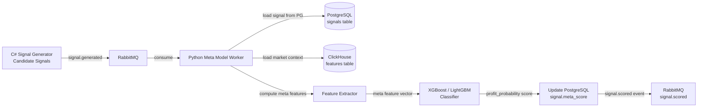

# Meta Model

The Meta Model is a binary classification layer that evaluates each candidate trading signal and assigns a **profit probability score**. It uses gradient boosted tree models (XGBoost or LightGBM) trained on historical signal outcomes to distinguish signals likely to reach their profit target from those likely to hit their stop loss.

---

## Table of Contents

- [Purpose and Position in Pipeline](#purpose-and-position-in-pipeline)
- [Model Selection Rationale](#model-selection-rationale)
- [Feature Engineering for Meta Model](#feature-engineering-for-meta-model)
- [Label Construction](#label-construction)
- [Training Pipeline](#training-pipeline)
- [Model Architecture](#model-architecture)
- [Inference Pipeline](#inference-pipeline)
- [Scoring Output and Interpretation](#scoring-output-and-interpretation)
- [Model Lifecycle](#model-lifecycle)
- [Failure Scenarios](#failure-scenarios)
- [Performance Considerations](#performance-considerations)
- [Trade-offs](#trade-offs)

---

## Purpose and Position in Pipeline

The TFT model produces price forecasts with inherent uncertainty. Even a directionally correct forecast may generate a signal that gets stopped out before reaching its target due to intrabar volatility, spread, or forecast error accumulation. The meta model addresses this by learning from historical outcomes: **given these signal parameters and market context, what is the probability this signal achieves its profit target?**



---

## Model Selection Rationale

### Why Gradient Boosted Trees (XGBoost / LightGBM)

| Requirement | GBDT Capability |
|---|---|
| Tabular feature input | GBDT is the gold standard for tabular classification |
| Fast inference | Single tree ensemble: <1ms per sample on CPU |
| Handles missing values | LightGBM natively handles NaN without imputation |
| Feature importance | Built-in gain/split importance; SHAP integration |
| Low training data requirements | Effective with thousands of samples; no need for millions |
| Interpretability | SHAP TreeExplainer for per-prediction explanations |
| No normalization required | Tree splits are threshold-based; scale-invariant |

### XGBoost vs LightGBM Selection
- **LightGBM preferred** for speed on large datasets (histogram-based algorithm)
- **XGBoost used** when reproducibility or exact mode is required
- Both are maintained in codebase; active model selected via `META_MODEL_TYPE` environment variable

---

## Feature Engineering for Meta Model

Meta model features are derived from three sources:

### 1. Signal Parameters
Direct attributes of the candidate signal:

| Feature | Description |
|---|---|
| `rr_ratio` | Risk-reward ratio |
| `target_move_pips` | Distance from entry to target in pips |
| `horizon_bars` | Maximum hold duration in M1 bars |
| `direction_encoded` | 0 = SHORT, 1 = LONG |
| `target_bar_index` | Bar index at which target is expected |
| `forecast_confidence` | Q90-Q10 interval width at target bar |
| `forecast_slope` | Linear regression slope of Q50 forecast over first 100 bars |
| `forecast_monotonicity` | % of forecast steps moving in the signal direction |

### 2. Market Context at Signal Time
Snapshot of market conditions when the signal was generated:

| Feature | Description |
|---|---|
| `rsi_14_m1` | RSI(14) on M1 at entry time |
| `rsi_14_h1` | RSI(14) on H1 at entry time |
| `adx_14_h4` | ADX(14) on H4 — trend strength |
| `atr_14_m1` | ATR(14) on M1 — volatility context |
| `bb_width_m1` | Bollinger Band width on M1 |
| `vol_20_m1` | 20-bar rolling volatility on M1 |
| `close_z_score_m1` | Z-score of close on M1 |
| `macd_hist_m15` | MACD histogram on M15 |
| `hour_of_day` | Market session context |
| `day_of_week` | Day of week |
| `close_vs_ema50_h1` | `(close - EMA50_H1) / ATR_H1` — distance from H1 EMA50 |
| `spread_at_entry` | Bid-ask spread at signal generation time (in pips) |

### 3. Historical Signal Performance Context
Aggregated statistics from recent past signals on the same instrument:

| Feature | Description |
|---|---|
| `win_rate_last_20` | Win rate of last 20 signals same direction + instrument |
| `avg_rr_last_20` | Average actual R:R of last 20 resolved signals |
| `consecutive_losses` | Count of consecutive losses before this signal |
| `time_since_last_signal` | Minutes since last approved signal |

---

## Label Construction

Labels are assigned retrospectively by simulating each historical candidate signal against actual price data.

### Labeling Rules
For each historical candidate signal:
1. Load actual M1 OHLCV data from `entry_bar_index` to `entry_bar_index + horizon_bars`
2. Simulate: scan bars in order
   - If HIGH of any bar ≥ `target_price` (for LONG): label = **1 (profit)**
   - If LOW of any bar ≤ `stop_price` (for LONG): label = **0 (loss)**
   - If neither hit within `horizon_bars`: label = **0 (timeout/loss)**
   - For SHORT: reverse HIGH/LOW conditions

### Edge Cases
- **Simultaneous target and stop hit in same bar:** Assume stop hit first (conservative; worst case)
- **Gap past stop/target at open:** Count as stop hit (or target hit) at open price
- **Weekend gap:** Use actual next trading bar open

### Label SQL Construction
```sql
-- Pseudocode: label assignment for historical signals
UPDATE signals s
SET meta_label = CASE
    WHEN EXISTS (
        SELECT 1 FROM ohlcv_m1 o
        WHERE o.instrument = s.instrument
          AND o.timestamp > s.created_at
          AND o.timestamp <= s.created_at + (s.horizon_bars || ' minutes')::interval
          AND (
            (s.direction = 'LONG'  AND o.high >= s.target_price) OR
            (s.direction = 'SHORT' AND o.low  <= s.target_price)
          )
          AND NOT EXISTS (
            SELECT 1 FROM ohlcv_m1 o2
            WHERE o2.instrument = s.instrument
              AND o2.timestamp > s.created_at
              AND o2.timestamp < o.timestamp
              AND (
                (s.direction = 'LONG'  AND o2.low  <= s.stop_price) OR
                (s.direction = 'SHORT' AND o2.high >= s.stop_price)
              )
          )
    ) THEN 'profit'
    ELSE 'loss'
    END
WHERE s.status IN ('expired', 'filled', 'stopped');
```

---

## Training Pipeline

### Data Requirements
- Minimum 1,000 labeled historical signals per instrument-direction pair
- Balanced classes preferred; use class weighting if imbalanced (typical win rate: 30-60%)
- Temporal split: train on signals before `T-30 days`, validate on last 30 days

### Training Configuration

```python
import lightgbm as lgb

params = {
    "objective": "binary",
    "metric": ["binary_logloss", "auc"],
    "num_leaves": 63,
    "learning_rate": 0.05,
    "n_estimators": 500,
    "min_child_samples": 20,
    "reg_alpha": 0.1,
    "reg_lambda": 0.1,
    "class_weight": "balanced",   # handles class imbalance
    "random_state": 42,
    "verbose": -1
}

model = lgb.LGBMClassifier(**params)
model.fit(
    X_train, y_train,
    eval_set=[(X_val, y_val)],
    callbacks=[lgb.early_stopping(50), lgb.log_evaluation(50)]
)
```

### Cross-Validation Strategy
- **Purged walk-forward CV:** 5 folds with 30-day purge gap between train and test to prevent data leakage from correlated signals
- **Embargo period:** 7 days after each training fold end to prevent lookahead from signals near fold boundary

---

## Model Architecture

The meta model is a **gradient boosted decision tree ensemble**:

- 300-500 trees (early stopping prevents overfitting)
- Max depth: auto (LightGBM leaf-wise growth; `num_leaves=63`)
- Feature sampling: 80% per tree (`colsample_bytree=0.8`)
- Row sampling: 80% per tree (`subsample=0.8`)
- L1/L2 regularization to prevent overfitting on small datasets

### Hyperparameter Tuning
- Optuna with 100 trials
- Search space: `num_leaves` [15, 127], `learning_rate` [0.01, 0.2], `min_child_samples` [10, 50], `reg_alpha/lambda` [0, 1.0]
- Objective: maximize AUC on purged validation set

---

## Inference Pipeline

### Trigger
- Consumed from RabbitMQ `signal.generated` queue
- Batch processing: consume up to 20 signals before running a batch prediction

### Inference Steps
```python
def score_signal(signal_id: str) -> float:
    signal = postgres.fetch_signal(signal_id)
    market_ctx = clickhouse.fetch_features(signal.instrument, signal.created_at)
    hist_ctx = postgres.fetch_historical_context(signal.instrument, signal.direction, signal.created_at)

    features = build_meta_features(signal, market_ctx, hist_ctx)
    prob = model.predict_proba([features])[0][1]  # probability of class 1 (profit)

    postgres.update_signal_score(signal_id, meta_score=prob, meta_label='profit' if prob >= threshold else 'loss')
    rabbitmq.publish('signal.scored', {'signal_id': signal_id, 'meta_score': prob})

    return prob
```

### Scoring Threshold
- Default threshold: **0.55** (tunable via strategy config)
- Signals with `meta_score >= threshold` → `meta_label = 'profit'` → forwarded to Risk Manager
- Signals below threshold → `meta_label = 'loss'` → status set to `rejected`

---

## Scoring Output and Interpretation

| `meta_score` Range | Interpretation | Action |
|---|---|---|
| 0.00 – 0.40 | Strong loss signal | Rejected |
| 0.40 – 0.55 | Uncertain | Rejected (below threshold) |
| 0.55 – 0.70 | Moderate profit probability | Forwarded to Risk (pending risk check) |
| 0.70 – 0.85 | High profit probability | Forwarded; higher position sizing allowed |
| 0.85 – 1.00 | Very high probability | Forwarded; maximum confidence |

---

## Model Lifecycle

| Event | Trigger | Action |
|---|---|---|
| Initial training | System setup | Train on all historical labeled signals |
| Scheduled retraining | Weekly (Sunday 02:00 UTC) | Retrain on all available labels |
| Performance-triggered retraining | AUC on recent signals drops below 0.55 | Alert + trigger retraining |
| Model promotion | New model AUC > current model AUC + 0.02 | Auto-promote after human review |
| A/B testing | Experimental new model | Route 10% of signals to new model; compare metrics |

---

## Failure Scenarios

| Scenario | Impact | Mitigation |
|---|---|---|
| Insufficient training data | Model cannot be trained; meta scoring disabled | Use rule-based fallback (all signals pass with default score 0.5) |
| Model produces all 0.5 scores | No differentiation; risk manager sees uniform scores | Detect via score entropy monitoring; alert |
| Label leakage in training | Overfitted model; inflated AUC | Enforce purged CV; validate on fully out-of-time holdout |
| Feature extraction failure | Missing market context | Default to signal-parameter-only features; log warning |
| LightGBM inference OOM | Worker crashes | Reduce batch size; CPU inference is sufficient given low throughput |
| PostgreSQL slow query | Labeling and context fetching slow | Index on `(instrument, created_at, direction)` |

---

## Performance Considerations

- **Inference latency:** LightGBM batch prediction for 20 signals: <5ms on CPU
- **Training time:** Full retraining on 10,000 signals: <30 seconds on a single CPU core
- **Model size:** LightGBM model file: ~1-10 MB depending on `num_leaves` and `n_estimators`
- **Label coverage:** Labels require historical price data; newly generated signals cannot be labeled until `horizon_bars` minutes have elapsed
- **Database query cost:** Historical context query (last 20 signals) must be indexed; < 5ms with proper index

---

## Trade-offs

- **Meta model depends on signal quality:** If the signal generator produces systematically poor candidates, the meta model learns to reject almost everything. The two layers must be co-validated.
- **Class imbalance:** In trending markets, win rate may be 60%+; in choppy markets, <40%. `class_weight='balanced'` compensates but may not fully correct for regime-specific distributions.
- **Temporal leakage risk:** The most critical risk in training. Signals from the same market event (e.g., a trend day) are correlated. Purged walk-forward CV mitigates this but does not eliminate it entirely.
- **Meta score threshold:** A fixed threshold is simple but suboptimal. Expected-value-based filtering (score × RR > 1.0) is more theoretically sound but requires calibrated probabilities.
