# Executive Overview

Geonera is an AI-driven trading intelligence platform that delivers high-precision predictions of financial market price movements. It ingests granular historical tick data, applies multi-stage feature engineering, trains deep learning forecasting models, and produces classified trading signals with risk-aware parameters — all within a production-grade, distributed, polyglot architecture.

---

## Table of Contents

- [Platform Purpose](#platform-purpose)
- [Core Value Proposition](#core-value-proposition)
- [System Boundaries](#system-boundaries)
- [Technology Stack Summary](#technology-stack-summary)
- [Data Flow at a Glance](#data-flow-at-a-glance)
- [Key Design Constraints](#key-design-constraints)
- [Audience and Scope](#audience-and-scope)

---

## Platform Purpose

Geonera is built for one primary objective: **automated, data-driven trading signal generation** backed by machine learning forecasting and statistical validation.

It is NOT:
- A manual trading terminal
- A broker or exchange
- A user-facing retail product (at current phase)

It IS:
- An internal intelligence engine that generates, scores, and routes actionable trading signals
- A platform designed to eventually evolve into a SaaS or signal marketplace

---

## Core Value Proposition

| Capability | Implementation |
|---|---|
| Price forecasting | Temporal Fusion Transformer (TFT) predicting multi-step close price sequences |
| Signal classification | XGBoost / LightGBM meta model scoring profit probability |
| Data fidelity | Dukascopy bi5 tick data → multi-timeframe OHLCV |
| Risk control | Per-signal risk-reward ratio, drawdown limits, position sizing |
| Execution | Java-based JForex integration to Dukascopy liquidity provider |
| Observability | Prometheus + Grafana + Loki/Elasticsearch stack |

---

## System Boundaries

```
[Dukascopy Data Source]
        |
        | bi5 tick data (historical + live)
        v
[Data Ingestion — Go]
        |
        | raw OHLCV, normalized tick streams
        v
[Preprocessing & Dataset Builder — Rust]
        |
        | multi-timeframe feature matrices
        v
[AI/ML Training & Inference — Python]
        |
        | TFT multi-step price predictions
        v
[Signal Generation — C# Microservice]
        |
        | candidate signal evaluation
        v
[Meta Model Scoring — Python/C# hybrid]
        |
        | profit/loss probability labels
        v
[Risk Manager — C# Microservice]
        |
        | approved signals with position parameters
        v
[JForex Execution Engine — Java]
        |
        | order submission to Dukascopy LP
        v
[Admin UI — TypeScript/Bun]
        |
        | real-time monitoring and signal management
```

---

## Technology Stack Summary

| Layer | Language / Technology | Rationale |
|---|---|---|
| Data ingestion | Go | High-throughput concurrent I/O, native goroutine model |
| Preprocessing | Rust | Zero-cost abstractions, memory safety for large dataset transforms |
| AI/ML | Python | Ecosystem depth (PyTorch, Darts, XGBoost, SHAP) |
| Backend API | C# (.NET) | Strongly-typed microservices, mature enterprise patterns |
| Trade execution | Java | JForex SDK is Java-native; no alternative binding available |
| Admin frontend | TypeScript + Bun | Fast runtime, type safety, modern dev experience |
| Time-series DB | ClickHouse | Columnar storage, high-speed aggregation for OHLCV/tick data |
| Relational DB | PostgreSQL | ACID compliance for signals, positions, user state |
| Message broker | RabbitMQ | Reliable async inter-service communication |
| Metrics | Prometheus + Grafana | Industry-standard pull-based metrics and visualization |
| Logging | Loki or Elasticsearch | Structured log aggregation at scale |

---

## Data Flow at a Glance

```mermaid
flowchart LR
    A[Dukascopy bi5] -->|tick data| B[Go Ingestion]
    B -->|raw OHLCV| C[Rust Preprocessor]
    C -->|feature matrices| D[Python TFT Training]
    D -->|model artifact| E[Python TFT Inference]
    E -->|price forecast| F[C# Signal Generator]
    F -->|candidate signals| G[Python Meta Model]
    G -->|scored signals| H[C# Risk Manager]
    H -->|approved signals| I[Java JForex Executor]
    H -->|signal events| J[RabbitMQ]
    J -->|notifications| K[Admin UI]
    I -->|execution status| J
```



---

## Key Design Constraints

- **Forecasting horizon:** TFT predicts up to **7200 steps** on M1 timeframe (= 5 days forward)
- **Granularity:** Base timeframe is M1; system supports multi-timeframe fusion (M5, M15, H1, H4, D1)
- **Latency target:** Signal generation pipeline must complete within acceptable window before market conditions shift (exact SLA defined per deployment)
- **Data source lock-in:** Dukascopy bi5 is the exclusive historical data format; JForex is the exclusive execution API
- **Polyglot boundary:** Services communicate exclusively via RabbitMQ (async) or REST (sync); no direct cross-language function calls
- **Statefulness:** ClickHouse owns time-series state; PostgreSQL owns business state; services are stateless between requests

---

## Audience and Scope

This documentation is written for:

- **Backend Engineers** — C# microservice design, REST API contracts, RabbitMQ topology
- **Data Engineers** — Go ingestion pipelines, ClickHouse schema, bi5 parsing
- **AI/ML Engineers** — TFT architecture, feature engineering, meta model training
- **Infrastructure/DevOps** — Deployment topology, scaling strategy, observability stack
- **System Architects** — Cross-service integration contracts, data consistency guarantees
- **Technical PMs** — System capabilities, constraints, and roadmap dependencies

It is NOT written for end users, traders, or non-technical stakeholders.
