# Real-Time Processing

Geonera operates as a real-time system during market hours, continuously ingesting live tick data, maintaining updated feature stores, generating inference requests, and routing approved signals to execution — all within latency budgets that allow meaningful response to current market conditions.

---

## Table of Contents

- [Real-Time Architecture Overview](#real-time-architecture-overview)
- [Live Tick Ingestion](#live-tick-ingestion)
- [Streaming Feature Update](#streaming-feature-update)
- [Inference Trigger Strategy](#inference-trigger-strategy)
- [Signal Lifecycle Timing](#signal-lifecycle-timing)
- [RabbitMQ Topology for Real-Time Flow](#rabbitmq-topology-for-real-time-flow)
- [Market Session Awareness](#market-session-awareness)
- [Latency Budget Analysis](#latency-budget-analysis)
- [Backpressure and Queue Management](#backpressure-and-queue-management)
- [Failure Scenarios](#failure-scenarios)
- [Performance Considerations](#performance-considerations)

---

## Real-Time Architecture Overview

```mermaid
flowchart LR
    subgraph Live Feed
        A[Dukascopy Live Tick\nJForex API / WebSocket]
    end

    subgraph Ingestion
        B[Go Live Ingestor\ncontinuous tick consumer]
    end

    subgraph Storage
        C[(ClickHouse\nLive Tick Buffer\nohlcv_m1 live table)]
    end

    subgraph Feature Update
        D[Rust Feature Updater\nincremental computation]
    end

    subgraph Inference
        E[Python TFT Worker\nM1-triggered inference]
    end

    subgraph Signal Pipeline
        F[C# Signal Generator]
        G[Python Meta Model]
        H[C# Risk Manager]
    end

    subgraph Execution
        I[Java JForex Engine]
    end

    A -->|tick stream| B
    B -->|insert tick| C
    C -->|M1 bar closed trigger| D
    D -->|updated feature vector| E
    E -->|forecast ready| F
    F -->|candidates| G
    G -->|scored| H
    H -->|approved| I
```



---

## Live Tick Ingestion

### Live Data Source
- Dukascopy provides live tick data through the JForex API (Java)
- The Java JForex Engine acts as the live data bridge: it receives ticks via JForex callbacks and publishes them to RabbitMQ

### Live Tick Flow

```
JForex tick callback (Java)
    → serialize to JSON {instrument, timestamp, bid, ask, bid_vol, ask_vol}
    → publish to RabbitMQ exchange: geonera.ticks, routing key: tick.{instrument}
    → Go Live Ingestor consumes
    → Go buffers ticks in memory (10ms batch window)
    → Go inserts batch to ClickHouse ticks table
```

### Why Java Publishes, Go Consumes
- JForex tick API is Java-only
- Go cannot receive JForex callbacks directly
- RabbitMQ decouples the Java execution concern from the data ingestion concern
- Go maintains its sole responsibility: ClickHouse write performance

### Tick Buffering in Go
- Go maintains a per-instrument circular buffer of incoming ticks
- Buffer flushed to ClickHouse every 100ms OR when buffer reaches 500 ticks
- ClickHouse batch insert: uses `AsyncInsert` mode for lower latency at the cost of slightly relaxed durability guarantee (acceptable for tick data; historical data is the source of truth)

---

## Streaming Feature Update

### M1 Bar Closure Detection
- Go Live Ingestor detects M1 bar closure when the first tick of a new minute arrives for an instrument
- On bar closure: trigger OHLCV aggregation for the completed minute
- Write completed M1 bar to `ohlcv_m1` table

### Incremental Feature Computation (Rust)
- Rust Feature Updater runs as a stream processor, listening for M1 bar close events (via RabbitMQ `bar.closed.m1.{instrument}`)
- On each event: loads last N bars (N = max indicator lookback, e.g., 200), computes updated indicator values for the new bar only
- Uses pre-computed running state (e.g., previous EMA value) to avoid full recomputation from scratch
- Writes updated feature row to ClickHouse `features` table

### Incremental Computation Design (Rust)

```rust
// Pseudocode: incremental EMA update
struct EMAState {
    prev_ema: f64,
    period: usize,
    k: f64,  // smoothing factor: 2 / (period + 1)
}

impl EMAState {
    fn update(&mut self, new_close: f64) -> f64 {
        self.prev_ema = (new_close - self.prev_ema) * self.k + self.prev_ema;
        self.prev_ema
    }
}
```

Each indicator maintains a state struct persisted in memory (and checkpointed to PostgreSQL for restart recovery). This eliminates O(N) recomputation on every tick.

### Multi-Timeframe Update Cascade
- M1 bar close → compute M1 features (always)
- M1 bar close at M5 boundary → compute M5 features (every 5 M1 bars)
- M1 bar close at M15 boundary → compute M15 features (every 15 M1 bars)
- M1 bar close at H1 boundary → compute H1 features (every 60 M1 bars)
- M1 bar close at H4 boundary → compute H4 features (every 240 M1 bars)
- D1 computation triggered at daily close time (configurable per instrument based on trading hours)

---

## Inference Trigger Strategy

### Trigger Conditions
TFT inference is NOT triggered on every M1 bar close (7200 bars/day = excessive GPU load). Instead, inference is triggered when:

1. **Time-based:** Every `inference_interval_minutes` (configurable; default: 60 minutes)
2. **Event-based:** When H1 bar closes (aligns inference with major structural timeframe update)
3. **Volatility-triggered:** When ATR(14) on M1 spikes > 2σ above its 20-bar average (responsive to market events)
4. **Signal queue empty:** When no approved signals remain active (proactive signal replenishment)

### Inference Request Message
Published to `geonera.inference.requests`:
```json
{
  "trigger": "h1_close",
  "instrument": "EURUSD",
  "as_of_timestamp": "2024-01-15T14:00:00Z",
  "feature_lookback_bars": 1440,
  "model_version": "v2024.01.10"
}
```

### Response Handling
- Python TFT Worker responds on `geonera.forecasts` exchange within expected SLA (< 500ms on GPU)
- If no response within timeout: re-queue request; alert if repeated timeout

---

## Signal Lifecycle Timing

End-to-end signal generation timing from M1 bar close to execution order:

```
t=0ms    : M1 bar closes (first tick of new minute arrives in Go)
t=10ms   : ClickHouse M1 OHLCV row written
t=25ms   : bar.closed.m1 event published to RabbitMQ
t=50ms   : Rust Feature Updater computes M1 features; writes to ClickHouse
t=100ms  : Inference trigger check (H1 boundary or interval)
           [if triggered:]
t=150ms  : Inference request published to RabbitMQ
t=300ms  : Python TFT Worker receives request; loads feature vector from ClickHouse
t=750ms  : TFT forward pass complete (GPU); forecast published to RabbitMQ
t=800ms  : C# Signal Generator receives forecast; generates candidates (< 5ms)
t=850ms  : Meta Model scores candidates (batch; < 50ms)
t=920ms  : Risk Manager evaluates approved signals (< 50ms)
t=970ms  : signal.approved event published to RabbitMQ
t=1000ms : Java JForex Engine receives order; submits to Dukascopy LP
```

**Total end-to-end latency: ~1 second from M1 close to order submission**

This is acceptable for a strategy operating on M1-H4 timeframes. The strategy is NOT designed for high-frequency or tick-level execution.

---

## RabbitMQ Topology for Real-Time Flow

```
Exchange: geonera.ticks (topic)
  tick.EURUSD → Go Ingestor queue
  tick.GBPUSD → Go Ingestor queue

Exchange: geonera.bars (topic)
  bar.closed.m1.EURUSD → Rust Feature Updater queue
  bar.closed.h1.EURUSD → Inference Trigger queue

Exchange: geonera.inference (direct)
  inference.request → Python TFT Worker queue

Exchange: geonera.forecasts (direct)
  forecast.ready → C# Signal Generator queue

Exchange: geonera.signals (topic)
  signal.generated → Python Meta Model queue
  signal.scored    → C# Risk Manager queue
  signal.approved  → Java JForex Executor queue
  signal.approved  → Admin UI notification queue
  signal.rejected  → Audit log queue

Exchange: geonera.execution (topic)
  order.submitted  → Admin UI queue
  order.filled     → Position Tracker queue (C# service)
  order.rejected   → Risk Manager queue (for decision logging)
```

---

## Market Session Awareness

Different FX instruments are most liquid during specific trading sessions:

| Session | UTC Hours | Primary Instruments |
|---|---|---|
| Sydney | 21:00 – 06:00 | AUDUSD, NZDUSD |
| Tokyo | 00:00 – 09:00 | USDJPY, AUDJPY |
| London | 07:00 – 16:00 | EURUSD, GBPUSD, EURGBP |
| New York | 12:00 – 21:00 | EURUSD, USDJPY, USDCAD |
| Overlap (London+NY) | 12:00 – 16:00 | All majors; highest liquidity |

### Session Logic in Risk Manager
- Reduce `max_open_positions` during off-hours for relevant instruments (lower liquidity → higher slippage risk)
- Suspend signal approval for instruments during their illiquid sessions (configurable)
- Block new approvals 5 minutes before and after major economic releases (requires economic calendar integration — planned feature)

### Rollover/Weekend Handling
- No new positions approved after 21:00 UTC Friday
- All positions with horizon extending past weekend are closed by Risk Manager at 20:55 UTC Friday
- System resumes at 22:00 UTC Sunday

---

## Latency Budget Analysis

| Component | Expected Latency | SLA Breach Threshold | Alert Action |
|---|---|---|---|
| Go tick insert | < 20ms | > 100ms | Alert: ClickHouse performance degradation |
| Rust feature update | < 50ms | > 200ms | Alert: Rust worker lag |
| TFT inference (GPU) | < 500ms | > 2000ms | Alert: GPU worker bottleneck |
| Signal generation (C#) | < 10ms | > 50ms | Alert: C# service issue |
| Meta model scoring | < 100ms | > 500ms | Alert: Python worker lag |
| Risk evaluation (C#) | < 50ms | > 200ms | Alert: PostgreSQL slow query |
| JForex order submission | < 500ms | > 2000ms | Alert: JForex connectivity issue |

All latencies monitored via Prometheus histograms with Grafana alerting.

---

## Backpressure and Queue Management

### Queue Depth Monitoring
- All RabbitMQ queues monitored for depth
- Alert thresholds per queue (e.g., `inference.requests` depth > 10 = worker not keeping up)

### Consumer Scaling
- Python TFT Worker: add more workers (each loads model in separate process) when queue depth rises
- Meta Model Worker: horizontally scalable; multiple workers consume from same queue with competing consumers

### Dead Letter Queue (DLQ)
- Every queue has a corresponding DLQ
- Messages go to DLQ after `max_retries` (default: 3) failed processing attempts
- DLQ messages are alertable and inspectable via Admin UI
- DLQ does NOT auto-retry; requires manual intervention or scheduled replay

### Lazy Queues
- Admin UI notification queues configured as lazy queues (messages stored on disk rather than in RAM)
- Prevents Admin UI queue from consuming broker RAM during periods of UI unavailability

---

## Failure Scenarios

| Scenario | Impact | Mitigation |
|---|---|---|
| JForex live feed disconnects | No new ticks; live feature store stale | Auto-reconnect in Java; alert after 30s disconnect |
| Go ingestor crashes | Tick buffer lost; gap in real-time data | Restart within seconds; gap detected and flagged in feature store |
| Rust feature updater lag | Features 1-2 minutes stale at inference time | Monitor lag; alert if > 5 minutes behind |
| TFT worker OOM | Inference halted; signals queue drains | Restart + reload model; inference requests re-queued from DLQ |
| RabbitMQ broker failure | All async communication halts | Cluster + quorum queues; 30-second max broker recovery time |
| ClickHouse slow during peak | Feature reads slow; inference delayed | Read from replica; scale ClickHouse cluster |
| Order rejected by JForex | Position not opened | Log rejection; publish order.rejected event; Risk Manager updates signal status |

---

## Performance Considerations

- **ClickHouse `AsyncInsert`:** Reduces per-insert latency from ~50ms to ~5ms at the cost of a ~100ms buffer window. Acceptable for real-time tick data where the last 100ms of ticks are not critical to inference.
- **Rust incremental state:** Eliminates full historical recomputation on each M1 close. Without it, computing EMA(200) would require loading 200 bars from ClickHouse on every tick.
- **GPU inference throughput:** A single RTX 3090 can process ~50 TFT inference requests per minute. With 20+ instruments, multiple GPU workers may be needed.
- **RabbitMQ prefetch:** Each consumer sets `prefetch_count=1` for latency-sensitive consumers (TFT, Risk) to prevent one slow message from blocking others.
- **PostgreSQL connection pool:** Risk Manager maintains a connection pool of 10 connections; prevents connection overhead per signal evaluation.
