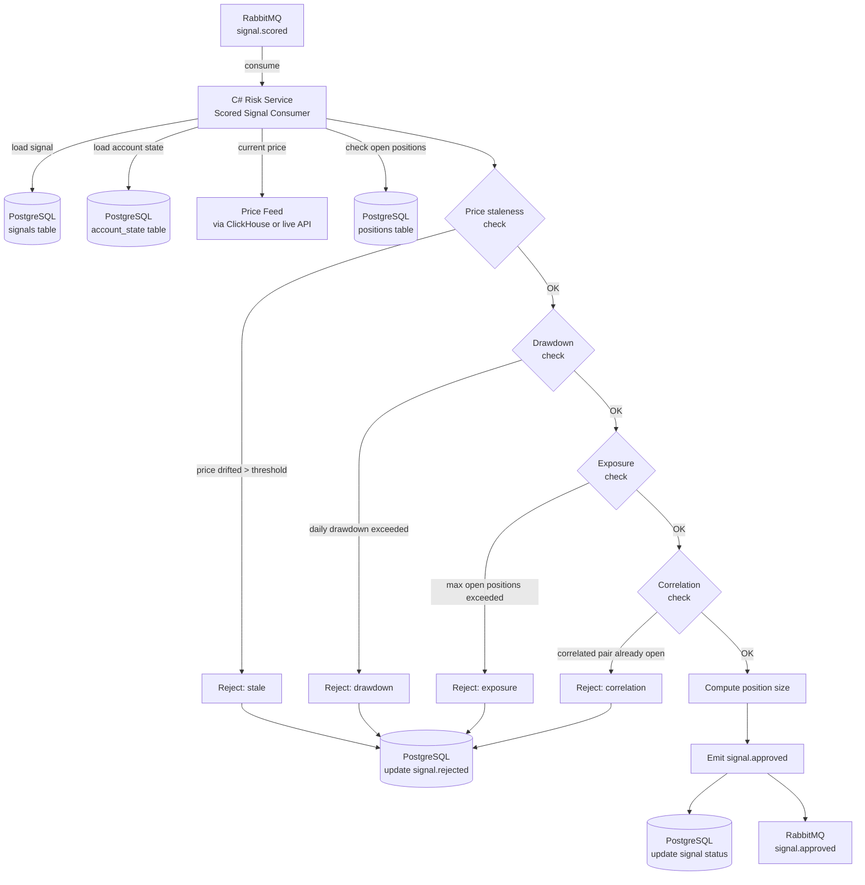

# Risk Management

The Risk Management layer is the final approval gate before a trading signal reaches the execution engine. It enforces position sizing, exposure limits, drawdown controls, and portfolio-level constraints to protect trading capital and maintain strategy robustness.

---

## Table of Contents

- [Risk Management Role](#risk-management-role)
- [Risk Approval Flow](#risk-approval-flow)
- [Position Sizing](#position-sizing)
- [Exposure Controls](#exposure-controls)
- [Drawdown Controls](#drawdown-controls)
- [Signal Approval Decision Logic](#signal-approval-decision-logic)
- [Risk Configuration Model](#risk-configuration-model)
- [Service Architecture (C#)](#service-architecture-c)
- [RabbitMQ Integration](#rabbitmq-integration)
- [Failure Scenarios](#failure-scenarios)
- [Performance Considerations](#performance-considerations)
- [Trade-offs](#trade-offs)

---

## Risk Management Role

The Risk Manager (C# microservice) receives **scored signals** from the meta model and applies portfolio-level risk rules before approving them for execution. It is the last line of defense before real money is committed to a trade.

Key responsibilities:
- Validate that a signal is still actionable (price hasn't moved significantly since signal generation)
- Compute position size based on account equity and risk-per-trade parameters
- Check that approving this signal won't exceed exposure limits or correlation thresholds
- Enforce daily/weekly drawdown limits
- Emit `signal.approved` or `signal.rejected` event to RabbitMQ

---

## Risk Approval Flow



---

## Position Sizing

Position sizing determines **how many units (lots)** to trade on an approved signal. Geonera uses **Fixed Fractional Position Sizing** (risk a fixed % of equity per trade).

### Formula

```
risk_amount = account_equity × risk_per_trade_pct
stop_distance_pips = abs(entry_price - stop_price) / pip_size
pip_value = contract_size × pip_size  (instrument-specific)

position_size_lots = risk_amount / (stop_distance_pips × pip_value)
position_size_lots = min(position_size_lots, max_position_size_lots)
position_size_lots = floor(position_size_lots / lot_step) × lot_step
```

### Example (EURUSD)
```
account_equity = $10,000
risk_per_trade_pct = 1% → risk_amount = $100
entry = 1.09250, stop = 1.09100 → stop_distance = 15 pips
pip_value = $10 per pip per standard lot (EURUSD, 100,000 units)

position_size = $100 / (15 pips × $10/pip) = $100 / $150 = 0.67 lots
→ rounded down to 0.67 (JForex supports 0.01 lot step)
→ capped at max_position_size_lots (e.g., 2.0)
```

### Parameters (stored in `risk_configs` table)

| Parameter | Default | Description |
|---|---|---|
| `risk_per_trade_pct` | 1.0% | Fraction of account equity to risk per trade |
| `max_position_size_lots` | 2.0 | Hard cap on single-trade position size |
| `lot_step` | 0.01 | Minimum lot increment (JForex constraint) |
| `min_position_size_lots` | 0.01 | Minimum viable position |

---

## Exposure Controls

### Maximum Open Positions
- **Global limit:** `max_open_positions` (e.g., 5 simultaneous trades)
- **Per-instrument limit:** `max_open_per_instrument` (e.g., 2 trades on same pair)
- **Per-direction limit:** `max_open_per_direction` (e.g., max 3 LONG trades at once)

### Currency Exposure
- Total notional value of all open positions must not exceed `max_total_exposure_pct` of account equity (e.g., 1000%)
- Computed as: `sum(position_lots × contract_size × current_price)` for all open positions

### Correlated Pair Check
- Highly correlated pairs (e.g., EURUSD and EURGBP both in LONG direction) are tracked
- Correlation matrix stored in `instrument_correlations` table (updated weekly from ClickHouse)
- If a new signal's pair is correlated (|ρ| > 0.7) with an existing open position in the same direction, the new signal is rejected to avoid doubling effective directional exposure

---

## Drawdown Controls

Drawdown limits protect against sequential losses that could deplete the trading account.

### Daily Drawdown
```
daily_realized_pnl = sum(closed_position_pnl) for today
daily_drawdown_limit = account_equity × max_daily_drawdown_pct
if daily_realized_pnl < -daily_drawdown_limit:
    HALT all new signal approvals for the rest of the trading day
```

### Weekly Drawdown
```
weekly_realized_pnl = sum(closed_position_pnl) for this week
weekly_drawdown_limit = account_equity × max_weekly_drawdown_pct
if weekly_realized_pnl < -weekly_drawdown_limit:
    HALT all new signal approvals until next week
    Alert: notify admin via RabbitMQ alert event
```

### Maximum Consecutive Losses
```
consecutive_losses = count of last sequential loss outcomes
if consecutive_losses >= max_consecutive_losses:
    PAUSE signal approvals for cooldown_minutes
    Log and alert
```

### Drawdown Parameters

| Parameter | Default | Description |
|---|---|---|
| `max_daily_drawdown_pct` | 3.0% | Max daily loss as % of equity |
| `max_weekly_drawdown_pct` | 8.0% | Max weekly loss as % of equity |
| `max_consecutive_losses` | 5 | Trigger pause after N consecutive losses |
| `cooldown_minutes` | 240 | Pause duration after consecutive loss trigger |

---

## Signal Approval Decision Logic

```csharp
// Pseudocode: risk approval workflow
public async Task<ApprovalResult> EvaluateSignalAsync(Signal signal)
{
    // 1. Price staleness check
    var currentPrice = await _priceFeed.GetLatestAsync(signal.Instrument);
    var priceDrift = Math.Abs(currentPrice - signal.EntryPrice) / _pipSize;
    if (priceDrift > _config.MaxEntryDriftPips)
        return Reject("stale_price", $"Price drifted {priceDrift} pips since signal generation");

    // 2. Drawdown check
    var account = await _accountRepo.GetCurrentStateAsync();
    if (account.DailyPnL < -account.Equity * _config.MaxDailyDrawdownPct)
        return Reject("daily_drawdown", "Daily drawdown limit reached");
    if (account.WeeklyPnL < -account.Equity * _config.MaxWeeklyDrawdownPct)
        return Reject("weekly_drawdown", "Weekly drawdown limit reached");

    // 3. Exposure check
    var openPositions = await _positionRepo.GetOpenAsync();
    if (openPositions.Count >= _config.MaxOpenPositions)
        return Reject("max_positions", "Maximum open positions reached");
    var instrumentPositions = openPositions.Count(p => p.Instrument == signal.Instrument);
    if (instrumentPositions >= _config.MaxOpenPerInstrument)
        return Reject("instrument_limit", $"Max open positions for {signal.Instrument} reached");

    // 4. Correlation check
    var correlatedOpen = await CheckCorrelationConflict(signal, openPositions);
    if (correlatedOpen)
        return Reject("correlation", "Correlated position already open");

    // 5. Consecutive loss check
    var consecutiveLosses = await _positionRepo.GetConsecutiveLossesAsync();
    if (consecutiveLosses >= _config.MaxConsecutiveLosses)
        return Reject("consecutive_losses", "Cooling down after consecutive losses");

    // 6. Compute position size
    var positionSize = _sizer.Calculate(signal, account);
    if (positionSize < _config.MinPositionSizeLots)
        return Reject("position_too_small", "Computed position size below minimum");

    // 7. Approve
    return Approve(positionSize);
}
```

---

## Risk Configuration Model

```sql
CREATE TABLE risk_configs (
    id                          UUID PRIMARY KEY DEFAULT gen_random_uuid(),
    name                        VARCHAR(100) NOT NULL,
    instrument                  VARCHAR(20),              -- NULL = global
    risk_per_trade_pct          DECIMAL(6, 4) NOT NULL DEFAULT 1.0,
    max_position_size_lots      DECIMAL(10, 4) NOT NULL DEFAULT 2.0,
    min_position_size_lots      DECIMAL(10, 4) NOT NULL DEFAULT 0.01,
    lot_step                    DECIMAL(10, 4) NOT NULL DEFAULT 0.01,
    max_open_positions          INT NOT NULL DEFAULT 5,
    max_open_per_instrument     INT NOT NULL DEFAULT 2,
    max_daily_drawdown_pct      DECIMAL(6, 4) NOT NULL DEFAULT 3.0,
    max_weekly_drawdown_pct     DECIMAL(6, 4) NOT NULL DEFAULT 8.0,
    max_consecutive_losses      INT NOT NULL DEFAULT 5,
    cooldown_minutes            INT NOT NULL DEFAULT 240,
    max_entry_drift_pips        DECIMAL(10, 4) NOT NULL DEFAULT 5.0,
    max_total_exposure_pct      DECIMAL(8, 4) NOT NULL DEFAULT 1000.0,
    correlation_threshold       DECIMAL(6, 4) NOT NULL DEFAULT 0.7,
    active                      BOOLEAN NOT NULL DEFAULT TRUE,
    created_at                  TIMESTAMP DEFAULT NOW()
);
```

---

## Service Architecture (C#)

### Components

- **`ScoredSignalConsumer`** — `IHostedService`; consumes `signal.scored` queue from RabbitMQ
- **`RiskEvaluator`** — Core domain service; executes approval decision logic
- **`PositionSizer`** — Computes lot size from account equity and signal parameters
- **`AccountStateRepository`** — Reads/writes account equity, daily/weekly PnL from PostgreSQL
- **`PositionRepository`** — Reads open positions, consecutive loss count
- **`RiskEventPublisher`** — Publishes `signal.approved` or `signal.rejected` to RabbitMQ
- **`DrawdownMonitor`** — Background service; monitors real-time PnL and halts approvals when limits are breached

### Key Design Decisions
- **Optimistic locking:** Account state updates use PostgreSQL row-level locks to prevent race conditions when multiple signals are evaluated concurrently
- **Stateless evaluation:** Each evaluation reads fresh state from PostgreSQL; no in-memory caching of account state (too critical to serve stale data)
- **Idempotency:** Signal IDs tracked to prevent double-processing on MQ redelivery

---

## RabbitMQ Integration

### Consumed Queue
- **Exchange:** `geonera.signals`
- **Queue:** `risk-service.scored-signals`
- **Routing key:** `signal.scored`

### Published Events

**signal.approved:**
```json
{
  "signal_id": "uuid",
  "instrument": "EURUSD",
  "direction": "LONG",
  "entry_price": 1.09250,
  "target_price": 1.09550,
  "stop_price": 1.09100,
  "position_size_lots": 0.67,
  "risk_reward_ratio": 2.0,
  "account_equity_at_approval": 10000.00,
  "approved_at": "2024-01-15T14:01:23Z"
}
```

**signal.rejected:**
```json
{
  "signal_id": "uuid",
  "rejection_reason": "daily_drawdown",
  "detail": "Daily drawdown limit of 3% reached",
  "rejected_at": "2024-01-15T14:01:23Z"
}
```

---

## Failure Scenarios

| Scenario | Impact | Mitigation |
|---|---|---|
| PostgreSQL unavailable | Cannot read account state; block all approvals | Fail closed (reject all signals); alert |
| Price feed unavailable | Cannot check staleness; use signal.entry_price | Configure max age: if signal > N minutes old, reject automatically |
| Race condition on concurrent approvals | Two signals approved simultaneously, exceeding max_open_positions | PostgreSQL advisory lock per instrument during evaluation |
| Account state out of sync | PnL calculation incorrect | Reconcile with JForex execution reports on each position close |
| RabbitMQ message redelivery | Signal evaluated twice; double approval | Idempotency check: if signal already approved/rejected, skip |
| Drawdown halt not released | System frozen after halt period | Admin UI override with forced resume; auto-release after cooldown |

---

## Performance Considerations

- **Evaluation latency:** Single signal evaluation: 10-50ms (dominated by PostgreSQL reads)
- **Throughput:** Risk service must handle bursts from Meta Model (e.g., 50 scored signals at once); use consumer prefetch of 10 for fair load distribution
- **PostgreSQL load:** Account state and positions queried per signal; cache with TTL of 1 second for non-critical reads (equity check can tolerate 1s lag; position count cannot)
- **Concurrent evaluation:** Run N consumer goroutines/threads with advisory locking to prevent race conditions while maintaining parallelism

---

## Trade-offs

- **Fail-closed vs fail-open:** Risk service fails closed (rejects all signals on uncertainty). This prevents rogue trades but means outages block all trading. A fail-open fallback would be unacceptable for a capital-protection system.
- **Fixed fractional vs Kelly Criterion:** Fixed fractional is simpler and avoids the estimation errors inherent in Kelly sizing (requires accurate win rate and R:R estimates). Kelly can theoretically outperform but is sensitive to mis-estimation.
- **Static correlation matrix:** Instrument correlations are computed weekly, not in real-time. During market stress, correlations can spike suddenly (correlation convergence to 1). This is a known limitation; addressed by conservative `max_open_per_instrument` limits.
- **Price staleness threshold:** A tight threshold (2-3 pips) reduces stale entries but increases rejection rate during volatile markets. A loose threshold risks filling at a worse price than the signal intended.
