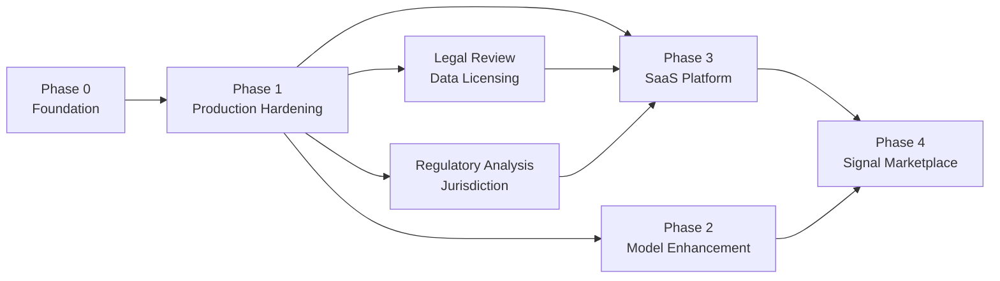

# Roadmap

This document describes Geonera's planned technical development trajectory. Items are organized by phase, with engineering priorities, architectural dependencies, and implementation complexity ratings. This is a living document and should be updated as priorities evolve.

---

## Table of Contents

- [Roadmap Philosophy](#roadmap-philosophy)
- [Phase 0: Foundation (Current)](#phase-0-foundation-current)
- [Phase 1: Production Hardening](#phase-1-production-hardening)
- [Phase 2: Model Enhancement](#phase-2-model-enhancement)
- [Phase 3: SaaS Platform](#phase-3-saas-platform)
- [Phase 4: Signal Marketplace](#phase-4-signal-marketplace)
- [Technical Debt Registry](#technical-debt-registry)
- [Architectural Decisions Pending](#architectural-decisions-pending)
- [Dependency Map](#dependency-map)

---

## Roadmap Philosophy

- **Vertical slices over horizontal layers:** Each phase delivers end-to-end working capability, not just a single layer
- **No speculative architecture:** Features are only designed when the phase they belong to is confirmed for development
- **Complexity ratings:** Each item is rated Low / Medium / High by implementation complexity (not timeline)
- **Dependency-first ordering:** Items within a phase are ordered by dependency chain; blocking items first

---

## Phase 0: Foundation (Current)

**Goal:** Functional end-to-end pipeline from bi5 ingestion to JForex order execution.

### Completed / In Progress

| Item | Status | Complexity | Notes |
|---|---|---|---|
| Go bi5 ingestion (historical backfill) | Done | Medium | Supports LZMA decompression, batch insert |
| ClickHouse schema (ticks, ohlcv_*, features) | Done | Low | MergeTree for dev; ReplicatedMergeTree for prod |
| Rust M1 OHLCV aggregation | Done | Medium | Tick → M1 bar builder |
| Rust multi-timeframe resampling | Done | Medium | M1 → M5/M15/H1/H4/D1 |
| Rust technical indicator computation | In Progress | High | EMA, RSI, MACD, ATR, ADX, BB done; full catalog pending |
| TFT model training (Python) | In Progress | High | Base architecture working; hyperparameter tuning pending |
| TFT inference worker (Python) | In Progress | Medium | Single-worker; multi-worker scaling pending |
| C# Signal Generator (basic) | In Progress | Medium | Algorithm implemented; strategy config loading done |
| Meta Model (LightGBM) training | Not Started | High | Requires labeled historical signals |
| C# Risk Manager (position sizing) | Not Started | Medium | |
| Java JForex execution engine | Not Started | High | JForex SDK integration; order submission |
| Admin UI (basic dashboard) | Not Started | Medium | |
| RabbitMQ topology setup | Done | Low | Exchanges, queues, DLX defined |
| PostgreSQL schema (signals, positions) | Done | Low | Base schema; migrations via Flyway |

---

## Phase 1: Production Hardening

**Goal:** System is stable, observable, and safe for continuous live trading.

### Items

#### 1.1 Complete Observability Stack
- **What:** Deploy Prometheus, Grafana, Loki, and Alertmanager; instrument all services; configure all alert rules
- **Why:** Cannot safely run live trading without real-time anomaly detection and latency monitoring
- **Complexity:** Medium
- **Dependencies:** All Phase 0 services must be deployed

#### 1.2 Full Backtesting Pipeline
- **What:** Implement the bar-by-bar simulation engine; store trade-level results; integrate with Admin UI reporting
- **Why:** Required before committing real capital; validates pipeline end-to-end
- **Complexity:** High
- **Dependencies:** TFT inference, Meta Model, Signal Generator, Risk Manager

#### 1.3 Meta Model Label Construction Pipeline
- **What:** Automated labeling of historical candidate signals by simulating against actual M1 data; scheduled retraining pipeline
- **Why:** Meta model cannot be trained without labeled data; automated pipeline prevents stale models
- **Complexity:** Medium
- **Dependencies:** Historical signals in PostgreSQL, historical M1 data in ClickHouse

#### 1.4 Live Tick Integration (Go → JForex → RabbitMQ)
- **What:** Java JForex Engine publishes live ticks to RabbitMQ; Go Live Ingestor consumes and writes to ClickHouse
- **Why:** Real-time data is required for live trading (historical-only mode can only backtest)
- **Complexity:** High
- **Dependencies:** Java JForex Engine, Go Ingestor, RabbitMQ topology

#### 1.5 Signal Lifecycle State Machine (Complete)
- **What:** Full signal status transitions: candidate → scored → approved → [filled | stopped | expired | rejected]
- **Why:** Signals must be auditably tracked through their entire lifecycle for performance analysis
- **Complexity:** Medium
- **Dependencies:** PostgreSQL signal schema, all pipeline services

#### 1.6 Drawdown Halt Mechanism
- **What:** Automatic halt of signal approvals when daily/weekly drawdown limits are breached; Admin UI override
- **Why:** Capital protection is non-negotiable; automated halts prevent catastrophic loss sequences
- **Complexity:** Low
- **Dependencies:** C# Risk Service, PostgreSQL account state

#### 1.7 Model Registry and Promotion Flow
- **What:** PostgreSQL-backed model registry; Admin UI model management (view, promote, rollback); model reload event via RabbitMQ
- **Why:** Cannot safely update models in production without versioned registry and zero-downtime reload
- **Complexity:** Medium
- **Dependencies:** Admin UI, PostgreSQL, RabbitMQ system exchange

#### 1.8 Kubernetes Production Deployment
- **What:** Complete Kubernetes manifests for all services; network policies; secrets via External Secrets Operator; HPA for Python workers
- **Why:** Docker Compose is insufficient for production resilience and scaling
- **Complexity:** High
- **Dependencies:** All services containerized; ClickHouse cluster ready

#### 1.9 CI/CD Pipelines (All Languages)
- **What:** Per-service CI pipeline (lint, test, build, push image); staging deploy; production deploy with approval gate
- **Why:** Manual deployments in a polyglot system are error-prone and unsustainable
- **Complexity:** Medium
- **Dependencies:** Container registry; Kubernetes cluster

---

## Phase 2: Model Enhancement

**Goal:** Improve signal quality and system intelligence.

### Items

#### 2.1 Multi-Instrument TFT Model
- **What:** Train a single TFT model with instrument embeddings across all supported FX pairs
- **Why:** Per-instrument models multiply training cost; a multi-instrument model can learn cross-pair correlations
- **Complexity:** High
- **Trade-offs:** May underfit instrument-specific dynamics vs per-instrument models; A/B test required
- **Dependencies:** Phase 1 complete; multi-instrument training data prepared

#### 2.2 Ensemble Forecasting
- **What:** Train multiple TFT variants (different lookbacks, hyperparameters); ensemble their forecasts via weighted average or stacking
- **Why:** Ensemble reduces individual model variance; more robust to regime changes
- **Complexity:** High
- **Dependencies:** Multiple TFT model variants; ensemble meta layer

#### 2.3 Walk-Forward Automated Retraining
- **What:** Automated weekly retraining cycle: train → validate → promote if AUC meets threshold → alert if not
- **Why:** Models must stay current with market regime; manual retraining is not scalable
- **Complexity:** Medium
- **Dependencies:** Model registry (Phase 1.7); backtest pipeline (Phase 1.2)

#### 2.4 Economic Calendar Integration
- **What:** Ingest economic event calendar (e.g., Forex Factory or ForexNewsAPI); block signal approvals N minutes before/after major releases (NFP, FOMC, CPI)
- **Why:** Major economic releases cause extreme volatility and erratic price behavior; signals generated near releases have poor expected value
- **Complexity:** Medium
- **Dependencies:** External calendar API; Risk Service integration; ClickHouse event table

#### 2.5 Dynamic Risk Sizing (Kelly Fraction)
- **What:** Compute position size using Kelly Criterion adjusted for meta model confidence and historical win rate
- **Why:** Fixed-fraction sizing is conservative; Kelly-fraction sizing can improve capital efficiency when well-calibrated
- **Complexity:** Medium
- **Trade-offs:** Kelly sizing is highly sensitive to win rate estimation error; requires calibrated meta model scores
- **Dependencies:** Calibrated meta model; position sizing module in Risk Service

#### 2.6 Regime Detection
- **What:** Add a market regime classifier (trending, ranging, high-volatility) that conditions signal generation and risk parameters
- **Why:** Model performance varies significantly by market regime; regime-conditional parameters improve robustness
- **Complexity:** High
- **Dependencies:** Regime classifier training data; integration into Signal Generator and Risk Manager

#### 2.7 Explainability Enhancements
- **What:** Natural-language signal summaries generated from SHAP values and attention weights; exportable explanation reports
- **Why:** Improves internal debugging and is a prerequisite for SaaS subscriber-facing explanations
- **Complexity:** Medium
- **Dependencies:** Phase 1 explanation storage; LLM integration (local or API) for NL generation

---

## Phase 3: SaaS Platform

**Goal:** External subscribers can access Geonera signals via API, WebSocket, and Webhook.

### Items

#### 3.1 Multi-Tenant Database Schema
- **What:** Add `tenants` table, `tenant_id` columns, Row Level Security in PostgreSQL
- **Complexity:** Medium
- **Dependencies:** Legal review of data licensing; regulatory analysis complete

#### 3.2 API Key Management Service
- **What:** New C# service for API key issuance, rotation, rate limiting, usage tracking
- **Complexity:** Medium
- **Dependencies:** Multi-tenant schema (3.1)

#### 3.3 Tier-Based Signal Access Enforcement
- **What:** API Gateway enforces instrument access and delay windows per subscriber tier
- **Complexity:** Low
- **Dependencies:** API key management (3.2); tenant tier stored in PostgreSQL

#### 3.4 Webhook Delivery System
- **What:** Per-subscriber RabbitMQ queue; delivery worker POSTs to subscriber webhook URL; retry with DLQ on failure
- **Complexity:** Medium
- **Dependencies:** RabbitMQ; subscriber webhook URL management

#### 3.5 Subscriber-Facing UI
- **What:** Separate SvelteKit application (not Admin UI); subscriber dashboard showing signals, performance, subscription status
- **Complexity:** High
- **Dependencies:** API key auth (3.2); tenant schema (3.1)

#### 3.6 Billing Integration (Stripe)
- **What:** Subscription lifecycle management via Stripe; webhook handlers for payment events; tier upgrade/downgrade
- **Complexity:** High
- **Dependencies:** Tenant schema (3.1); subscriber UI (3.5)

#### 3.7 GDPR Compliance
- **What:** Subscriber data deletion endpoint; data export endpoint; consent management
- **Complexity:** Medium
- **Dependencies:** Multi-tenant schema (3.1)

#### 3.8 SLA Monitoring
- **What:** Per-tier uptime and signal latency SLA tracking; automated credit issuance on breach
- **Complexity:** Medium
- **Dependencies:** Observability stack (Phase 1.1); billing integration (3.6)

---

## Phase 4: Signal Marketplace

**Goal:** Third-party signal providers can publish signals through Geonera to its subscriber base.

### Items

#### 4.1 Provider Onboarding API
- **What:** API for third-party providers to register, publish signals, and view their performance metrics
- **Complexity:** High

#### 4.2 Provider Signal Validation Pipeline
- **What:** All third-party signals pass through meta model scoring; only signals meeting quality threshold are surfaced to subscribers
- **Complexity:** Medium

#### 4.3 Revenue Attribution Engine
- **What:** Track which provider's signals each subscriber subscribes to; compute revenue share per provider
- **Complexity:** High

#### 4.4 Provider Performance Dashboard
- **What:** Public-facing provider performance statistics (win rate, RR, drawdown, signal count)
- **Complexity:** Medium

---

## Technical Debt Registry

| Item | Debt Description | Impact | Priority |
|---|---|---|---|
| Rust indicator catalog | Not all indicators implemented; basic set only | Missing features for ML training | High |
| Python inference multi-process | Single-worker only; no horizontal scaling yet | Throughput bottleneck at scale | High |
| Backtest tick-level simulation | Bar-level simulation only; intrabar dynamics ignored | Backtest results optimistic | Medium |
| Admin UI auth | Basic JWT; no OAuth/SSO | Security limitation for larger teams | Medium |
| ClickHouse single-node dev | No replication in development; prod-dev discrepancy | Replication bugs not caught in dev | Low |
| JForex reconnection handling | Basic exponential backoff; no connection health monitoring | Outages not detected until order fails | Medium |
| Meta model feature store | No versioned feature store; features computed on-the-fly | Reproducibility of historical meta features | Medium |

---

## Architectural Decisions Pending

| Decision | Options | Blocking |
|---|---|---|
| TFT library: pytorch-forecasting vs Darts | pytorch-forecasting: more control; Darts: simpler API | Phase 0 completion |
| LightGBM vs XGBoost for meta model | LightGBM: faster; XGBoost: more control | Phase 1.3 |
| Loki vs Elasticsearch for logging | Loki: simpler; Elasticsearch: richer queries | Phase 1.1 |
| gRPC vs REST for internal ML services | gRPC: faster, typed; REST: simpler, browser-compatible | Phase 2 |
| Managed DB vs self-hosted ClickHouse | Managed (Altinity): lower ops burden; self-hosted: lower cost | Phase 1.8 |
| Multi-instrument vs per-instrument TFT | Per-instrument: more accurate; multi: lower cost | Phase 2.1 |

---

## Dependency Map

Key dependencies:
- **Phase 1 gates Phase 2 and Phase 3:** Production hardening is a prerequisite for both model improvements and external commercialization
- **Legal review gates Phase 3:** Dukascopy data licensing and jurisdiction-based regulatory analysis must be complete before any subscriber-facing product
- **Phase 2 and Phase 3 are parallel:** Model enhancement and SaaS buildout can proceed concurrently with different engineering teams
- **Phase 4 requires both Phase 2 and Phase 3:** Marketplace requires mature model performance (Phase 2) and SaaS infrastructure (Phase 3)
