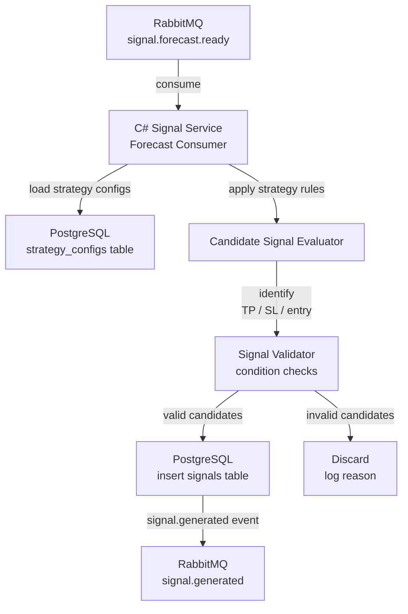

# Signal Generation

The Signal Generation layer converts TFT multi-step price forecasts into structured trading signal candidates using strategy parameters: risk-reward ratio, target price movement, and time horizon. Each candidate is a well-defined, parametrized trade proposal ready for meta-model evaluation.

---

## Table of Contents

- [Conceptual Role](#conceptual-role)
- [Signal Generation Flow](#signal-generation-flow)
- [Signal Parameters](#signal-parameters)
- [Candidate Generation Algorithm](#candidate-generation-algorithm)
- [Signal Data Model](#signal-data-model)
- [Strategy Configuration](#strategy-configuration)
- [Service Architecture (C#)](#service-architecture-c)
- [RabbitMQ Integration](#rabbitmq-integration)
- [Failure Scenarios](#failure-scenarios)
- [Performance Considerations](#performance-considerations)
- [Trade-offs](#trade-offs)

---

## Conceptual Role

The TFT model produces a raw price forecast: a sequence of predicted close prices for the next 7200 M1 bars. This forecast is rich in information but not directly actionable as a trade. The Signal Generator applies **strategy rules** to convert the forecast into a structured trade proposal that specifies:

- **Entry price** — where to enter the trade
- **Direction** — long (buy) or short (sell)
- **Target (take profit)** — price level where the trade reaches profit
- **Stop loss** — price level where the trade is closed at a loss
- **Time horizon** — maximum duration (in M1 bars) the trade is held open

A signal is only generated if the forecast satisfies minimum movement and risk-reward thresholds defined in the strategy configuration.

---

## Signal Generation Flow



---

## Signal Parameters

Each candidate signal is generated from a combination of the following parameters:

| Parameter | Type | Description |
|---|---|---|
| `entry_price` | Float | Current market mid price at signal generation time |
| `direction` | Enum | `LONG` or `SHORT` |
| `target_price` | Float | Take-profit price level |
| `stop_price` | Float | Stop-loss price level |
| `risk_reward_ratio` | Float | `(target_price - entry_price) / (entry_price - stop_price)` |
| `target_move_pips` | Float | Absolute price distance from entry to target in pips |
| `horizon_bars` | Int | Maximum M1 bars to hold the trade open |
| `entry_bar_index` | Int | Bar index (M1) at which entry occurs |
| `target_bar_index` | Int | Forecast bar index where target is expected to be hit |
| `forecast_confidence` | Float | Q90-Q10 interval width at target bar (smaller = higher confidence) |

---

## Candidate Generation Algorithm

The algorithm operates on the 7200-step Q50 (median) forecast produced by TFT.

### Step 1: Determine Entry
- `entry_price` = current last known close (bar at `t=0`)
- `entry_bar_index` = 0

### Step 2: Identify Extrema in Forecast
- Find all local maxima and minima in the Q50 forecast series within the configured horizon
- Local maximum: `forecast[i] > forecast[i-1]` and `forecast[i] > forecast[i+1]`
- Local minimum: `forecast[i] < forecast[i-1]` and `forecast[i] < forecast[i+1]`

### Step 3: Generate LONG Candidates
For each local maximum `M` at bar index `k`:
```
if forecast[k] - entry_price >= min_target_move_pips * pip_size:
    target_price = forecast[k]
    target_bar_index = k
    stop_price = entry_price - (target_price - entry_price) / required_rr_ratio
    if stop_price > 0 and stop_price < entry_price:
        emit LongCandidate(entry_price, target_price, stop_price, k)
```

### Step 4: Generate SHORT Candidates
For each local minimum `m` at bar index `k`:
```
if entry_price - forecast[k] >= min_target_move_pips * pip_size:
    target_price = forecast[k]
    target_bar_index = k
    stop_price = entry_price + (entry_price - target_price) / required_rr_ratio
    emit ShortCandidate(entry_price, target_price, stop_price, k)
```

### Step 5: Apply Validation Filters
Filter out candidates where:
- `horizon_bars > max_horizon_bars` (trade lasts too long)
- `target_move_pips < min_target_move_pips` (move too small relative to spread)
- `risk_reward_ratio < min_rr_ratio`
- `forecast_confidence > max_interval_width` (forecast too uncertain at target bar)

### Pseudocode Summary

```python
def generate_signals(forecast_q50, forecast_q10, forecast_q90, entry_price, config):
    candidates = []
    extrema = find_extrema(forecast_q50, window=config.smoothing_window)

    for idx, price in extrema:
        move = price - entry_price
        if abs(move) < config.min_target_move:
            continue

        direction = LONG if move > 0 else SHORT
        stop = compute_stop(entry_price, price, config.rr_ratio, direction)
        confidence = forecast_q90[idx] - forecast_q10[idx]

        candidate = Signal(
            direction=direction,
            entry=entry_price,
            target=price,
            stop=stop,
            horizon=idx,
            rr_ratio=abs(move) / abs(entry_price - stop),
            confidence=confidence
        )

        if candidate.rr_ratio >= config.min_rr and candidate.horizon <= config.max_horizon:
            candidates.append(candidate)

    return candidates
```

---

## Signal Data Model

### PostgreSQL: `signals` table

```sql
CREATE TABLE signals (
    id                  UUID PRIMARY KEY DEFAULT gen_random_uuid(),
    instrument          VARCHAR(20) NOT NULL,
    direction           VARCHAR(5) NOT NULL CHECK (direction IN ('LONG', 'SHORT')),
    status              VARCHAR(20) NOT NULL DEFAULT 'candidate'
                        CHECK (status IN ('candidate', 'scored', 'approved', 'rejected', 'expired', 'filled', 'stopped')),
    entry_price         DECIMAL(18, 8) NOT NULL,
    target_price        DECIMAL(18, 8) NOT NULL,
    stop_price          DECIMAL(18, 8) NOT NULL,
    risk_reward_ratio   DECIMAL(8, 4) NOT NULL,
    target_move_pips    DECIMAL(10, 4) NOT NULL,
    horizon_bars        INT NOT NULL,
    entry_bar_index     INT NOT NULL,
    target_bar_index    INT NOT NULL,
    forecast_confidence DECIMAL(10, 8),
    strategy_config_id  UUID REFERENCES strategy_configs(id),
    model_version       VARCHAR(50),
    forecast_run_id     UUID,
    meta_score          DECIMAL(6, 4),       -- filled by meta model
    meta_label          VARCHAR(10),          -- 'profit' or 'loss'
    created_at          TIMESTAMP DEFAULT NOW(),
    updated_at          TIMESTAMP DEFAULT NOW()
);

CREATE INDEX idx_signals_instrument_status ON signals(instrument, status);
CREATE INDEX idx_signals_created_at ON signals(created_at DESC);
```

---

## Strategy Configuration

Strategy configurations are stored in PostgreSQL and loaded by the Signal Generator at runtime. Multiple configurations can coexist (e.g., conservative vs aggressive).

```sql
CREATE TABLE strategy_configs (
    id                  UUID PRIMARY KEY DEFAULT gen_random_uuid(),
    name                VARCHAR(100) NOT NULL UNIQUE,
    instrument          VARCHAR(20),      -- NULL = applies to all instruments
    min_rr_ratio        DECIMAL(6, 4) NOT NULL DEFAULT 1.5,
    min_target_move_pips DECIMAL(10, 4) NOT NULL DEFAULT 20.0,
    max_horizon_bars    INT NOT NULL DEFAULT 7200,
    max_interval_width  DECIMAL(10, 8),  -- max forecast Q90-Q10 at target bar
    smoothing_window    INT NOT NULL DEFAULT 10,  -- extrema detection window
    active              BOOLEAN NOT NULL DEFAULT TRUE,
    created_at          TIMESTAMP DEFAULT NOW()
);
```

### Configuration Example: Conservative Strategy

```json
{
  "name": "conservative_eurusd",
  "instrument": "EURUSD",
  "min_rr_ratio": 2.0,
  "min_target_move_pips": 30.0,
  "max_horizon_bars": 2880,
  "max_interval_width": 0.0050,
  "smoothing_window": 15
}
```

### Configuration Example: Aggressive Strategy

```json
{
  "name": "aggressive_eurusd",
  "instrument": "EURUSD",
  "min_rr_ratio": 1.5,
  "min_target_move_pips": 15.0,
  "max_horizon_bars": 7200,
  "max_interval_width": 0.0100,
  "smoothing_window": 5
}
```

---

## Service Architecture (C#)

The Signal Generator is a C# microservice built on ASP.NET Core with a hosted background service consuming RabbitMQ.

### Components

- **`ForecastConsumer`** — `IHostedService` that subscribes to `signal.forecast.ready` queue
- **`SignalGeneratorService`** — domain logic: applies strategy configs, generates candidates, validates
- **`StrategyConfigRepository`** — loads and caches strategy configs from PostgreSQL
- **`SignalRepository`** — persists signals to PostgreSQL
- **`SignalEventPublisher`** — publishes `signal.generated` event to RabbitMQ

### Message Consumption

```csharp
// Pseudocode
public async Task ConsumeAsync(ForecastMessage message, CancellationToken ct)
{
    var strategies = await _strategyRepo.GetActiveForInstrument(message.Instrument);
    var allCandidates = new List<Signal>();

    foreach (var strategy in strategies)
    {
        var candidates = _generator.Generate(message.Forecast, message.EntryPrice, strategy);
        allCandidates.AddRange(candidates);
    }

    await _signalRepo.BulkInsertAsync(allCandidates, ct);

    foreach (var signal in allCandidates)
        await _publisher.PublishAsync(new SignalGeneratedEvent(signal.Id), ct);
}
```

---

## RabbitMQ Integration

### Consumed Queue
- **Exchange:** `geonera.forecasts`
- **Queue:** `signal-generator.forecasts`
- **Routing key:** `signal.forecast.ready`
- **Message payload:** JSON-serialized forecast with instrument, timestamp, Q10/Q50/Q90 arrays

### Published Events
- **Exchange:** `geonera.signals`
- **Routing key:** `signal.generated`
- **Message payload:**
```json
{
  "signal_id": "uuid",
  "instrument": "EURUSD",
  "direction": "LONG",
  "entry_price": 1.09250,
  "target_price": 1.09550,
  "stop_price": 1.09100,
  "risk_reward_ratio": 2.0,
  "horizon_bars": 1440,
  "created_at": "2024-01-15T14:00:00Z"
}
```

---

## Failure Scenarios

| Scenario | Impact | Mitigation |
|---|---|---|
| No forecast received | No signals generated; queue empty | Monitor queue depth; alert if no messages within expected interval |
| All candidates filtered out | Zero signals from a forecast | Log reason; adjust strategy thresholds via Admin UI |
| PostgreSQL write failure | Signals lost | Retry with backoff; if persistent, DLQ the forecast message |
| Strategy config not found | Signal generation cannot proceed | Fall back to default strategy config; alert |
| Forecast contains NaN | Algorithm produces undefined results | Validate forecast before processing; reject and log |
| Duplicate forecast received | Duplicate signals inserted | Idempotency key on `forecast_run_id`; check before insert |

---

## Performance Considerations

- **Signal generation latency:** For a 7200-step forecast, extrema detection and candidate generation completes in <5ms in C# (algorithmic complexity: O(n) scan)
- **Candidate count:** A single forecast may produce 5-50 candidates depending on strategy configuration and forecast volatility
- **PostgreSQL throughput:** Bulk insert of 50 signals takes ~10ms; not a bottleneck
- **Queue throughput:** RabbitMQ can handle thousands of signal.generated events per second; admin UI consumers must keep up or use lazy queues

---

## Trade-offs

- **Extrema detection window:** Larger window reduces false extrema but may miss short-duration targets; smaller window produces more candidates (more meta-model work)
- **Multiple strategies:** Running multiple strategy configs per forecast increases candidate count and meta-model load but improves signal diversity
- **Entry price assumption:** The algorithm assumes entry at the current close price. Slippage and spread are NOT modeled here — they are handled by the Risk Manager
- **Discrete bar-level targets:** Targets are aligned to M1 bar closes, not intra-bar price levels. This introduces up to 1 minute of target approximation error, acceptable for the 7200-bar horizon
